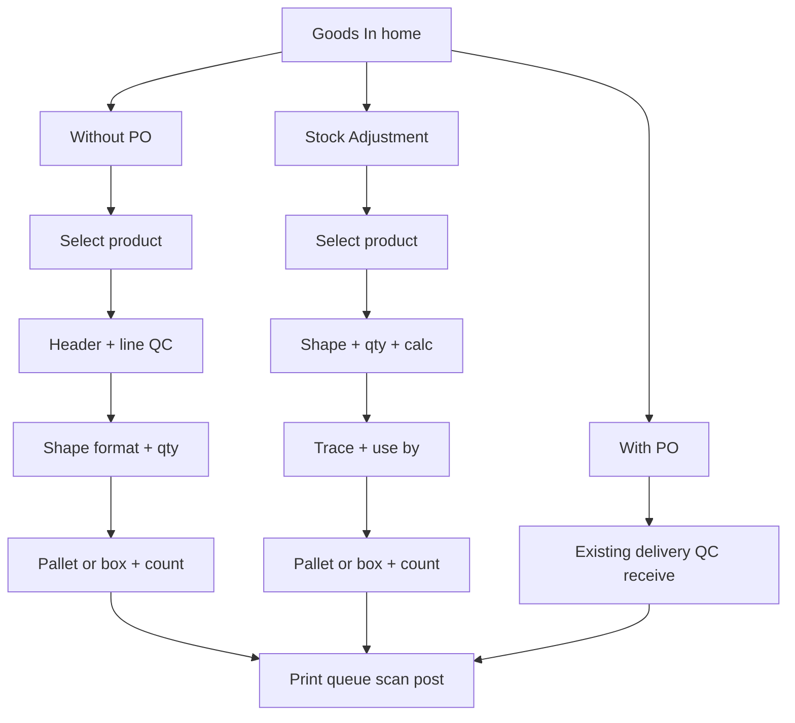

# Goods In: With PO / Without PO / Stock Adjustment

## Can we do that?

**Yes.** Keep **With PO** 100% as today. Add two new simple mobile journeys. Strong calculation stays on Django (QC gates, shape→stock qty, label split, queue→scan→post).

| Tab | Mobile | Django | Disturbs With PO? |
|---|---|---|---|
| **A. Goods In (With PO)** | Existing flow unchanged | Existing purchasing delivery QC + receive | No |
| **B. Goods In (Without PO)** | New wizard: product → QC → shape/qty → labels → print/scan/post | **New** lightweight adhoc session + reuse QC templates + `services.receipt` | No |
| **C. Stock Adjustment** | New simple wizard: product → shape/qty → trace/use-by → labels → print/scan/post | Receipt-lite (no QC); **not** `count-adjustment` (that API has no labels/queue) | No |

**Defaults (manager ask):**
- Without PO includes **full QC** (same checks as PO food flow where applicable).
- Manual “item PO number” = **free-text reference only** — never updates `PurchaseOrder` / `qty_received`.
- Stock Adjustment = **Add qty** (positive stock in) with labels; same barcode queue → scan → post as goods in.
- UI: short straight screens; no extra fluff.

## Hard rules (no disruption)

- Tab A code paths: **do not edit** receive qty math, delivery QC, or PO list screens except adding a tab switcher around them.
- Without-PO / Adjustment **must not** set `source_document_type=po` or bump any PO balance (PO7 lesson).
- Shared after confirm: reuse mobile [`GoodsInCompleteScreen`](file:///home/gazebo/projects/gazebo-cloud/warehouse-mobile-app/src/screens/goodsIn/GoodsInCompleteScreen.tsx) + [`GoodsInVerifyScreen`](file:///home/gazebo/projects/gazebo-cloud/warehouse-mobile-app/src/screens/goodsIn/GoodsInVerifyScreen.tsx) and stock `labels/print`, `labels/verify`, `entries/.../post/`.

---

## Tab A — With PO (unchanged)

Floor today ([warehouse-mobile-app](file:///home/gazebo/projects/gazebo-cloud/warehouse-mobile-app)):

`GoodsIn` → orders → `GoodsInReceive` (review → header QC → line QC → receive) → Complete → Verify.

APIs stay under `/purchasing/pos/...`. No behaviour change.

---

## Tab B — Without PO (manager journey)

**User screens (simple order):**

1. Search/select product (by name).
2. **Line/header QC** (same spirit as PO): delivery date → **trace auto (Julian)**; product temp; vehicle temp; other template checks that apply.
3. Manual **item PO number** (free text).
4. Show **supplier shape formats** for that product (`ProductSupplier.shape_format_label` list) + **Other** (user enters custom shape / pack).
5. Enter **qty** (packs or free); server calculates stock qty from multiplier.
6. Choose **pallet** or **box** label; enter **how many to print** (box ≥1; pallet =1).
7. Same as today: print → stock queue → barcode scan → stock posted.

**Django (why new session):** Today QC requires `PurchaseOrder` + `PurchaseOrderDelivery`. There is no free-stock QC. Plan:

- New models e.g. `AdhocGoodsInSession` + one line (product, answers, shape, qty) — **or** equivalent minimal tables under `purchasing` / `stock_ledger`.
- Reuse [`GoodsInCheckTemplate`](purchasing/models.py) + answer validation from [`header_qc.py`](purchasing/services/header_qc.py) / [`line_qc.py`](purchasing/services/line_qc.py) against the session (extract shared QC helpers; **do not** call PO-only `submit_header_qc(po_id=…)` for this path).
- Confirm: `POST …/adhoc-goods-in/:id/receive/` → `stock_services.receipt` with `queue_stock`, `label_format`, `label_count`, lot attrs; store free-text ref on entry (`remarks` or dedicated `supplier_reference` — **not** linked PO).
- Keep `/stock/receipt/` direct door for internal/tools; mobile Without-PO goes through **adhoc session** so QC cannot be skipped.

**Shape “Other”:** accept ad-hoc outer/inner qty+units (or free kg) on the session line; compute stock qty server-side; do not require creating a permanent `ProductSupplier` unless product already has packs.

---

## Tab C — Stock Adjustment (manager journey)

**User screens:**

1. Select product.
2. Add Qty: shape dropdown (supplier packs + **Other**) → enter qty → show **calculated stock**.
3. Trace code **manual**; use-by date.
4. Label: pallet or box; print count (default 1, editable).
5. Same print → queue → scan → post.

**Django:**

- **Use receipt-style write** (labels + `queue_stock`), tagged `source_document_type=stock_adjustment` (or `origin`/remarks), **not** [`count_adjustment`](stock_ledger/urls.py) (no label/queue today).
- No vehicle/product temp QC, no adhoc QC session — lighter than Tab B.
- Strong calc: same shape multiplier → stock qty as Tab B; reject bad use-by / empty qty.

---

## Mobile app (warehouse-mobile-app)

Entry: [`HomeScreen` → GoodsIn](file:///home/gazebo/projects/gazebo-cloud/warehouse-mobile-app/src/screens/goodsIn/) — today PO-only; [`App.tsx`](file:///home/gazebo/projects/gazebo-cloud/warehouse-mobile-app/App.tsx) only mounts navigator.

**UI changes:**

1. Top of Goods In: **3 tabs** — With PO | Without PO | Stock Adjustment.
2. With PO: existing stack unchanged inside that tab.
3. Without PO: new screens (product search → QC forms reused/adapted from `HeaderQcForm` / `LineQcForm` → shape/qty → label choice) then **navigate to existing Complete + Verify** with `receive_results`.
4. Adjustment: shorter new screens → same Complete + Verify.
5. `goodsInService` already has unused `POST /stock/receipt/` helpers — wire or replace with adhoc/adjustment endpoints.

**UX bar:** one job per screen; large inputs; no PO period/supplier chrome on B/C.

---

## Phase 1 chunks (implement one at a time)

| Chunk | Name | Side | Outcome |
|---|---|---|---|
| **1** | Journey freeze | Plan | Field checklist Tab B vs C vs A; confirm Adjustment = add-qty receipt-lite |
| **2** | Adhoc session + QC APIs | Django | Start session, header QC, line QC (templates reused) |
| **3** | Adhoc receive | Django | Shape/qty/labels → queued receipt; free-text PO ref; PO balance untouched |
| **4** | Adjustment receive | Django | Product+shape+lot+labels → queued receipt; no QC |
| **5** | Postman + tests | Django | Contracts + regression With-PO |
| **6** | Mobile 3 tabs + wizards | Mobile | Simple journeys; reuse Complete/Verify |

**Chunk 1 done. Chunk 2 done** (adhoc session + QC APIs). Chunk 3 next: adhoc receive.

### Chunk 1 — FROZEN journey map (approved)

#### Screen order

**Tab A — With PO** (reuse as-is)

1. Period → supplier/PO → Receive (review → header QC → line QC → receive)
2. Complete (print) → Verify (scan → post)

**Tab B — Without PO**

1. Search product by name → select
2. Header QC (delivery date + auto Julian trace + template checks)
3. Line QC (use_by, product temp, spec_check, …)
4. Manual item PO# (free text)
5. Shape format (supplier packs + Other) → qty → show calculated stock
6. Label: pallet | box + print count (default 1)
7. → **reuse** Complete → Verify (same as A)

**Tab C — Stock Adjustment** (add qty only)

1. Search product → select
2. Shape (packs + Other) → qty → show calculated stock
3. Trace **manual** + use_by
4. Label: pallet | box + print count (default 1)
5. → **reuse** Complete → Verify

No period/supplier chrome on B/C. One job per screen.

#### Field matrix

| Field | A With PO | B Without PO | C Adjustment |
|---|---|---|---|
| product | from PO line | search select | search select |
| location_id | ship-to / warehouse | warehouse (grant) | warehouse (grant) |
| delivery_date | header QC | yes | no |
| trace | Julian from delivery_date | same auto | **manual** entry |
| item_po_ref | real PO number | **manual free text** (not FK) | no |
| vehicle_temperature | food header template | same template | no |
| other header checks | GFF001F food/packaging | same by product type | no |
| use_by | line QC | line QC | yes (lot) |
| product_temperature | line QC | line QC | no |
| spec_check | line QC | line QC | no |
| shape_format | PO line (read-only) | supplier packs + **Other** | packs + **Other** |
| qty | keyed (vs PO balance) | keyed (no PO balance) | keyed |
| calculated stock | pack × multiplier | same server calc | same |
| label_format | PO line plan | **user picks** pallet/box | **user picks** |
| label_count | from PO | user (pallet=1; box≥1) | same |
| queue → print → scan → post | yes | yes | yes |
| updates PurchaseOrder | **yes** | **never** | **never** |

#### Food QC codes to reuse (GFF001F seed)

**Header:** `vehicle_clean_fb_pest_odour`, `primary_outer_packaging_damaged`, `vehicle_temperature`, `coa_coc_received`, `reject_delivery`, `comment`, `random_qc_tl_check`

**Line:** `use_by`, `product_temperature`, `spec_check`

(Packaging/other templates still selected by product `goods_in_type` / storage regime — same resolver as PO.)

#### Reuse vs new (Chunk 2+)

| Piece | Action |
|---|---|
| Tab A mobile + purchasing receive | **No change** |
| `GoodsInCheckTemplate` + answer validation | **Reuse** (extract helpers from PO QC) |
| `AdhocGoodsInSession` (+ line) | **New** — holds B QC + shape/qty before receive |
| B confirm | New receive → `services.receipt` + labels/queue |
| C confirm | Receipt-lite API (or thin wrapper) — **not** `count-adjustment` |
| Free-text item PO# | Store on entry as reference/remarks; **never** `source_document_type=po` |
| Shape Other | Ad-hoc outer/inner or free kg on session; server computes stock qty |
| `GoodsInCompleteScreen` / `GoodsInVerifyScreen` | **Reuse** for A/B/C |
| `LabelFormatField` | Tab A read-only; B/C need **editable** picker (new small component) |

#### Explicit non-goals for B/C

- No fake PurchaseOrder rows
- No PO `qty_received` / over-receive math
- No shortfall-vs-PO-balance on B (no ordered qty)
- Tab C is add-qty only (not negative count-adjust) in Phase 1

---

## Phase 2+ (later)

Goods Out with plan / without plan (scan → transfer ± `requirement_ids`) — unchanged from earlier plan; start after Phase 1 Tab B/C ship.

## Out of scope

- Changing With-PO QC/receive math.
- Using `count-adjustment` for Tab C label flow.
- Fake PurchaseOrders for Without-PO.
- Goods Out work in Phase 1.

## Success criteria

- Tab A: identical behaviour and tests green.
- Tab B: product without PO → full QC → shape/qty → labels → queue → scan → posted; no PO `qty_received` change.
- Tab C: product → shape/qty/trace/use-by → labels → queue → scan → posted.
- Operator path feels short; server owns multipliers, QC ranges, label split, post gates.
