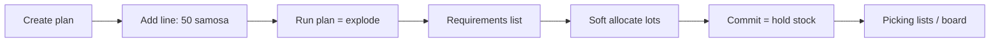

# Backward chain netting — user journeys + chunks

## Get un-lost: what planning is today (standard)

You are a **planner**. Sales says: **50 cases vegetable samosa**.

| Step | What you do | What system does | What you see |
|------|-------------|------------------|--------------|
| 1 | Create plan for today | Empty plan | Plan header |
| 2 | Add demand line: product = FG samosa, qty = 50 | Saves `PlanLine` | Line: 50 |
| 3 | Click **Run** (explode) | Recipe × 50 → all ingredients | Long requirements list (full BOM) |
| 4 | Soft-allocate / commit | Reserves lots (does **not** move stock) | Held ATP |
| 5 | Print picking / board | Lists what to pick/make | Shop-floor paper |

**Manager’s complaint:** step 3 is “standard ERP” — it mostly ignores *where* finished/WIP already sits (Dispatch, High Risk, Spice…). Your company hired you for the **custom** bit: subtract that stock going **backward** from Dispatch to Unit 2.

**Important:** We will **not** change steps 1–5 above. We add a **second calculator** (chain-net) you can run beside it.

---

## Story we are building (one example)

- Order: **50** samosas (need at Dispatch).
- Dispatch already has **10** (trace `20215`).
- → Only need to **make / pull 40** from earlier stages.
- High Risk already has **20** trays → Fryers only need **20** more.
- Spice Room has **10** packs but **min batch 25** → make **25** (not 10).
- Unit 2 only gets ingredient qty for that **25** spice (and other netted stages).

Every number must show **why** (stock + trace), so nobody says “system is wrong.”

---

## Chunk list

| Chunk | Planner gets… |
|-------|----------------|
| **1** | For the finished good only: “50 ordered, 10 in Dispatch (trace …) → make 40” |
| **2** | Same logic down the recipe chain (Sleeving → … → Unit 2) |
| **3** | Readable sentences + top banner (“Using 10 in Dispatch…”) |
| **4** | Min batch round-up (spice 10 short → make 25) |
| **5** | Screen/API button to run this without breaking standard Run |
| **6** | Automated proof the example numbers stay correct |

---

## Chunk 1 — user journey (awaiting approve)

**Who:** Planner checking one sales line.

**Journey:**
1. You already have a plan with line **Vegetable Samosa = 50**.
2. You (or we, in a shell) call chunk-1 service for that plan.
3. System looks only at that **finished product** stock at its **Dispatch / source** locations.
4. It finds lot(s): e.g. 10 at Dispatch, trace `20215`.
5. It tells you: demand 50, stock 10, **to_make 40**, and the lot/trace.

**What you still cannot do in chunk 1:** see Spice / Fryers / Unit 2 — that is chunk 2.

**Build:** only [`planning/services/chain_net.py`](planning/services/chain_net.py). No API UI yet. Standard explode untouched.

**Done when:** demand 50 + 10 Dispatch stock → `to_make=40` + `trace_number` visible.

---

## Chunk 2 — user journey

**Who:** Same planner, now asking “what must each department make?”

**Journey:**
1. Start from chunk-1 result: **make 40** FG (not 50).
2. System opens FG recipe → next components (e.g. sleeved / tray / …).
3. At each stage: demand from parent → minus stock sitting in that stage’s room → new `to_make` → pass downward.
4. You see a **tree**: Dispatch/FG → … → Spice → Unit 2 raws, each with its own stock and to_make.

---

## Chunk 3 — user journey

**Who:** Planner showing the screen to a manager who distrusts “40 instead of 50”.

**Journey:**
1. Open chain-net result.
2. Banner: *“Using 10 already in Dispatch [trace 20215]; planning 40.”*
3. Each row has a sentence: *“Demand 50. Covered by stock: 10 at Dispatch (trace 20215). To make: 40.”*
4. Manager sees stock was considered — not a bug.

---

## Chunk 4 — user journey

**Who:** Spice Room lead / planner.

**Journey:**
1. Net calc says spice shortfall = 10.
2. Recipe says min batch = 25.
3. System shows: *“Shortfall 10. Min batch 25 → to make 25.”*
4. Upstream Unit 2 ingredients explode for **25**, not 10 — factory is not short mid-batch.

---

## Chunk 5 — user journey

**Who:** Planner in the app (not shell).

**Journey:**
1. Open plan → click **Chain net** (or Postman `POST …/chain-net/`).
2. Get JSON tree (read-only). Standard **Run** still works as today.
3. No pick list rewrite yet — view/compare only.

---

## Chunk 6 — user journey

**Who:** You / CI.

**Journey:** Automated test replays the 50 / 10 Dispatch+trace / spice batch 25 story so a future change cannot silently break it.

---

## What we are NOT changing

- Standard explode / lock / commit / picking.
- No new product master fields in these chunks (min batch uses existing `RecipeVersion.batch_quantity`).

## Ops prerequisite

Products need correct recipes and source/destination containers (same chain as Low Risk picking). Wrong containers ⇒ stock looked up in the wrong room.
