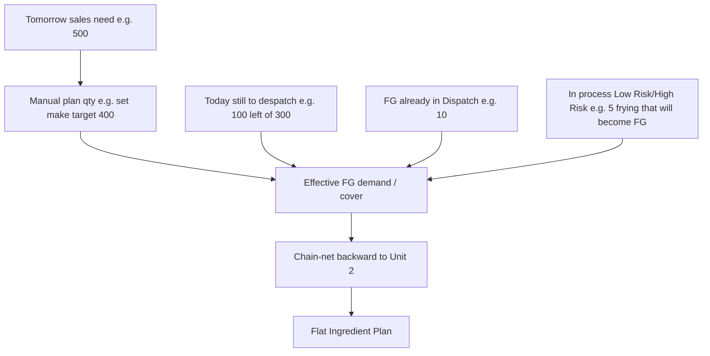
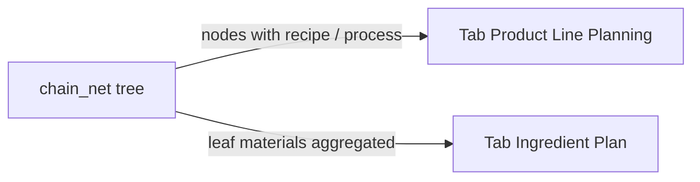

# Backward chain netting — user journeys + chunks

## Yes — demand point understood

You are planning **today for tomorrow’s despatch**, not only “Recipe × sales qty”.



**Example (your story):**
- Tomorrow need ~500 (future sales-order module; today = manual / plan line).
- Today despatch job 300: 200 done, **100 still pending** → that 100 is committed outbound; don’t treat all Dispatch stock as free for tomorrow.
- Dispatch has **10** FG on hand (but some may be reserved for today’s pending).
- **5** still in fryer / low-risk path → will become packable FG → counts as **incoming / WIP cover**, not “must remake from Unit 2”.
- Planner may **manually set** “we will make 400 today for tomorrow”.
- Chain-net then nets stages and produces the ingredient sheet.

**Sales orders:** no module yet → plan line / manual qty is the stand-in; leave a clear hook (`demand_source: manual | sales_order`) for later.

**WIP:** intermediate SKUs already on chain-net (stock at source rooms). Chunk 8 makes “FG-equivalent WIP” explicit (e.g. map fryer WIP → covers tomorrow FG) + optional manual WIP qty.

---

## Chunk status

| Chunk | Status | Planner gets… |
|-------|--------|----------------|
| **1** | Done | FG: demand − Dispatch/source stock → to_make + traces |
| **2** | Done | BOM tree backward |
| **3** | Done | Explanations + `stock_ref` |
| **4** | Done | Min-batch ceil |
| **5** | Done | HTTP API |
| **6** | Done | Automated test |
| **7** | Done | **NotaZone-like Ingredient Plan** (flat qty / stock / balance ± cost) |
| **8** | Done | Demand composition (pending despatch + WIP + manual; SO stub) |

---

## Chunk 4 — min batch (next to approve/build)

After shortfall, if `recipe_version.batch_quantity` set:

`to_make = ceil(shortfall / batch_qty) * batch_qty`

Children explode from bumped `to_make`. Explanation notes the bump.

---

## Chunk 7 — two tabs (like NotaZone)

Same `chain-net` calc feeds **two planner tabs** (FE + API payload sections):

| Tab | Shows | Hides |
|-----|--------|--------|
| **Product Line Planning** | Recipe / process levels only (FG, Spice, Belt, Fryer tray, …) — nodes that **have a recipe** (or are FG root) | Raw materials / packaging leaves |
| **Ingredient Plan** | Materials only (leaves with **no recipe**, or pack/raw) — qty / stock / balance / cost | Intermediate recipe SKUs |



**API shape (chunk 7):** extend chain-net response with:

- `product_lines[]` — flattened recipe-level rows (no materials)
- `ingredients[]` — flattened material rows (NotaZone columns: product, quantity=`to_make`, stock, balance=stock−qty, status, unit_cost, material_cost, supplier when available)

One POST; FE renders two tabs. No second explode.

---

## Chunk 8 — Demand composition (after API or with it)

Inputs on plan line / chain-net request (v1, no SO tables):

| Input | Meaning |
|-------|---------|
| `plan_qty` / line qty | What we intend to cover (manual stand-in for tomorrow SO) |
| `manual_make_qty` | Optional override “make 400” |
| `today_pending_dispatch_qty` | Still owed for today’s despatch |
| `wip_fg_equivalent_qty` | Manual or summed WIP that will become this FG |
| Live Dispatch FG stock | Already in chain-net |

Effective cover logic (v1, documented in explanation):

```
free_dispatch = max(0, dispatch_stock - today_pending_dispatch)
cover = free_dispatch + wip_fg_equivalent
target = manual_make_qty or plan_qty
to_make_fg = max(0, target - cover)   # then min-batch, then BOM
```

Future: replace `plan_qty` with sum(open sales orders for plan_date).

---

## What we are NOT changing

- Standard explode / lock / commit / picking (`explode-1.0`).
- Building full sales-order app in these chunks.

## Ops prerequisite

Correct recipes + source/destination containers. WIP only nets if intermediate products exist in stock at those rooms (or manual WIP qty in chunk 8).
