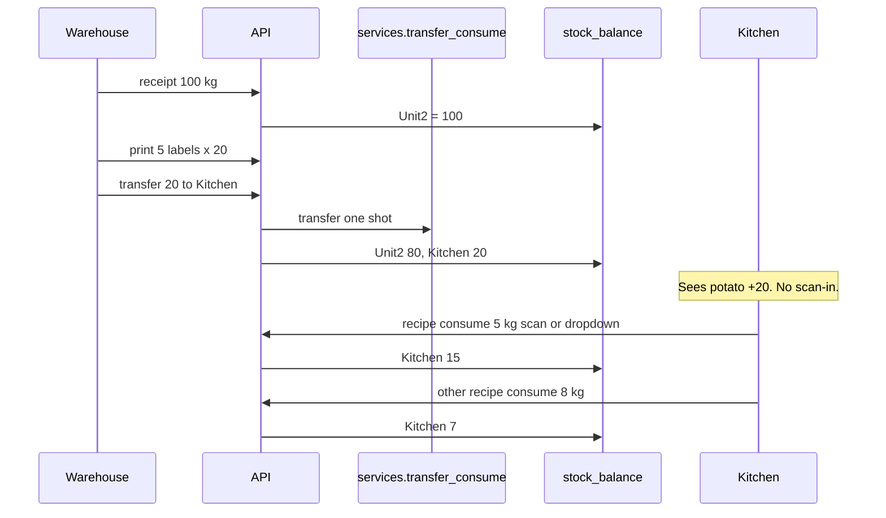
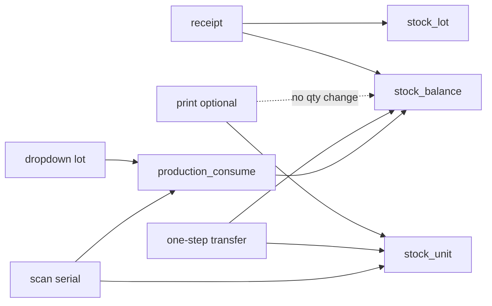

# Build chunks (approve one at a time)

| Chunk | Build | Done when |
|---|---|---|
| **1** | Models + migration `0010` | Tables exist; no API yet |
| **2** | Print helpers + `POST /stock/stock-units/print/` | Labels for receipt **or** production_output entry |
| **3** | `GET /stock/stock-units/<unit_serial>/` | Scan → product/stock info |
| **4** | `POST …/consume/` | Scan consume |
| **5** | ~~scan transfer~~ **SKIPPED** | Goods Out = `POST /stock/transfer/` |
| **5b** | **Extend `POST /stock/receipt/`** | Optional print on same goods-in call |
| **6** | void + reprint | Damage / reprint audit |
| **7** | Tests | Green |

## Goods-in (unchanged path — no duplicate API)

Still exactly:

1. `POST /stock/lots/` — create lot  
2. `POST /stock/receipt/` — stock qty into warehouse  

Barcode does **not** replace either. Labels never add stock.

**Chunk 5b:** optional fields on the **same** receipt body:

```json
{
  "idempotency_key": "...",
  "lot_id": 1,
  "location_id": 8,
  "quantity": "100",
  "unit_id": 1,
  "print_unit_count": 5,
  "print_quantity_per_unit": "20"
}
```

When `print_unit_count` is set → after receipt, create `StockUnit`s + return them with GS1 in the receipt response.  
When omitted → receipt behaves exactly as today (no labels).

`POST /stock/stock-units/print/` stays only for **production_output** labels / printing later against an existing entry — not a second goods-in.

**Warehouse Goods Out (unchanged):** `GET /stock/balances/` + `POST /stock/transfer/` by lot.

---

# Barcode StockUnit — working plan + potato / box journey

## Verdict: safe to build

**Yes.** Additive layer only. Ledger maths stay in [`services.py`](stock_ledger/util/services.py).

| Layer | Owns |
|---|---|
| `stock_entry` + triggers | Immutable ledger |
| `stock_balance` | Qty per **(lot, location)** — what kitchen “sees” |
| `stock_lot` | Batch / trace number |
| **New** `stock_unit` | Optional physical label (bag / pallet / box group) |

**Rule:** print never adds stock; transfer/consume always posts ledger first, then updates the unit.

Balance math (already live):

```180:180:stock_ledger/util/services.py
    new_qty = entry.quantity if balance is None else balance.quantity + entry.quantity
```

---

## Clarifications (answers to your questions)

### 1. Step 4 — do we need scan-in? **No for warehouse → kitchen**

You were right to push back. Extra scan-in is **not** needed for same-site department moves.

| Move type | How it works | Kitchen action |
|---|---|---|
| **Same site** (Unit 2 warehouse → Kitchen) | **One** call to existing `transfer()` | **Nothing.** Their `stock_balance` goes up immediately |
| **Inter-site** (Unit 2 ↔ Unit 11 truck) | Optional two-step (`in_transit`) | Only if you care that stock is “on the road” |

**Default we will build:** one-step transfer via [`transfer()`](stock_ledger/util/services.py) (~L464). Kitchen opens balances screen / recipe dropdown and already sees more potato. No second scan.

Two-step stays as an **optional later** path for site-to-site only — not in the happy path.

### 2. Partial use across many recipes — **yes**

A bag/pallet is **not** “all or nothing.”

- Recipe A uses 5 kg → unit remaining 15, balance −5
- Recipe B uses 8 kg → unit remaining 7, balance −8
- Same `stock_unit` (or same `stock_lot` via dropdown) reused until remaining hits 0

### 3. Scan **or** dropdown — **both**

| UI | What you send | Backend |
|---|---|---|
| **Dropdown** (trace / lot list, FIFO by `use_by`) | `lot_id` + qty | Existing `POST /stock/production/<output>/consume/` → `production_consume()` |
| **Scan** barcode | `unit_serial` + qty | New `…/stock-units/<serial>/consume/` → posts same ledger consume, also decrements that unit |

Dropdown does **not** require barcodes. Scan is a shortcut that picks the exact physical unit (and thus its lot).

FIFO for packing recipes = frontend sorts `stock_balance` / lots by `use_by` (oldest first); backend already accepts whichever `lot` you send.

### 4. Pallet of 920 boxes — **yes, goods-in big, goods-out small**

Example:

1. Goods in: **receipt +920** (one pallet, one lot). Optionally print **1** StockUnit with `quantity_initial=920` (pallet label), not 920 stickers.
2. Transfer 320 to packing: `transfer(quantity=320)` → Unit2 balance 920→600, packing 0→320; if a pallet unit exists, its `quantity_remaining` 920→600 (or you split units — see below).
3. Later transfer 200: same pattern.
4. Packing recipe consume 50 boxes from dropdown (FIFO lot) or scan pallet label with qty=50.

**You do not need one label per box** unless you want individual box traceability. For folded boxes, **one lot + optional one pallet unit** is enough.

---

## Two ways to label (pick per product)

| Pattern | Goods in | Move / use | When to use |
|---|---|---|---|
| **A. Individual bags** | receipt 100; print 5 units × 20 | Transfer/consume whole or partial bag | Potatoes, sealed bags you scan one-by-one |
| **B. Bulk pallet** | receipt 920; print **1** unit × 920 | Transfer/consume any qty ≤ remaining | Boxes, bulk packs |

Both share the same tables; only `unit_count` / `quantity_per_unit` at print time differ.

---

## Plain-English journeys

### Journey A — 5 × 20 kg potato bags



#### Step 1 — Goods in 100 kg

| Table | Change |
|---|---|
| `stock_lot` | One potato lot (`trace_number`, `use_by`) |
| `stock_entry` | `receipt` **+100** @ Unit2 |
| `stock_balance` | `(lot, Unit2)` = **100** |

#### Step 2 — Print 5 bag labels (optional)

| Table | Change |
|---|---|
| `stock_unit` × 5 | each remaining=20, location=Unit2 |
| `stock_unit_print_event` × 5 | initial |

`stock_balance` still 100. Print ≠ extra stock. Guard: `5×20 ≤ receipt.quantity`.

#### Step 3 — Transfer one bag to kitchen (**one step**)

Warehouse: `POST /stock/transfer/` or scan-transfer with `to_location=Kitchen`, qty=20.

Calls [`transfer()`](stock_ledger/util/services.py): OUT −20 @ Unit2 + IN +20 @ Kitchen, same `transfer_group_id`.

| Table | Change |
|---|---|
| `stock_entry` | 2 rows (out/in) |
| `stock_balance` | Unit2 100→80; Kitchen 0→20 |
| `stock_unit` (if scanned) | `location=Kitchen` |

**Kitchen does nothing.** Their stock level already increased.

#### Step 4 — Cook: partial consume, many recipes

**Option dropdown:** pick lot by trace / FIFO → existing `production_consume(lot, quantity=5)`.

**Option scan:** scan bag → `consume_unit(serial, quantity=5)` → same `production_consume` + unit remaining 20→15.

| Table | After 5 kg used |
|---|---|
| `stock_entry` | `production_consumption` **−5** |
| `stock_genealogy` | edge to output |
| `stock_balance` | Kitchen 20→15 |
| `stock_unit` | remaining 15, `partially_consumed` |
| `stock_unit_consumption` | +1 row |

Next recipe uses 8 kg from same bag/lot → remaining 7, balance 7. No need to finish the bag in one go.

---

### Journey B — 1 pallet × 920 folded boxes

#### Goods in

| Table | Change |
|---|---|
| `stock_lot` | One box lot |
| `stock_entry` | `receipt` **+920** @ warehouse |
| `stock_balance` | warehouse = 920 |
| `stock_unit` (optional) | **1** row: initial=920, remaining=920 (pallet label) |

#### Goods out / transfer in chunks

| Action | Ledger | Balance | Pallet unit |
|---|---|---|---|
| Give packing 320 | `transfer(320)` | WH 920→600; packing 0→320 | remaining 920→600 |
| Give packing 200 | `transfer(200)` | WH 600→400; packing 320→520 | remaining 600→400 |

#### Packing recipe (FIFO dropdown or scan)

Pick oldest lot from dropdown (or scan pallet) → `production_consume(quantity=50)`.

Balance packing −50; if unit linked, remaining −50. Same partial pattern as potatoes.

---

## Mental model (one line)

> **Ledger holds the kilos/boxes; labels are optional names for a chunk of that qty; kitchen stock rises on one transfer; recipes take any amount via dropdown or scan until the chunk is empty.**



---

## What “working” means (scope)

- Models + migration `0010` (`StockUnit`, `StockUnitConsumption`, `StockUnitPrintEvent`)
- [`stock_units.py`](stock_ledger/util/stock_units.py): serial, GS1, print, **partial** consume, **one-step** transfer (update unit location), void, reprint
- FBVs under `/stock/stock-units/…`
- Tests: bags + pallet chunk transfer + partial multi-recipe consume; dropdown path uses existing consume API
- **Skip for v1:** mandatory scan-in, SalesOrder, auth rewrite, printer/ZPL, frontend bwip-js
- **Later optional:** inter-site `in_transit` two-step

**Do not:** duplicate balance math, treat print as a second receipt, force kitchen to confirm same-site transfers.
