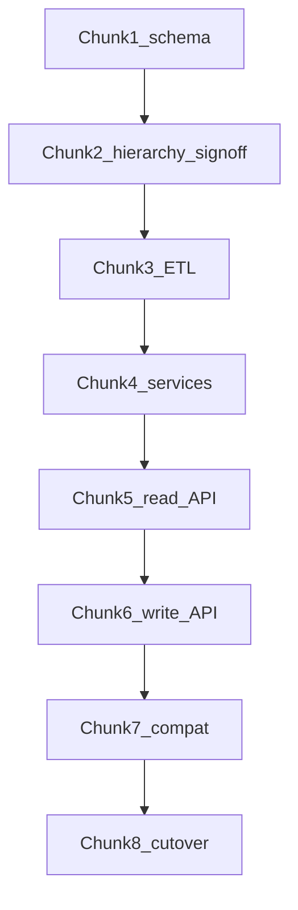

# Decouple tblcontainers — chunked build plan

## Locked rules

- **New Locations path:** Django ORM + REST API only. Frontend calls API. **No new triggers, stored procedures, or DB functions.**
- **Business rules** (rename/delete guards, hierarchy cycles, flag mapping) live in Python services.
- **Never renumber** `tblcontainers.id` — new `loc_location.id` = same ints.
- **Ignore Django admin tables** for now (no `django.contrib.admin`; do not migrate auth/sessions into ERP as a goal of this work).
- **Do not touch** stock/planning ADJACENT procs/functions in this project.

## Target tables (Chunk 1 creates these empty)

| Table | Purpose |
|---|---|
| `loc_location` | Core identity: name, external_code, visible, static, locked, timestamps. PK = legacy id |
| `loc_location_role` | Roles: internal, process, supplier, customer, courier, depot, storage, transform |
| `loc_location_feature` | UI/process flags: customer_orders, forecasts, picking_list, etc. |
| `loc_stock_profile` | 1:1 stock/production identifiers, shelf life, real_stock, etc. |
| `loc_location_edge` | Single hierarchy: parent_id + child_id, unique pair, FKs |
| `loc_address` | Addresses (from mainaddress + postal table) |
| `loc_contact` | Contacts (merge of two legacy contact tables; can be empty initially) |

Out of scope columns: `customerTotalDelivered`, packaging vessels, slope/reconcile.

## Chunks (approve one at a time)

### Chunk 1 — Schema only (NEXT)
Django models + `locations` migration that creates empty `loc_*` tables. No ETL, no API, no dual-write.

### Chunk 2 — Hierarchy reconcile
Worksheet of all 12 child edges + all `topcontainer` values; pick one parent truth per child. No code until signed off.

### Chunk 3 — ETL
Management command: copy 61 rows (+ edges/addresses) into `loc_*` with identical IDs + parity checks.

### Chunk 4 — Domain services
Python replacements for BEFORE UPDATE/DELETE trigger rules + hierarchy cycle checks + role/feature updates in one transaction.

### Chunk 5 — Read API
DRF list/retrieve location (+ roles, features, stock profile, edges, addresses).

### Chunk 6 — Write API
Create/update/delete via API only (frontend path).

### Chunk 7 — Compat for stock
Projection/dual-write so existing stock tables still see legacy-shaped data / same IDs until stock moves to API.

### Chunk 8 — Cutover
Frontend on API; document when CORE triggers on `tblcontainers` can be disabled (not required for new path; only for leftover legacy writers).

## Legacy diagnosis (short)

- `tblcontainers` = god table (61 rows).
- Dual hierarchy is inconsistent (edge parent≠`topcontainer`).
- CORE triggers = audit + rename/delete guards → move to Python.
- CORE functions = thin getters → move to Python/API.
- Hard FKs from `tblproducts` etc. force ID preservation + strangler.
