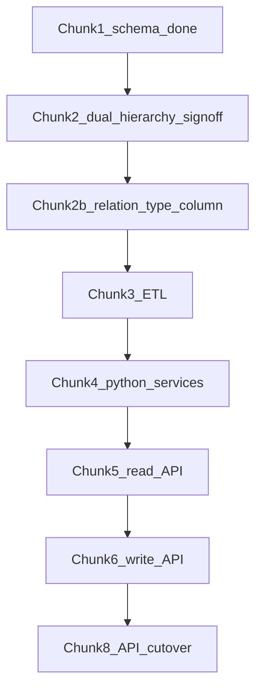

# Decouple tblcontainers — chunked build plan

## Locked rules (updated)

- **Target stack:** Django ORM + REST API only. Frontend calls API.
- **No VB Access** going forward.
- **No new triggers / stored procedures / DB functions.** Business logic in Python.
- **Current ERP `production` SPs are not a runtime constraint** for this microservice — we will reimplement behaviour in Django when each consumer moves.
- **Non-negotiable:** migration must **preserve business meaning and calculation accuracy**. Same location IDs. Same zone vs subordinate-storage semantics. Same role/stock-profile facts.
- **Never renumber** ids (`loc_location.id` = legacy `tblcontainers.id`).
- **Ignore Django admin tables** for now.

## Why dual hierarchy stays (accuracy, not SP loyalty)

Audited on `production`: two different business relationships, both real:

| relation_type | Legacy source | Business meaning | Accuracy impact if dropped |
|---|---|---|---|
| `zone_group` | `topcontainer` | Zone/group (Cold Storage, Low Risk) | Lose process/storage grouping used for organisation and historical top-container logic |
| `subordinate_storage` | child-edge table | Site subordinate bins (Unit 11, Dispatch, Unit 2) | Lose “parent site includes child freezer/chiller stock” behaviour (today in sales-order stock allocation) |

We keep **both in `loc_location_edge` with `relation_type`** so when Stock/Sales are rewritten in Django, calculations can match legacy behaviour. We do **not** keep MySQL SPs — we keep the **data facts** those SPs used.

Signed map: [core/document/chunk2_hierarchy_reconcile.csv](core/document/chunk2_hierarchy_reconcile.csv)

## Target tables

| Table | Purpose |
|---|---|
| `loc_location` | Core identity; PK = legacy id |
| `loc_location_role` | Roles |
| `loc_location_feature` | UI/process flags |
| `loc_stock_profile` | Stock/production identifiers, real_stock, shelf life |
| `loc_location_edge` | parent/child + **`relation_type`** (`zone_group` \| `subordinate_storage`) |
| `loc_address` | Addresses |
| `loc_contact` | Contacts |

## Chunks

### Chunk 1 — Schema only — DONE
Empty `loc_*` tables.

### Chunk 2 — Hierarchy sign-off — AWAITING APPROVE DUAL
CSV map with both relationship types. No pick-one.

### Chunk 2b — Edge schema tweak
Add `relation_type` to `loc_location_edge` + unique `(relation_type, parent, child)` (and likely unique `(relation_type, child)` so one parent per type).

### Chunk 3 — ETL
Copy 61 locations + both edge sets + addresses/roles/features/stock profiles into `DB_LOCATIONS` with parity checks.

### Chunk 4 — Domain services
Python: rename/delete guards, cycle checks, helpers like `get_zone_parent`, `get_subordinate_children` (replacements for old getter/SP behaviour).

### Chunk 5–6 — Read/Write API
DRF only path for frontend.

### Chunk 7 — Compat (optional)
Only if another service still must read legacy-shaped rows during transition. Not required if everything new goes through Locations API.

### Chunk 8 — Cutover
Frontend on API; document retirement of VB + container triggers/SPs on ERP when those consumers are gone.

