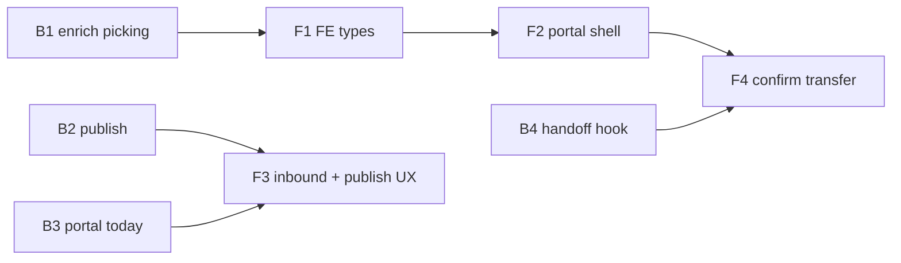

# Department portal — chunk list

**Rule:** one master portal template, location = department. Keep PDF print as fallback until floor adopts portal.

---

## Backend chunks (`svc-locations-django`)

| Chunk | Name | Deliverable |
|---|---|---|
| **B1** | Enrich picking-list | IDs on lines + `to_location` filter + tests |
| **B2** | Plan publish | `published_at` + `POST .../publish/` + PlanEvent |
| **B3** | Portal today API | `GET /planning/portal/today/?location=` |
| **B4** | Handoff hook | Optional event/progress after stock transfer |
| **B5** | Production (later) | Case / production_output wiring |
| **B6** | Notify (later) | In-app / push |

---

## Frontend chunks (`notazone-frontend-web`)

Separate plan: [department_portal_frontend.plan.md](/Users/utsavgohel/projects/gazebo-erp/fronten/notazone-frontend-web/.cursor/plans/department_portal_frontend.plan.md)

| Chunk | Name | Deliverable | Depends on |
|---|---|---|---|
| **F1** | Types + mappers | Consume enriched picking IDs | B1 |
| **F2** | Portal shell | Nav + dept select + outbound table (read-only) | F1 |
| **F3** | Inbound + publish UX | Inbound tab; planner Publish | B2, B3, F2 |
| **F4** | Confirm transfer | Button → `/stock/transfer/` | F2, stock API |
| **F5** | Production UI (later) | Make case / onward | B5 |
| **F6** | Notify UI (later) | Badge / today’s plan alert | B6 |

---

## Chunk B1 — first build (approve this next)

**Goal:** Make picking-list actionable for a future portal without building the portal yet.

**Why first:** Frontend portal and stock handoff both need `product_id` / location IDs. Today response is names-only (and tests assert no IDs).

### Scope

Files:

- [planning/services/picking.py](planning/services/picking.py)
- [planning/views.py](planning/views.py) — pass `to_location`
- [planning/tests.py](planning/tests.py)
- [docs/planning-redesign/chunk-07-http-api/NOTES.md](docs/planning-redesign/chunk-07-http-api/NOTES.md)

### API (same route)

`GET /planning/plans/<plan_id>/runs/<run_id>/picking-list/`

Query:

- `from_location` — outbound filter (existing, name)
- `to_location` — inbound filter (new, name)

Each **line** adds (keep existing name fields):

- `product_id`
- `from_location_id`
- `to_location_id`
- `requirement_ids` — list of aggregated requirement PKs

Response also echoes filters:

- `from_location` / `to_location` (as today for from)

`by_department` stays name-based for now (optional: add `from_location_id` later).

### Out of scope for B1

- No `published_at` / publish endpoint
- No portal today endpoint
- No stock transfer changes
- No frontend portal page
- PDF print path unchanged

### Done when

- Tests assert IDs present and aggregation still correct
- `?to_location=Sleeving` returns only lines delivering to Sleeving
- Existing `?from_location=Unit 11` still works
- Docs note updated (names + ids)

### After B1

You approve **F1** (frontend types) and/or **B2** (publish) next.

---

## Product reminder (all chunks)

1. **Outbound** — I am `from_location` → pick & deliver to X  
2. **Inbound** — I am `to_location` → expecting from Y → later produce/transfer onward  

Same template; Unit 11 → Sleeving → Dispatch is location context only.
