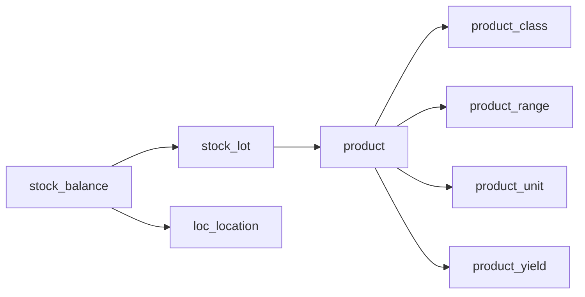

# Enrich stock balances for Stock Overview

## Field map (UI → source)

| UI column | API field | Source |
|---|---|---|
| Date | `updated_at` | `stock_balance.updated_at` (balance last change; not production date) |
| Item ID | `product_id` (+ optional `location_name` on FE) | `lot.product_id` |
| Location | `location_id`, `location_name` | `stock_balance.location` |
| Class | `product_class_id`, `product_class_name` | `product.product_class` |
| Range | `range_id`, `range_name` | `product.range` |
| Item Name | `product_name` | `product.name` (already added) |
| Item Code | `recipe_code` | `product.recipe_code` |
| Quantity | `quantity` | `stock_balance.quantity` (already) |
| Unit | `unit_id`, `unit_name` | `product.unit` |
| Production Date | `production_date` | `stock_lot.production_date` |
| Use By | `use_by` | `stock_lot.use_by` |
| Trace Number | `trace_number` | `stock_lot.trace_number` (already added) |
| Yield | `yield_factor` | `product_yield.yield_factor` via `product.yield_data` |

Assumption: **Date** = balance `updated_at`. Production/use-by stay as their own columns.



## Backend — one change

In [`stock_ledger/views.py`](stock_ledger/views.py) `balance_list_api`:

- Widen `select_related`:
  - `location`
  - `lot__product__product_class`
  - `lot__product__range`
  - `lot__product__unit`
  - `lot__product__yield_data`
- Expand each row with the fields above (keep existing `lot_id` / `location_*` / qty fields).

Example row shape:

```json
{
  "lot_id": 1,
  "product_id": 2369,
  "product_name": "GG-Chicken Thigh Bites - Pakora - ...",
  "recipe_code": "CCPKC3a",
  "product_class_id": 3,
  "product_class_name": "Packed Items",
  "range_id": 14,
  "range_name": "Snacks",
  "unit_id": 2,
  "unit_name": "unit",
  "yield_factor": "1.000000",
  "trace_number": "26149",
  "production_date": "2026-05-29",
  "use_by": "2027-05-29",
  "location_id": 42,
  "location_name": "Sleeving",
  "quantity": "976.000000",
  "quantity_base": "976.000000",
  "last_entry_id": 99,
  "updated_at": "2026-07-30T12:00:00+00:00"
}
```

No migration. No new endpoints.

## Frontend — wire Stock Overview

Already has stubs in [`StockBalanceRow`](C:/Users/varun/projects/gazeboo-cloud/frontend/gazeboo-cloud-web/src/features/stock/types.ts) / [`mapBalanceRow`](C:/Users/varun/projects/gazeboo-cloud/frontend/gazeboo-cloud-web/src/features/stock/api/stockMappers.ts) that leave `unitName` / `productCode` / `batchNo` null.

1. Extend `StockBalanceRow` with: `className`, `rangeName`, `traceNumber`, `productionDate`, `useBy`, `yieldFactor` (and map `recipe_code` → `productCode`, `unit_name` → `unitName`, `trace_number` → `batchNo` or dedicated `traceNumber`).
2. Update `mapBalanceRow` to read the new snake_case fields.
3. Update columns in [`StockOverviewPage.tsx`](C:/Users/varun/projects/gazeboo-cloud/frontend/gazeboo-cloud-web/src/features/stock/pages/StockOverviewPage.tsx) to match the Gazebo list (Date, Item ID, Location, Class, Range, Item Name, Item Code, Qty, Unit, Production Date, Use By, Trace, Yield).
4. Update search blob in [`filters.ts`](C:/Users/varun/projects/gazeboo-cloud/frontend/gazeboo-cloud-web/src/features/stock/utils/filters.ts) to include recipe code / class / trace.

## Out of scope

- Separate lot-number field (use `trace_number`)
- ATP / reserved / stock-value / warning thresholds (still not on balance API)
- N+1 product detail calls from the FE
