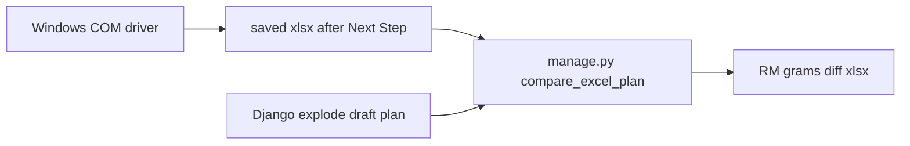

# Windows Excel vs system RM compare

Yes. Split into two jobs: **Excel must run on a company-LAN Windows PC with Excel**. Django compare already exists and can run anywhere with DB access.



openpyxl **cannot** click **Next Step** or talk to the factory SQL the macros use. That is Excel COM (`win32com.client`) on the LAN box only.

## Already in this repo

[`planning/services/excel_compare.py`](planning/services/excel_compare.py) + [`planning/management/commands/compare_excel_plan.py`](planning/management/commands/compare_excel_plan.py):

- Read **PACKING PLAN** col B/C, col M cases
- Read sheets whose name contains **FRESH PRODUCTS**
- Map RM via [`docs/planning-compare/code-map.json`](docs/planning-compare/code-map.json)
- Create **draft** plan, explode, compare RM, write report (grams + % + `fix` hint for ~20% yield)

First item we will **not** invent a second compare engine.

**Column check on first run:** current `parse_rm` treats **col F as kg**, starts at **row 5**. You described **col E grams**, data from **row 4**. After the first COM dump we align the parser to the live sheet. Do not guess.

## What we will add (minimal)

One Windows-only script, not a Django dep: `scripts/drive_bhargav_excel.py` (pywin32, already how Windows talks to Excel; do not add xlwings).

Per SKU:

1. Open template **ReadOnly**: [`docs/master-template/Master Template - DAY PLANNING TEMPLATE - 19.08.2026- V1.xlsm`](docs/master-template/Master Template - DAY PLANNING TEMPLATE - 19.08.2026- V1.xlsm)
2. **Home** `C4` = plan date (`2026-08-24`). Leave **C7** Planning by untouched.
3. **PACKING PLAN**: find row with FG code in col B (or `--row`); set that row **M = 2000**; zero other M so macros do not mix SKUs.
4. Click **Next Step** (discover `OnAction` / `Application.Run` on first run; wait ~30s until **Fresh Products By Supplier** has rows).
5. Copy that sheet (B = purchase code, E or F = qty after we verify) to `docs/planning-compare/runs/<code>-2000.xlsx` (values only).
6. Call existing compare:

```text
python manage.py compare_excel_plan --excel <dump.xlsx> --location-id <id> --plan-date 2026-08-24 --qty-mode cases
```

CLI flags: `--code`, `--cases 2000`, `--date`, `--excel` path. No 300-item loop until one SKU report is signed off.

## Yield (do not auto-write recipes)

Diffs go in the compare report. If % is large, `fix` already says check `yield_pct` / `process_loss`.

Optional extra column only: **implied yield %** = `excel_g / system_g * current_yield_pct` (today often 100). **No PATCH** of recipe yield until you pick an SKU. Yield API is already live (`yield_pct` → stored `process_loss` factor).

## Constraints

- Script runs **on the LAN desktop**, Excel installed, same network as Bhargav’s file.
- ~30s per SKU → 300 items ≈ 2.5h sequential; later we can loop a code list from PACKING PLAN col B.
- Excel UI can stay visible; do not fight hidden Excel if macros show dialogs (fail loud, do not click unknown MessageBoxes).

## First SKU to prove

You pick the PACKING PLAN code (e.g. first real row 6). We run 2000 cases, dump RM, compare, then show you the gram table. After that, loop.
