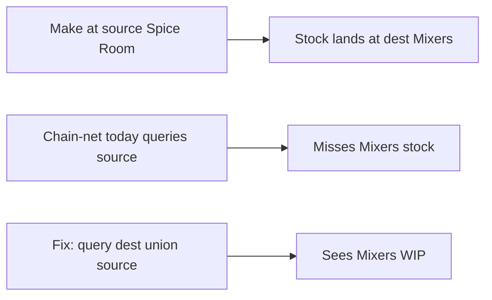

# Fix process stage stock (source vs destination)

## What is going wrong

On plan **24** (5000 × Vegetable Samosa), FG stock works (261 at Dispatch). Every process row shows **stock 0** even though live balances exist.

Cause in [`planning/services/chain_net.py`](planning/services/chain_net.py):

```24:39:planning/services/chain_net.py
def _stage_location_ids(..., is_top_fg: bool) -> list[int]:
    """FG: dest ∪ source. Children/WIP/raw: source only."""
    if is_top_fg:
        ...
    return [source_id]  # children: source only
```

Your flow: once a process SKU is made, it is **delivered to the next department** (destination). Chain-net looks at the **make room** (source).

| Process SKU | Source (queried today) | Dest (where stock sits) | Live stock | Chain sees |
|-------------|------------------------|-------------------------|------------|------------|
| 2600 Spice | Spice Room | Mixers | **138150** at Mixers | 0 |
| 3143 Belt | Belts | Fryers | **300** at Fryers | 0 |
| 910121 Tray | High Risk | Sleeving | **344** at Sleeving | 0 |
| 2823 Steamed carrot | Steaming | Mixers | **2068** at Mixers | 0 |
| 3071 Mixer / 3229 Frying | Mixers / Fryers | next | none anywhere | 0 (correct) |

Secondary confusion: Global Stocks in Spice Room / Mixers / Belts is mostly **raw materials** (BALTI PASTE, pastry, etc.). Those feed the **Ingredient Plan** tab, not the process rows. Process rows only net the **intermediate SKU** (e.g. `Vegetable Samosa - 003 - Spice`), which lives at Mixers after make — not as “spice pack sitting in Spice Room”.



## Fix (one rule)

Change `_stage_location_ids` so **every** node uses **destination ∪ source** (same as FG today). Drop the `is_top_fg` special case for location picking (keep `is_top_fg` only if still needed elsewhere for other behavior; for locations, always union).

- Matches “made → delivered to next dept”.
- Still catches WIP left at source if any.
- Materials with only `source` set keep working; if both set, both are searched.

Update the docstring and any comments that say “children: source only”.

## Verify

Re-run chain-net on plan 24; expect process rows roughly:

- Spice stock ≈ 138150 → large cut in spice `to_make`
- Belt ≈ 300, Tray ≈ 344, Steamed carrot ≈ 2068
- Mixer / Frying stay 0 if no balances
- FG unchanged (already dest∪source)

Adjust / extend [`planning/tests_chain_net.py`](planning/tests_chain_net.py) if it asserts source-only for children.

## Out of scope

- Do not change standard explode.
- Do not invent WIP for Mixer/Frying when there is no balance row.
- Materials tab already aggregates leaves; this fix is about process `product_lines` stock.