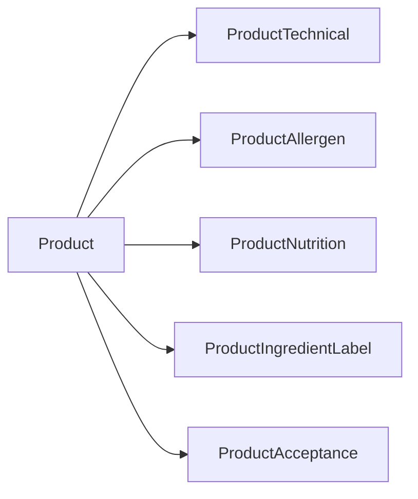

# Food compliance schema (beyond `product_technical`)

## Decision

Do **not** turn `product_technical` into another wide god-table. Keep it for existing GMO / temperature / spec-review fields. Add **new 1:1 (and row-based allergen) satellites** matching the product normalization pattern already used in [`product/models.py`](product/models.py).

## What you listed → tables

### 1. Allergens — `product_allergen` (rows, not 28 columns)

One row per allergen declared for a product. EU-14 codes + explicit `none`.

| Field | Type | Notes |
|---|---|---|
| `product` | FK → `product` | |
| `allergen_code` | CharField choices | `none`, `celery`, `crustaceans`, `eggs`, `fish`, `gluten`, `lupin`, `milk`, `molluscs`, `mustard`, `nuts`, `peanuts`, `sesame`, `soya`, `sulphites` |
| `contains` | Boolean | |
| `may_contain` | Boolean | |

Constraints:
- Unique `(product, allergen_code)`
- Check: not both false unless we allow sparse rows (store only declared rows; “None” = single row with `allergen_code=none`)
- Check: if `none`, then `contains`/`may_contain` false and no other allergen rows for that product (enforced in service layer for now)

Matches your UI matrix without exploding column count.

### 2. Nutrition — `product_nutrition` (1:1)

Typical values **per 100g**:

| Field | Type |
|---|---|
| `energy_kj` | Decimal |
| `energy_kcal` | Decimal |
| `fat_g` | Decimal |
| `saturates_g` | Decimal |
| `carbohydrate_g` | Decimal |
| `sugars_g` | Decimal |
| `fibre_g` | Decimal |
| `protein_g` | Decimal |
| `salt_g` | Decimal |

Bespoke nutrition labels (“Manage via Control panel”) = **future template feature**, not columns here.

### 3. Ingredient label — `product_ingredient_label` (1:1)

| Field | Maps to |
|---|---|
| `name` | Name |
| `description` | Description |
| `per_srp` | Per SRP |
| `per_box` | Per Box |
| `free_text_a` | Free Text 1 |
| `free_text_b` | Free Text 2 |
| `size_text` | Size Text |
| `storage` | Storage |
| `cooking_preparation` | Preparation / cooking |
| `average_weight` | Average weight |
| `per_pallet` | Per Pallet |
| `per_case` | Per Case |
| `ingredients_text` | Ingredients Input (`**bold**` markup preserved as text) |

### 4. Acceptance — `product_acceptance` (1:1)

| Field | Maps to |
|---|---|
| `min_acceptable_shelf_life_days` | Min acceptable shelf life |
| `acceptance_note` | Acceptance note |

(Related shelf-life numbers stay on existing `product_shelf_life`.)

### 5. Keep on `product_technical` (unchanged)

`is_gmo_free`, temp checks, spec sign-off / next review.

## Extra compliance fields worth adding now

Small, common for food ops — include in the same migration:

- On `product_technical`: `is_vegetarian`, `is_vegan`, `country_of_origin` (CharField)
- On `product_ingredient_label`: `ingredients_bold_markup` already covered by `ingredients_text`; no separate field needed

## Explicitly out of scope (this chunk)

- Label **template** management (Box / Goods-in / Labels “manage templates”) — separate CRUD entities later
- Bespoke nutrition label templates via Control panel
- Compatibility view / backfill from legacy `tblproducts`

## Implementation steps

1. Add models to [`product/models.py`](product/models.py): `AllergenCode` TextChoices, `ProductAllergen`, `ProductNutrition`, `ProductIngredientLabel`, `ProductAcceptance`; extend `ProductTechnical` with vegetarian/vegan/country_of_origin.
2. `makemigrations product` → apply migration.
3. Update [`product/management/commands/seed_demo_product.py`](product/management/commands/seed_demo_product.py) so Peri Peri Burger has realistic demo allergens, nutrition, ingredient label, and acceptance note.
4. Re-seed demo: `seed_demo_product --flush`.

## Files touched

- [`product/models.py`](product/models.py)
- new migration under `product/migrations/`
- [`product/management/commands/seed_demo_product.py`](product/management/commands/seed_demo_product.py)
- optionally a one-line note in [`.cursor/plans/table_products.md`](.cursor/plans/table_products.md) listing the new satellites (only if you want the plan doc kept in sync)