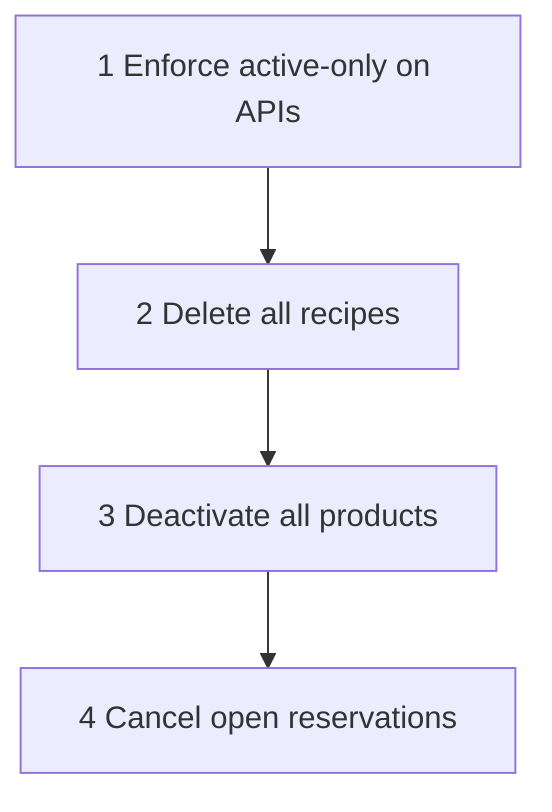

# Soft clear + active-only APIs

## Best approach (no flow break)

1. Soft-deactivate products (`is_active=False`) — same as existing `DELETE /product/:id/`
2. Hard-delete all recipes (components → versions → recipes)
3. Cancel open stock reservations only (ledger stays)
4. **Every API that lists or references products only sees `is_active=True`**



## Gap today

| Area | Current | Needed |
|---|---|---|
| `GET /product/` | Already `is_active=True` | Keep |
| `GET /product/:id/` | Returns inactive | **404 if inactive** |
| Satellite `/product/:id/...` | Loads any product | **404 if inactive** |
| `GET /recipe/` | All recipes | **`product__is_active=True`** |
| Recipe create / component product | Any product id | **Require active** |
| Stock lots / balances lists | All lots | **`product__is_active=True`** (or `lot__product__is_active`) |
| Stock create lot / movements | Any product | **Require active** |
| Supplier product lists | Product exists only | **Require product active** |

Exception (locked): `PATCH /product/:id/` still loads inactive rows so you can set `is_active=true` to restore. `DELETE` on already-inactive is idempotent.

## Implementation

### 1. Shared helper

Add to [`product/models.py`](product/models.py) or a tiny [`product/query.py`](product/query.py):

```python
def active_products():
    return Product.objects.filter(is_active=True)
```

Use everywhere instead of bare `Product.objects` for reads/FK checks (except PATCH restore path).

### 2. API filters (files)

- [`product/views/product_master_view.py`](product/views/product_master_view.py) — GET detail 404 if not active
- Product satellite views (flags, packaging, etc.) — resolve product via `active_products().get(pk=...)`
- [`product/views/supplier_product_views.py`](product/views/supplier_product_views.py) — require active product
- [`recipe/views.py`](recipe/views.py) — list filter `product__is_active=True`; create/component checks use active queryset
- [`stock_ledger/views.py`](stock_ledger/views.py) — lots/balances filter active product; create lot / writes reject inactive
- [`stock_ledger/util/services.py`](stock_ledger/util/services.py) — reject writes if product inactive (alongside downtime check)

### 3. Wipe command

[`product/management/commands/wipe_catalog_fresh.py`](product/management/commands/wipe_catalog_fresh.py)

```bash
python manage.py wipe_catalog_fresh --dry-run
python manage.py wipe_catalog_fresh
```

- Delete all `RecipeComponent` → `RecipeVersion` → `Recipe`
- `Product.objects.filter(is_active=True).update(is_active=False)`
- Cancel open `StockReservation` rows (match existing expire status)
- Print counts: active products=0, recipes=0

Lookups (category/unit/class/locations) stay.

## Verify

- `GET /product/` → `[]`
- `GET /recipe/` → `[]`
- `GET /product/<old_id>/` → 404
- Stock lots/balances for old products → not listed
- Create new active product → appears in list

## Out of scope

- Hard-delete products or stock ledger
- Deleting categories/units/locations
- Auto-purge inactive products later
