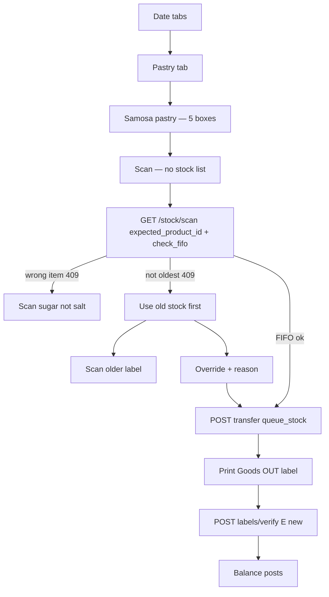

# Goods Out — scan-first FIFO, queue, verify

Phone flow (Belts stays on the line for the API, never shown):



## What already exists (do not rebuild)

- List: `GET /planning/portal/today/?mode=outbound&plan_date=` with `category_l2` — [planning/services/picking.py](planning/services/picking.py)
- Wrong item: `GET /stock/scan/?expected_product_id=` → 409 names — [stock_ledger/views.py](stock_ledger/views.py)
- FIFO order: `fifo_rank` 0 = oldest — [stock_ledger/util/fifo.py](stock_ledger/util/fifo.py)
- Goods In queue: `StockEntryPosting` queued → label verify → `POST /stock/entries/<id>/post/` — [stock_ledger/util/entry_posting.py](stock_ledger/util/entry_posting.py)
- Ephemeral Goods OUT print dict (issue only, posts immediately): `build_goods_out_label` — [stock_ledger/util/entry_labels.py](stock_ledger/util/entry_labels.py)

**Does not exist today:** FIFO-mismatch error, override history on the item, box qty on portal lines, queue+label on transfer, `post_entry` for anything except receipt.

## Boxes (same as Goods In)

Goods In already converts packs ↔ stock with `ProductSupplier.multiplier` (`stock_qty = packs × multiplier`, `pack_quantity = qty / multiplier`) in [stock_ledger/views.py](stock_ledger/views.py) `entry_dict`.

**Best way:** add those fields on each portal line from the product’s supplier mapping (same row goods-in uses). Phone shows `pack_quantity` + outer unit (Box), never `unit` / `to_location`.

If a pastry has no `product_supplier` row, there is no pack size — fall back to `net_quantity` with no UoM word. Fix data on the item, do not invent a second conversion.

## APIs to add / extend

### 1. Portal line — pack fields (additive)

Same [picking.py](planning/services/picking.py) helper. Keep `net_quantity` / `to_location` for old clients.

New: `pack_quantity`, `pack_unit_name`, `shape_format_label`.

### 2. Scan — FIFO check, no stock list

```
GET /stock/scan/?code=&location_id=&expected_product_id=&check_fifo=1
```

- Do **not** return `batches[]` when `check_fifo=1` (warehouse must not see all lots).
- Compare scanned lot to FIFO rank 0 at `location_id`.
- Match → 200, product + that lot only (`selected_lot_id`, `trace_number`).
- Older stock exists → **409**

```
message: Please use older stock first. Scan trace 20112 (use by 2026-08-01), or override.
data.error: fifo_mismatch
data.scanned_trace / recommended_trace / recommended_use_by / recommended_lot_id
```

Wrong product stays the existing 409 `wrong_product`. Incomplete `E` stays 400.

### 3. Queue Goods Out (transfer, not issue)

Stock must still exist at Belts after confirm. Reuse `POST /stock/transfer/` with `queue_stock: true` (same flag as receipt).

- `defer_balance` on **both** transfer_out and transfer_in (today transfer always posts).
- Create `StockEntryLabel` + `StockEntryPosting(queued)` on the **out** entry.
- Persist Goods OUT label (`title: Goods OUT`, `trace_number` = goods-in lot trace, `barcode: E{out_entry_id}`).
- Response: `{ out, in, posting, goods_out_label }` — print from `goods_out_label`.

Do **not** use `POST /stock/issue/` (that writes stock off the books).

Body includes `lot_id` from the scan, `from_location_id` from the line, `to_location_id` from the line (hidden on UI). If lot is not FIFO rank 0, require `fifo_override_reason`.

### 4. Verify then post (reuse Goods In URLs)

Same:

- `POST /stock/entries/<out_id>/labels/print/`
- `POST /stock/entries/<out_id>/labels/verify/` `{ "code": "E{out_id}", "post_stock": true }`

Extend [entry_posting.post_entry](stock_ledger/util/entry_posting.py): allow `transfer_out`; when posting out, also project the paired `transfer_in` (same `transfer_group_id`). Until verify, warehouse balance is unchanged.

### 5. Override history on item profile

New table `stock_fifo_override`: product, scanned lot, recommended lot, reason, actor, created_at, source entry id.

Written when transfer is queued with `fifo_override_reason`.

```
GET /product/<id>/stock-overrides/
```

`{ who, scanned_trace, recommended_trace, reason, when, entry_code }`

No email subsystem exists — this list is the admin notification. Email later if needed.

## Phone (no backend guess)

| Screen | Show | Hide |
|---|---|---|
| Requirement | name + pack qty | Unit, Belts, all lots |
| Scan | camera only | `batches[]` |
| FIFO 409 | recommended trace + Override | |
| After queue | print Goods OUT | |
| Verify | scan new `E{id}` | |

Override: reason required, then same queue POST.

## Files

- [planning/services/picking.py](planning/services/picking.py) — pack fields
- [stock_ledger/views.py](stock_ledger/views.py) — scan `check_fifo`; transfer `queue_stock` + label
- [stock_ledger/util/services.py](stock_ledger/util/services.py) — `defer_balance` on transfer
- [stock_ledger/util/entry_posting.py](stock_ledger/util/entry_posting.py) — post transfer pair
- [stock_ledger/util/entry_labels.py](stock_ledger/util/entry_labels.py) — persist Goods OUT label
- New model + `GET /product/<id>/stock-overrides/`
- Tests next to existing scan / picking / posting tests
