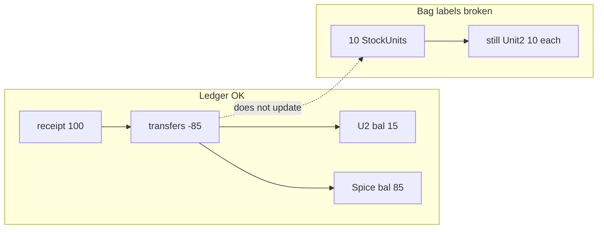

# Goods transfer multi-scan — audit + fix plan

## Your gut check (lot 109 SUGAR- / trace 26217)

**Ledger is alright. Bag layer is wrong. UI toast is wrong.**

| Check | Result |
|--------|--------|
| Receipt #423 | +100 @ Unit 2 (unit_id **6 Box**) |
| Transfers | −15, −30, −40 = **−85** out → Spice Room |
| Balance now | Unit 2 **15** · Spice Room **85** · total **100** |
| Your 4 cart serials | Still `active`, `qty_remaining=10`, **location still Unit 2** |
| All 10 labels on lot | Same — none moved, none drawn down |
| `StockUnitConsumption` | **0** rows for this lot |

So after Goods Out, scan still returns **10 / 10** and allows the bag again. That is not a scanner bug — **`POST /stock/transfer/` never touches `StockUnit`**.

Also: success text mixed **"Goods Out …"** with **"Receipt posted. Entry #423"** — #423 is the *old goods-in*, not the transfer (real move was #428/#429). UI toast glitch.

Secondary smell: transfers posted with `unit_id=1` ("unit") while bags/receipt use `unit_id=6` (Box). Numbers still added up this time; still fix FE to send the bag’s `unit_id`.



---

## Root cause

Phase 1 UI did the right *lot* call:

```json
POST /stock/transfer/
{ "lot_id": 109, "quantity": "40", "from_location_id": 8, "to_location_id": 15, ... }
```

Scan only **suggests** qty. Backend never learns which serials left. Half-bag / full-bag history lives only in `stock_balance`, not on the label — so re-scan looks fresh.

---

## How we stop these mistakes

**Rule:** stock math stays on the ledger; **bag truth stays on `StockUnit`**. Every scanned Goods Out must update both in one transaction. UI checks are UX only — backend rejects are what stop the mistake.

| Mistake you hit | Hard stop |
|-----------------|-----------|
| Re-scan after full bag moved | After transfer: `location_id = Spice`, so next Goods Out from Unit 2 gets **400** “wrong location” |
| Re-scan after half bag moved | Draw down `quantity_remaining` (e.g. 10→5); scan shows **5/10**; cannot move more than remaining |
| Cart total &gt; warehouse balance | Ledger already rejects overdraw; also reject if sum(unit_moves) ≠ body.quantity |
| Double Confirm | Existing `idempotency_key` — same key returns same transfer, no second move |
| Wrong toast (Receipt #423) | FE: Goods Out success only from transfer response (`out`/`in` entry ids) |
| Wrong UoM (unit 1 vs Box 6) | FE sends bag `unit_id`; BE validates it matches unit / product |

**Scan path vs manual path**

- **Scan cart Confirm** → `unit_moves` **required**. No silent lot-only transfer from a scan screen.
- **Manual FIFO** (no barcodes) → omit `unit_moves`; lot balance only (labels unchanged — operator accepts that).

**After each bag line in `unit_moves` (same txn as transfer_out/in):**

1. Validate serial: exists, same lot, status in `{active, partially_consumed}`, `location_id == from`.
2. Validate qty ≤ `quantity_remaining`.
3. **Whole bag** (`qty == quantity_remaining`): set `location_id = to`; leave remaining as-is (still full bag at dest).
4. **Partial bag** (`qty < quantity_remaining`): `quantity_remaining -= qty` at **from** (bag stays at Unit 2 with less left); dest gets lot qty via ledger only for that slice (no new serial unless we add split later).
5. If after update `quantity_remaining == 0` → `status = consumed` (only when emptied, not when merely relocated).
6. Else if remaining &lt; initial → `partially_consumed`.
7. Sum of move qtys must equal transfer `quantity`.

Then re-scan cannot look like a fresh 10/10 at Unit 2.

### What Unit 2 sees when they scan a finished / moved bag

GET scan always returns the unit (200) with truth fields; **Goods Out UI decides block + message** from those fields (do not soft-allow into cart).

| Bag state after honest updates | Scan at Unit 2 Goods Out | Message to show |
|--------------------------------|--------------------------|-----------------|
| Whole bag moved to Spice (`location=Spice`, remaining still &gt; 0) | Block | **Not at Unit 2 — this bag is at Spice Room** (qty still X there) |
| Bag emptied here or at dest (`remaining=0`, `status=consumed`) | Block | **This bag is empty / fully used** · last location: Spice Room |
| Void label | Block | **Void — do not use** |
| Still at Unit 2, remaining 5 of 10 | Allow | Cart row **5 / 10** |

So for “serial stock completed entirely”: say **empty / fully used**, and **where it last was** — not “used at Unit 2” unless `location_id` is still Unit 2.

**Transfer vs consume (important)**

- **Goods Out whole bag:** move `location_id` → dest; keep `quantity_remaining` (bag still full at Spice). Do **not** mark consumed.
- **Goods Out partial from one bag:** reduce `quantity_remaining` at source; only mark `consumed` when remaining hits 0; if whole remaining moved, treat as whole-bag move (location→dest, remaining stays the moved qty at dest).
- **Production / disposal consume:** draw remaining → 0 → `consumed` (bag used up).

Unit 2 never hears a fake “10/10 available” once either location or remaining is updated.

---

## Fix (blocking)

### Backend — bind serials on the same transfer API

Extend [`transfer_api`](stock_ledger/views.py) / [`services.transfer`](stock_ledger/util/services.py):

```json
{
  "idempotency_key": "...",
  "lot_id": 109,
  "from_location_id": 8,
  "to_location_id": 15,
  "quantity": "40",
  "unit_id": 6,
  "unit_moves": [
    { "unit_serial": "AKRP379ZEQKC", "quantity": "10" },
    { "unit_serial": "K6WJHW7YGB8H", "quantity": "10" },
    { "unit_serial": "4M235PJJJ3PT", "quantity": "10" },
    { "unit_serial": "S3QE6R30ZTZ3", "quantity": "10" }
  ]
}
```

### Frontend

1. Confirm from scan cart **must** send `unit_moves`.
2. Success toast from transfer `out`/`in` only — never receipt message.
3. On scan: reject wrong location / zero remaining / void / duplicate in cart.
4. Send bag `unit_id` (Box), never hardcode 1.
5. Show `location_balance` in header (e.g. 15 left at Unit 2).

### Do not rely on

- Frontend-only “already scanned” memory.
- Destination scan-in for same-site move.

---

## What was already correct (keep)

- Multi-scan cart, one transfer per lot
- No kitchen/Spice scan-in
- Idempotency keys on transfer
- Print ≠ stock

---

## Suggested repair for today’s test data (ops, not code)

After backend ships: either void/relabel leftover Unit 2 bags to match balance **15**, or a one-off script that does not invent stock — **do not** manually edit balances (they are already correct). Until then, treat barcodes on lot 109 as **untrustworthy for location/qty**; trust `stock_balance` only.
