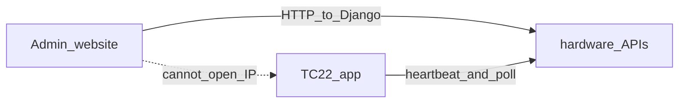

# What’s next, and what is possible

## Where you are

Backend for the five TC22Fs is done: register, stickers `GUN-01`–`GUN-05`, usage log, feed, `last_ip` / `last_user` / `last_seen_at`.

**Gap:** only **GUN-01** has `com.gazeboerp.warehouse`. GUN-02–05 are factory-fresh. The admin site cannot reach a gun by `172.16.0.224` — that IP is Wi‑Fi DHCP, not a server. Android blocks inbound TCP.

**Next real work:** install/ship the warehouse app to all five, then add a thin live channel. Not more USB enroll.

---

## 1. Is this device active?

Today `last_seen_at` only moves when the gun hits login/scan/stock with `X-Device-Serial`. Idle on a home screen looks **offline**.

**Possible (simple):** app POST every ~15s:

`POST /hardware/heartbeat/`  
headers `X-Device-Serial` + `X-Device-Ip`  
body `{ "screen": "goods_out", "user_id": 12 }`

Admin list: **green** if `last_seen_at` &lt; 30s, **amber** &lt; 5 min, **grey** else.

Ping `last_ip` from the server (ICMP) is **not** a good “in use” signal — Wi‑Fi sleep, ICMP often blocked.

---

## 2. What is he doing right now?

Possible if the app tells you the screen:

- `goods_in` / `goods_out` / `remaining` / `idle` / `offline_queue`
- last scan code (optional, noisy)
- `location_id` (Unit 2 vs 11)

Admin card: “Amit · GUN-03 · Goods Out · 8s ago”.

Without the app, you only see **last stock API** (`GET /hardware/usage/`) — after the fact, not live.

---

## 3. Send a popup from the website to that gun

You cannot push into Android by IP. Three real options:

| How | Popup when | Cost |
|---|---|---|
| **Inbox + poll** — admin `POST /hardware/devices/GUN-03/messages/` `{ "title", "body" }`; app GET every 5s; if new row, `Alert` | App open (or backgrounded with a timer) | Smallest. Fits 5 guns. |
| **FCM** — store `fcm_token` on `hw_device`; admin send → Firebase → system notification | App closed / screen off | Extra Firebase project + Play services (GMS TC22 has this) |
| **Zebra MDM** (StageNow / SOTI) MX notification | Even without your app | Ops/MDM, not this Django service |

**Recommend inbox+poll first.** Five devices, same Wi‑Fi, 5s poll is nothing. Add FCM later if they need a beep when the app is killed.

Example admin action: “Go to bay 4” → GUN-03 pops a dialog; operator taps OK; `acked_at` shows on the website.

---

## Suggested order (do not build all at once)

1. **Ship the warehouse APK** to GUN-02–05 (stickers already exist).
2. **Heartbeat + presence** on the device list (`online` / `screen` / `last_ip`).
3. **Admin → gun message** (inbox poll + on-screen alert).
4. FCM only if (3) is not enough when the app is in the background.

Skip: opening SSH/ADB over Wi‑Fi from the website, live screen mirror, per-keystroke tracking.
