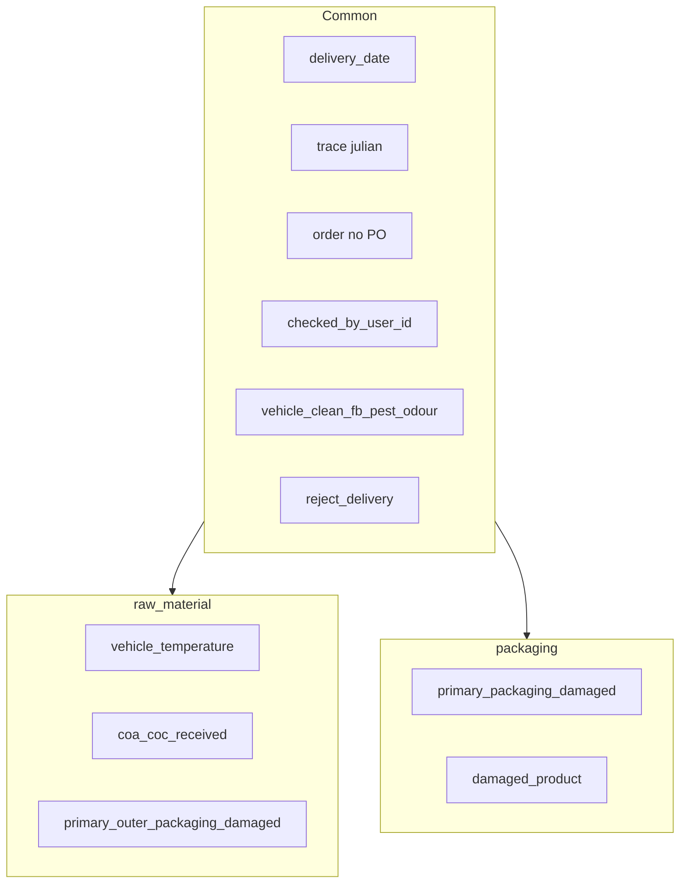

# Header QC by product type

## Verified field map (your breakdown)

**Correct — shared on every food + packaging paper form:**

| Field | Source | Code / body key |
|-------|--------|-----------------|
| Delivery Date | body / PO | `delivery_date` → `po.delivery_at` |
| Trace No | Julian (or override) | `delivery_trace_number` (auto) / `trace_override` |
| Order No | PO | `number` (not submitted; read-only) |
| Checked By | logged-in user | `checked_by_user_id` |
| Reject Delivery? | answer | `reject_delivery` |
| Vehicle Clean, Free from FB, Pest and Odour | answer | `vehicle_clean_fb_pest_odour` |

**Correct — raw material only** (`goods_in_type=raw_material`, chilled / frozen / ambient share this header today):

| Field | Code |
|-------|------|
| Vehicle Temp (°C) | `vehicle_temperature` (ambient → null / N/A) |
| COA/COC received | `coa_coc_received` |

**Also on raw material (you didn’t list — still on paper + seed):**

| Field | Code |
|-------|------|
| Primary & Outer packaging damaged? | `primary_outer_packaging_damaged` |

**Correct — packaging only** (`goods_in_type=packaging`):

| Field | Code |
|-------|------|
| Primary Packaging Damaged | `primary_packaging_damaged` |
| Damaged Product? | `damaged_product` |



Matches seed in [`seed_goods_in_templates.py`](purchasing/management/commands/seed_goods_in_templates.py): one `raw_material` header (regime=NULL) for chilled/frozen/ambient; one `packaging` header. Regime only changes how vehicle temp is filled (number vs N/A), not which header keys exist.

## How submit works


- Packaging line on PO → packaging template
- Else first line’s `goods_in_type` + `storage_regime`

## Example POSTs

**Raw material:**

```json
{
  "delivery_date": "2026-08-07",
  "checked_by_user_id": 12,
  "answers": {
    "vehicle_clean_fb_pest_odour": { "value": true },
    "primary_outer_packaging_damaged": { "value": false },
    "vehicle_temperature": { "value": "4.0" },
    "coa_coc_received": { "value": true },
    "reject_delivery": { "value": false }
  }
}
```

Ambient: same keys, `"vehicle_temperature": { "value": null }`.

**Packaging:**

```json
{
  "delivery_date": "2026-08-07",
  "checked_by_user_id": 12,
  "answers": {
    "vehicle_clean_fb_pest_odour": { "value": true },
    "primary_packaging_damaged": { "value": false },
    "damaged_product": { "value": false },
    "reject_delivery": { "value": false }
  }
}
```

## Remaining code changes

1. **Ambient temp optional** — `vehicle_temperature.required = False` in food header seed; re-run `seed_goods_in_templates`.
2. **Print PDF from template** — [`print_pdf.py`](purchasing/services/print_pdf.py) iterate `form['header']['items']` + always draw Delivery Date / Order No / Trace No / Checked By; null vehicle temp → `N/A`.
3. **No new URL** — keep single `pos/<po_id>/qc/header/`.
