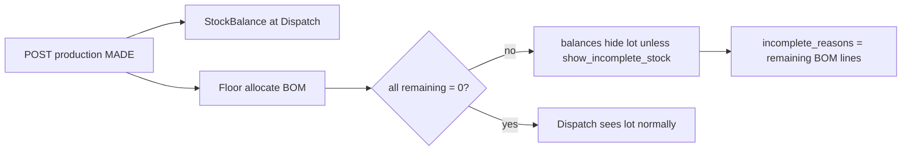

# Incomplete allocation — hide from Dispatch until BOM done

## Problem

Today `POST /stock/production/` posts `PRODUCTION_OUTPUT` and immediately projects `StockBalance` at `product.destination_container` (e.g. Dispatch / VersF). Entry 430 can already appear in Dispatch while Sleeving still shows Incomplete (BOM not fully allocated). Manager wants: **Dispatch must not see that stock until allocation is 100% complete**, with a **department admin toggle** and a clear **reason** for management.

## Decisions (confirmed)

1. **Complete** = every BOM line for that MADE row has `remaining_quantity == 0` (existing floor allocate via [`production_requirements`](stock_ledger/util/services.py) / [`production_consume`](stock_ledger/util/services.py)).
2. **Hold** = still post stock at Dispatch, but **filter it out of Dispatch-facing reads** until complete (no change to where the ledger posts).



## Mental model

- Ledger truth stays at Dispatch (no fake reverse-transfer).
- **Visibility** is gated by allocation completeness of the producing `PRODUCTION_OUTPUT` that created that lot (via genealogy / output entry for the lot).
- Process dept (Sleeving) list always shows Incomplete/Complete + why.
- Destination dept (Dispatch) only sees complete lots by default.

---

## Chunk 1 — Completeness helper + production list fields

Add `stock_ledger/util/allocation_status.py`:

```python
def allocation_status(*, output_entry_id) -> dict:
    # reuse production_requirements() without balances
    # status: 'complete' | 'incomplete' | 'no_recipe'
    # remaining_lines: [{component_product_id, name, remaining_quantity, needed, consumed}]
    # incomplete_reasons: human strings e.g. "CUSAL base still needs 12.5 kg"
```

Rules:
- No recipe / no components → treat as **complete** (nothing to allocate; do not block Dispatch).
- Any line with `remaining_quantity > 0` → **incomplete**.
- All zero → **complete**.

Extend [`production_list_row`](stock_ledger/views.py) (and detail) with:
- `allocation_status`
- `incomplete_reasons` (list of strings)
- `remaining_component_count`

Add list filter `?allocation_status=incomplete|complete|all` (default `all`) on `GET /stock/production/`.

**Done when:** Sleeving grid can show Incomplete and the BOM-based reasons without a second round-trip for every row (batch-compute for the page of runs).

## Chunk 2 — Department setting `show_incomplete_stock`

On [`LocationStockProfile`](locations/models.py):

```python
show_incomplete_stock = models.BooleanField(default=False)
```

- Migration on `locations`.
- Wire through existing `stock_profile` create/update in [`location_service.py`](locations/services/location_service.py) and presentation dict.
- Meaning: **when this location is the balance `location_id` being queried**, if `False` (default), hide incomplete lots; if `True`, include them (admin/ops override for that department).

Sleeving does not need this on for their own Incomplete work queue — they use the production list. Dispatch stays `False`.

## Chunk 3 — Gate Dispatch balances (and related reads)

In [`balance_list_api`](stock_ledger/views.py) / shared filter helper:

When `location_id` is set and that location’s profile has `show_incomplete_stock=False`:
- Exclude balances whose lot was created by a `PRODUCTION_OUTPUT` that is still incomplete (BOM remaining > 0).
- Lots with no production output origin (purchase receipts, opening) stay visible.
- Optional query override: `?include_incomplete=1` for support/admin, still respect profile unless override is allowed (use override only when explicitly requested; document it).

Also apply the same gate to any Dispatch-facing aggregate that lists sellable FG (e.g. [`warehouse_remaining_api`](stock_ledger/views.py) if it can include process destinations — only if those endpoints currently expose the same lots).

Do **not** change ATP/reservations in v1 unless they already read the same balance queryset.

**Done when:** after MADE with unfinished allocate, `GET /stock/balances/?location_id=<Dispatch>` does not return that lot; after last consume brings remaining to 0, the lot appears without a transfer.

## Chunk 4 — Management “why stopped” payload

On production list/detail (Chunk 1 fields) plus a thin endpoint for one row:

`GET /stock/production/<entry_id>/allocation-status/`

Returns full `production_requirements` summary + `status` + `incomplete_reasons`. Frontend Incomplete filter and management panel use this; no new write API.

## Chunk 5 — Tests + FE note

Tests (SQLite `core.settings_test`):
- MADE with recipe, no consume → incomplete; Dispatch balances empty for that lot when `show_incomplete_stock=False`.
- Consume all lines → complete; lot appears.
- Purchase lot at same Dispatch location never hidden.
- Profile `show_incomplete_stock=True` → incomplete lot visible.
- `?allocation_status=incomplete` filters production list.
- Product with no recipe → complete immediately.

Short FE note in `stock_ledger/docs/` (same style as barcode doc): Incomplete badge, Complete = BOM done, Dispatch list uses balances as today, admin toggle on department stock profile.

---

## Not doing (v1)

- Moving MADE to Sleeving then transferring on Complete (rejected — you chose B).
- Labels/print as a completeness gate (you chose BOM only).
- New Complete button that ignores BOM.
- Rewriting MRP `PlanAllocation` (different concept).

## Priority order

1. Accurate Dispatch visibility (Chunks 1–3).
2. Reasons for management (Chunk 1/4).
3. Department toggle (Chunk 2, required by 3).
