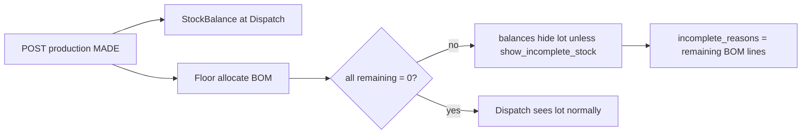

# Incomplete allocation — hide from Dispatch until BOM done

## Problem

Today `POST /stock/production/` posts `PRODUCTION_OUTPUT` and immediately projects `StockBalance` at `product.destination_container` (e.g. Dispatch / VersF). Entry 430 can already appear in Dispatch while Sleeving still shows Incomplete (BOM not fully allocated). Manager wants: **Dispatch must not see that stock until allocation is 100% complete**, with a **department admin toggle** and a clear **reason** for management.

## Decisions (confirmed)

1. **Complete** = every BOM line for that MADE row has `remaining_quantity == 0` (existing floor allocate via [`production_requirements`](stock_ledger/util/services.py) / [`production_consume`](stock_ledger/util/services.py)).
2. **Hold** = still post stock at Dispatch, but **filter it out of Dispatch-facing reads** until complete (no change to where the ledger posts).

## Mental model

- Ledger truth stays at Dispatch (no fake reverse-transfer).
- **Visibility** is gated by allocation completeness of the producing `PRODUCTION_OUTPUT` that created that lot (via genealogy / output entry for the lot).
- Process dept (Sleeving) list always shows Incomplete/Complete + why.
- Destination dept (Dispatch) only sees complete lots by default.

---

## Chunks — approve one at a time

| # | Chunk | Done when |
|---|---|---|
| 1 | Completeness helper + production list Incomplete/Complete + reasons + list filter | Sleeving grid can badge Incomplete and show why |
| 2 | Department setting `show_incomplete_stock` on `LocationStockProfile` | Admin can toggle per dept via location API |
| 3 | Gate Dispatch balances (hide incomplete lots when flag off) | Entry 430-style MADE hidden from Dispatch until BOM done |
| 4 | `GET /stock/production/<id>/allocation-status/` detail for management | One-row drill-down with full remaining BOM |
| 5 | Tests + FE integration note | Green under `core.settings_test` + short FE doc |

Say **approve** (or **approve 1**) to build only Chunk 1.

---

## Chunk 1 — Completeness helper + production list fields (DONE)

[`stock_ledger/util/allocation_status.py`](stock_ledger/util/allocation_status.py):
- `allocation_status(output_entry_id=…)` and batch `allocation_status_for_entries(ids)`
- Statuses: `complete` | `incomplete` | `no_recipe` (no recipe / empty BOM → not incomplete)

[`production_list_row`](stock_ledger/views.py) now includes `allocation_status`, `incomplete_reasons`, `remaining_component_count`. List filter `?allocation_status=incomplete|complete|all`. POST/PUT production responses include the same fields.

## Chunk 2 — Department setting `show_incomplete_stock` (DONE)

On [`LocationStockProfile`](locations/models.py): `show_incomplete_stock` (default `False`). Migration `locations/0003_show_incomplete_stock.py`. Wired in create + presentation; PATCH via existing `stock_profile` dict on location update.

## Chunk 3 — Gate Dispatch balances (DONE)

[`exclude_incomplete_lot_ids`](stock_ledger/util/allocation_status.py) + helpers. Applied on:
- `GET /stock/balances/?location_id=` (honours `show_incomplete_stock`; `?include_incomplete=1` override)
- `GET /stock/scan/` FIFO batches at a location (same rules)

Purchase/opening lots never hidden. Warehouse remaining (storage only) unchanged.

## Chunk 4 — Management “why stopped” payload (DONE)

`GET /stock/production/<entry_id>/allocation-status/?location_id=` → status, incomplete_reasons, remaining_lines, plus full requirements `components` when a recipe exists.

## Chunk 5 — Tests + FE note (DONE)

[`stock_ledger/tests_allocation_hold.py`](stock_ledger/tests_allocation_hold.py) — 8 tests green.
[`stock_ledger/docs/incomplete_allocation_frontend_integration.md`](stock_ledger/docs/incomplete_allocation_frontend_integration.md).

---

## Not doing (v1)

- Moving MADE to Sleeving then transferring on Complete (rejected — you chose B).
- Labels/print as a completeness gate (you chose BOM only).
- New Complete button that ignores BOM.
- Rewriting MRP `PlanAllocation` (different concept).

## Priority order

1. Accurate Dispatch visibility (Chunks 1–3).
2. Reasons for management (Chunk 1/4).
3. Department toggle (Chunk 2, required by 3).
