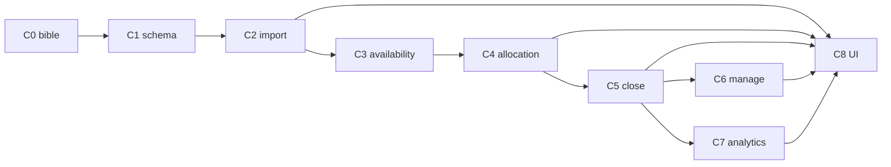

# Legacy Sales Order — chunk list (approve before build)

**Source:** [legacy_so_reverse_spec_cd5aff5f.plan.md](legacy_so_reverse_spec_cd5aff5f.plan.md)  
**Rule:** No implementation until you approve a chunk by name (e.g. “Approve Chunk 0”).

**What this module is:** commercial **despatch pipeline** (CSV → upsert → FEFO allocate → close → stock transfer → shorts/analytics). Not blank order entry.

---

## Chunk overview

| Chunk | Name | Outcome | Depends |
|-------|------|---------|---------|
| **0** | Migration bible | Accepted doc: flow, tables, CSV, procs — no code | — |
| **1** | Schema | Order / Line / Import / Allocation / Audit tables | 0 |
| **2** | Import | CSV → discard → upsert; block closed | 1 |
| **3** | Availability | FEFO piles + shelf-life + warehouse − holds | 1 (+ stock) |
| **4** | Allocation | Soft reserve to `quantityUser`; reduce-only; clear | 3 |
| **5** | Close | QC → post transfers → close → short anomalies | 4 |
| **6** | Management | Search, cancel, overdue email | 2, 5 |
| **7** | Analytics | Short / tier reports | 5 |
| **8** | Frontend | Access-parity tabs against APIs | 2–7 as needed |

---

## Chunk 0 — Migration bible (docs only)

**Who:** Tech lead + domain owner.  
**Why first:** Lock “what legacy does” before anyone invents new behaviour.

**Deliverable:** One accepted doc (can be this file + the reverse spec) covering:

1. **Flow:** CSV F1–F18 → Access staging → discard → validate → MySQL import → `procSalesOrderPushInsert` → header/lines → allocate (`tblstockmovementbatch` SALESORDER) → close (`procSTKstocKBATCHsalesOrderClose` → TRANSFER) → shorts/anomalies → reports.  
2. **No CalcDate** — use `processDate`, `collectionDate`, `deliveryDate`.  
3. **Line qty model:** ordered / user (cap) / dispatched / balance / userBalance.  
4. **Exclude** `genIsDispatchSupport` from commercial totals.  
5. **Hardcoded warehouse 6** (legacy) → note redesign: configurable despatch warehouse.  
6. Proc catalog split: **core must migrate** vs analytics optional vs do-not-port (`schedulerWrapperSalesOrdersShortRows` empty; `procImplicitItemAllocation` not SO).

**Done when:** You sign off that this matches floor behaviour.  
**Out of scope:** Any code.

---

## Chunk 1 — Schema (next system)

**Who:** Backend.  
**Why:** Replace Access/MySQL SO tables with clear domain tables; keep soft-allocation separate from posted stock.

**Build (when approved):**

| Entity | Replaces / mirrors | Notes |
|--------|-------------------|--------|
| `SalesOrder` | `tblpoordersordersheader` | Keys, dates, courier/depot, totals, QC fields; status `Open \| Allocating \| Closed \| Cancelled` |
| `SalesOrderLine` | `tblpoordersordersdetails` | Unique `external_transaction_id` (F1); qty ordered/user/dispatched/balances |
| `OrderImportBatch` + `ImportDiscard` | Access `dailyOrderERP*` | Persist discard reasons |
| `SalesOrderAllocation` | `tblstockmovementbatch` action=SALESORDER executed=0 | Pending reservation only |
| `OrderAuditEvent` | changelog + triggers | Structured events, not free-text spam |

**Invariants to encode:** closed immutable to re-import; unique line transaction id; support-item flag on product.

**Done when:** Migrations exist; can insert header+line in shell.  
**Out of scope:** Import logic, stock posting.

---

## Chunk 2 — ImportService

**Who:** Backend (+ later Import UI in C8).  
**Maps to:** `pushSalesOrderERP` / `procSalesOrderPushInsert` + CSV discard rules.

**Business rules (detail):**

1. Parse CSV columns F1–F18 (transaction id, internal order, dates, customer external code, product id, qty, collection/delivery, customer order #, DN, depot, courier, chilled/frozen, duplicate timestamp).  
2. **Discard** (log then drop): missing item/DN/collection/process/delivery/depot; collection in past; unknown courier; qty 0; duplicate transaction (keep MAX F18).  
3. **Validate** before push: not already closed; require internal #, customer order #, DN, courier, depot; all lines resolve to products.  
4. **Upsert by `internalOrderNbr`:**  
   - missing → insert header + lines  
   - exists + **closed** → **no-op**  
   - exists + open → update header; sync lines by transaction id (insert/update/delete)  
5. Recalc `totalOrdered` (exclude dispatch-support) and `totalOrderValue` (qty × price).  
6. Clear staging for that order; write audit events.

**Redesign default (decide in C0/C2):** do **not** blindly reset dispatched/user on open re-import without an explicit “replace lines” policy (legacy footgun).

**Acceptance tests:** discard matrix; new upsert; update open; block closed; support items out of totals.

**Done when:** Postman/API or command imports a fixture CSV end-to-end.  
**Out of scope:** Allocation, close, UI.

---

## Chunk 3 — AvailabilityService

**Who:** Backend.  
**Maps to:** `procSalesOrderAvailableStockAllocation` + `fnSTKheldInBatchQueue`.

**Inputs:** item, customer, collectionDate, deliveryDate, honourShelfLife flag.

**Rules (detail):**

1. Stock from live balance/cache for that product.  
2. Location in **despatch warehouse tree** (legacy: container 6 + children; redesign: config).  
3. Location real-stock + visible.  
4. `production_date <= collectionDate` OR production null.  
5. Customer–product mapping required (`customerMinimumShelfLife`).  
6. Available = on-hand − **unexecuted reservations** (all open orders’ holds).  
7. `remainingShelfLife = DATEDIFF(useby, deliveryDate) + 1`.  
8. If sales item AND honour shelf-life ON → `remainingShelfLife >= customerMinimumShelfLife`.  
9. Sort **FEFO** (`useby ASC`).

**Done when:** API returns ordered piles for a known fixture; shelf-life on/off changes set.  
**Out of scope:** Writing allocations.

---

## Chunk 4 — AllocationService

**Who:** Backend (+ Dispatch UI later).  
**Maps to:** VBA allocate combo + batch INSERT + clear + reduce-only edit.

**Rules (detail):**

1. Cap = `quantityUser` (else ordered).  
2. Take `min(available, cap − alreadyAllocatedOnLine)`.  
3. Create **pending** allocation (not ledger yet): link order, line transaction id, lot/trace/useby, src warehouse, dest = customer, date = collectionDate.  
4. Refresh line dispatched/balances; header total dispatched (exclude support; **unexecuted only**).  
5. Manual qty edit: **reduce only** (block increase above previous).  
6. **Clear:** delete all pending allocations for SO; reset lines to ordered / dispatched 0.

**Done when:** Allocate multi-pile partial fill; reduce; clear; cannot over-cap.  
**Out of scope:** Stock transfer / close.

---

## Chunk 5 — DispatchCloseService

**Who:** Backend (+ stock ledger integration).  
**Maps to:** `cmdInsertAndCloseOrder` → `procSTKstocKBATCHsalesOrderClose` → `procSTKstockTRANSFER` → `procSalesOrderCloseCheckRowsAndReport` + shelf-life anomaly.

**Rules (detail):**

1. Unless bypass QC: require vehicle temp, dispatch stock temp, vehicle cleanliness ≠ 0.  
2. **Atomic transaction:** for each unexecuted SO allocation → post warehouse→customer transfer → mark allocation executed → set order **Closed**.  
3. Update customer delivered totals.  
4. Lines with `quantityUserBalance ≠ 0` → short anomalies (`SALESORDERSHORTROW`).  
5. Shelf-life breach at transfer → anomaly **non-blocking** (log only).  
6. Closed → re-import blocked (C2).

**Redesign:** real DB transaction (legacy weak cursor error handling); fix unused customerID anti-pattern when porting delivered units.

**Acceptance:** close posts stock; executed flags; shorts written; support excluded; incomplete lines allowed with anomaly.

**Done when:** Close green against stock ledger in one transaction.  
**Out of scope:** Tier reports.

---

## Chunk 6 — Management + overdue

**Who:** Backend (+ Management tab UI).  
**Maps to:** Management tab + `schedulerWrapperSalesOrdersDueCollectionDate`.

**Scope:**

- List/filter open vs closed; search by date/customer/order.  
- Cancel → `Cancelled` (excluded from analytics).  
- Changelog / audit read.  
- Scheduler/email: open valid orders with `collectionDate < yesterday`.

**Do not port:** empty `schedulerWrapperSalesOrdersShortRows`.

**Done when:** Cancel + overdue query/email stub proven.  
**Out of scope:** Full reporting UI.

---

## Chunk 7 — Analytics (optional after core green)

**Who:** Backend read models.  
**Maps to:** `*ShortPrepared` / `*TierPrepared` + customer metric functions.

**Scope:**

- Date window over **valid + closed + not cancelled**.  
- Exclude dispatch-support.  
- Item/order shorts; customer/item tiers (units, value, ranks, completion %).  
- Parameterized queries (no giant dynamic SQL procs).

**Done when:** Short + one tier report match legacy numbers on a fixture window.  
**Out of scope:** Changing despatch path.

---

## Chunk 8 — Frontend (Access parity)

**Who:** Frontend.  
**Shell tabs:** Import | Management | Dispatch | Reporting (same as `frmSalesOrdersMain`).

| Tab | Behaviours |
|-----|------------|
| **Import** | File pick, discard list, validate, push, bulk push, discarded report |
| **Management** | Search, cancel, lines, changelog |
| **Dispatch** | Cascade: collectionDate → customer → order; Honour Shelf Life; Bypass QC; stock combo allocate; edit/delete/clear; close with QC; totals |
| **Reporting** | Date window; shorts; tiers; print pivot by use-by |

**Build after** APIs for the tab exist (Import needs C2; Dispatch needs C3–C5; etc.).

---

## Explicit non-goals (all chunks)

- Treating `procImplicitItemAllocation` as SO despatch.  
- Porting empty short-rows scheduler.  
- Keeping unused Planned/Scheduled flags unless planning asks.  
- Hardcoding warehouse id 6 forever (replace with config in C3/C5).

---

## Suggested approve order

`0 → 1 → 2 → 3 → 4 → 5 → 6` then `7` and `8` in parallel as needed.

Reply **Approve Chunk N** to start that chunk only.
