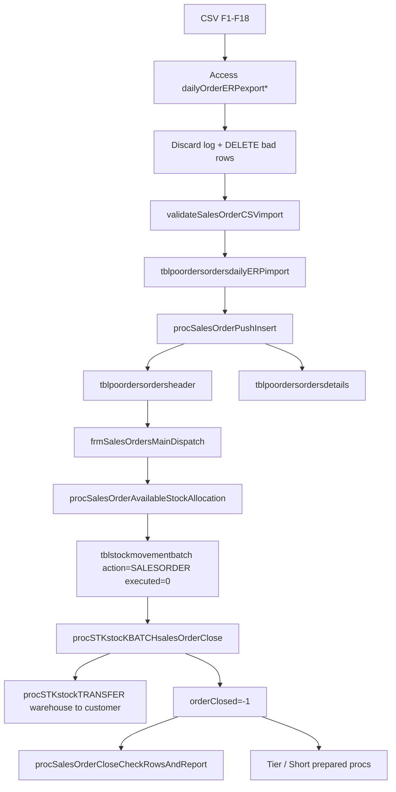

# Legacy Sales Order Module — Full Spec + Redesign Blueprint

Source of truth: [`data/Dump20260720.sql`](data/Dump20260720.sql), [`VB Access/modules/mdlSalesOrders.bas`](VB%20Access/modules/mdlSalesOrders.bas), form VBA under [`scripts/_tmp_access_export/sales_orders/`](scripts/_tmp_access_export/sales_orders/).

---

## What the module is

A **commercial despatch pipeline**, not order-entry from scratch:

1. External accounts/ERP CSV lands in Access staging
2. Valid orders upsert into MySQL `tblpoordersordersheader/details`
3. Warehouse picks stock piles (FEFO + customer min shelf-life) into a **pending batch queue**
4. Close flushes queue as stock TRANSFERs warehouse → customer, marks order closed
5. Shorts / shelf-life breaches become anomalies; reporting/tiers run over closed orders

There is **no separate CalcDate**. Operational dates are `processDate`, `collectionDate`, `deliveryDate` (+ dispatch vehicle/stock timestamps on close).

---

## Tables

### MySQL commercial

| Table | Role |
|---|---|
| `tblpoordersordersheader` | Order header: keys, dates, courier/depot, totals, vehicle/dispatch QC, state flags |
| `tblpoordersordersdetails` | Lines keyed by unique `transactionid`; qty ordered/dispatched/balance + **user tally** |
| `tblpoordersordersdailyERPimport` | Transient MySQL staging for push (cleared after upsert) |
| `tblpoordersorderschangelog` | Audit rows from triggers via `procSalesOrderPushInsertchangeLog` |
| `tblpoordersordersheadertechnical` | Technical/compliance link (secondary) |
| `tblpoordersordersheaderhistory` | Legacy/unused-shaped PO history table (not SO core path) |

**Header state flags:** `orderValid`, `orderClosed`, `orderCancelled`, `orderComplete`, `orderPlanned`, `orderScheduled`, `orderAllocated` (Access/VBA mainly drive Valid/Closed/Cancelled).

**Line qty model:**
- `quantityOrdered` — ERP demand
- `quantityUser` — editable **cap** for allocation (defaults = ordered); warehouse can short the line before picking
- `quantityDispatched` — sum of pending/executed allocations for the line
- `quantityBalance` = ordered − dispatched
- `quantityUserBalance` = user − dispatched

**`genIsDispatchSupport` products** (pallets/support items) are **excluded** from `totalOrdered`, allocation totals (`fnSalesOrdersGlobalUnitsAllocated`), and shortage analytics.

### MySQL stock (SO-linked)

| Table | Role |
|---|---|
| `tblstockmovementbatch` | Pending allocation queue (`action='SALESORDER'`, `executed=0` until close) |
| `tblstockmovement` | Live ledger after close; carries `salesOrderID`, `externalTransactionID`, `useby` |
| `tblstockcache` | Availability source for allocation picker |
| `tblstockmovementAnomalies` | Short rows + short-shelf-life alerts |
| `tblstockmovementAllocationsComplete` | Per-stock-row allocation-complete flag |

**Hardcoded despatch source:** container **id 6** (and its children via `tblContainersChildContainers`) — only stock in that warehouse tree is allocatable.

### Access-local staging (not MySQL)

`dailyOrderERPexport` (raw F1–F18), `dailyOrderERPexportHeader`, `dailyOrderERPexportDetails`, `dailyOrderERPexportDiscardedRows`.

### Related master data

`tblproducts` (`genSalesItem`, `genIsDispatchSupport`), `tblProductsMappingCustomer` (`customerMinimumShelfLife`), `tblContainers` (customer = dest), `tblContainersPostalAddress` (depot), `tblunits`, `fnSTKheldInBatchQueue`.

---

## CSV contract (Access import)

| Col | Meaning |
|---|---|
| F1 | `transactionID` (line key, unique) |
| F2 | `internalOrderNbr` |
| F3 | `processDate` |
| F4 | Customer accounts ref → `tblContainers.externalcode` → `customerID` |
| F6 | ERP item id → `tblproducts.id` |
| F8 | `quantityOrdered` |
| F9 | `collectionDate` |
| F10 | `deliveryDate` |
| F11 | `customerOrderNbr` (quotes stripped) |
| F12 | `internalDeliveryNote` |
| F13 | Destination depot id → postal address |
| F14 | Courier name → `tblContainers.container` |
| F17 | Chilled/frozen (`typeOfDelivery`) |
| F18 | Duplicate-resolution timestamp (keep MAX per F1) |

**Discard reasons (logged then deleted):** missing item/DN/collection/process/delivery/depot; collection date in past; unknown courier; qty 0; duplicate transaction id.

**Pre-push validation** ([`mdlSalesOrders.bas`](VB%20Access/modules/mdlSalesOrders.bas)): reject if already closed; require internal order #, customer order #, DN, courier, depot; all lines must resolve to itemIDs.

---

## End-to-end business rules

### Import / upsert (`pushSalesOrderERP` → `procSalesOrderPushInsert`)

- Stage raw CSV → MySQL import table (join product + customer + courier).
- If `internalOrderNbr` **missing** → INSERT header + all lines.
- If exists and **`orderClosed`** → **no-op** (re-import blocked).
- If exists and open → UPDATE header fields from import; sync lines by `transactionid` (update qty, insert new, delete removed); **resets dispatched/user/balance to ordered** on update.
- Recalc `totalOrdered` = sum qty where `genIsDispatchSupport=0`.
- Recalc `totalOrderValue` = sum(qty × `fnGetItemPrice(item)`).
- Delete import rows for that order.
- Triggers write changelog on every header/line INSERT/UPDATE/DELETE.
- Header DELETE cascade: deletes details, batch rows, and stock movements for that SO.

### Dispatch allocation (UI + `procSalesOrderAvailableStockAllocation`)

Picker cascade: **collectionDate → customer (open orders) → order**.

For each line `Form_Current` / shelf-life toggle:
- Call `procSalesOrderAvailableStockAllocation(item, customer, Null, collectionDate, deliveryDate, honourShelfLife)`.

**Availability rules:**
1. Stock from `tblstockcache` for that item
2. Container `realstock=-1` and `containerVisible=-1`
3. Location = container **6** or child of 6
4. `productiondate <= collectionDate` OR production date null
5. Must have customer–item mapping (`tblProductsMappingCustomer`)
6. Available = cache qty − `fnSTKheldInBatchQueue(...)` (committed elsewhere)
7. `remainingShelfLife = DATEDIFF(useby, deliveryDate) + 1`
8. If product `genSalesItem=-1` **and** Honour Shelf Life ON → require `remainingShelfLife >= customerMinimumShelfLife`
9. Ordered **FEFO**: `ORDER BY useby ASC`

**Allocate (combo AfterUpdate):**
- Cap = `quantityUser` (else ordered)
- Take `min(available, cap − alreadyAllocatedOnLine)`
- INSERT `tblstockmovementbatch`: `action='SALESORDER'`, `runbatch=-1`, `executed=0`, copy production/useby/trace/unit/src; dest = **customerID**; date = collectionDate; link `externalTransactionID` + `salesOrderID`
- Refresh line dispatched/balances; header `totalDispatched` via `fnSalesOrdersGlobalUnitsAllocated` (excludes dispatch-support items; only **unexecuted** batch qty)

**Manual qty edit:** dbl-click allocation qty; BeforeUpdate **blocks increases** above old value (can only reduce).

**Clear allocations:** delete all batch for SO; reset line qtys to ordered / dispatched 0.

### Close (`cmdInsertAndCloseOrder`)

Unless `chkBypassTechnicalChecks`: require vehicle temp, dispatch stock temp, vehicle cleanliness ≠ 0.

Then:
1. `procSTKstocKBATCHsalesOrderClose` — for each unexecuted `SALESORDER` batch row: `procSTKstockTRANSFER` (src warehouse → dest customer), mark `executed=-1`; set `orderClosed=-1`; refresh customer `customerTotalDelivered`
2. `procSalesOrderCloseCheckRowsAndReport` — for closed order, lines with `quantityUserBalance <> 0` write `SALESORDERSHORTROW` anomalies
3. UI also sets `orderClosed=-1` again

**Shelf-life at transfer time:** `procOPSSalesOrderShortShelfLifeStock` (called from stock transfer path) logs anomaly if `DATEDIFF(useby, trDate)+1 < customerMinimumShelfLife` — does not block transfer.

### Management / cancel

Management tab filters open/closed; cancel sets `orderCancelled`. Change log subform reads changelog.

### Reporting

Date-window analytics over **valid + closed + not cancelled** orders; exclude dispatch-support items. Sort/limit via `prmAction` / `prmTiers` codes.

Scheduler: `schedulerWrapperSalesOrdersDueCollectionDate` emails open valid orders with `collectionDate < yesterday`. `schedulerWrapperSalesOrdersShortRows` is empty stub.

---

## Stored procedures — business logic catalog

### Core path (must migrate)

| Procedure | Business logic |
|---|---|
| **`procSalesOrderPushInsert`** | Idempotent upsert by `internalOrderNbr`. Skip if closed. Insert/update header from daily import. Sync details by `transactionid` (insert/update/delete). Reset allocation qty fields on line update. Recompute `totalOrdered` (non-support) and `totalOrderValue` (price×qty). Clear import staging. |
| **`procSalesOrderPushInsertchangeLog`** | Append one audit row to `tblpoordersorderschangelog` (user, workstation, action, free-text). |
| **`procSalesOrderAvailableStockAllocation`** | Return allocatable piles for item/customer: warehouse-6 tree, real+visible stock, production ≤ collection, customer mapping required, deduct batch-held qty, optional min shelf-life vs **deliveryDate**, FEFO sort. |
| **`procSTKstocKBATCHsalesOrderClose`** | Cursor over pending SO batch jobs → each becomes `procSTKstockTRANSFER` → mark executed → close order → update customer delivered units. |
| **`procSalesOrderCloseCheckRowsAndReport`** | After close, insert anomaly for incomplete lines (`quantityUserBalance≠0`) class `SALESORDERSHORTROW`. |
| **`procOPSSalesOrderShortShelfLifeStock`** | Post-transfer check: if remaining shelf life below customer min, insert shelf-life anomaly (non-blocking). |
| **`procSalesOrderPivotStockAllocations`** | Dynamic SQL pivot of batch allocations by `currentuseby` columns for report `rptSalesOrder`. |

### Stock helpers used by SO

| Procedure / function | Role |
|---|---|
| **`procSTKstockTRANSFER`** | Actual ledger move; accepts `prmSalesOrderID` / external txn |
| **`fnSTKheldInBatchQueue`** | Qty already committed in unexecuted batch for pile key |
| **`fnSalesOrdersGlobalUnitsAllocated`** | Sum unexecuted batch qty for SO excluding dispatch-support |
| **`fnGetIsItemDispatchSupport`** | Product flag helper |
| **`fnGetItemPrice`** | Used in order value rollup |

### Analytics (migrate if reporting required)

| Procedure | Business logic |
|---|---|
| **`procSalesOrderItemsOrdersShortPrepared`** | Per item-line shorts in date range; ranks by units/%; filter `qtyDispatched < qtyOrdered`; dynamic sort via `prmAction` |
| **`procSalesOrderSalesItemsOrdersShortPrepared`** | Item–order short variant |
| **`procSalesOrderSalesOrdersShortPrepared`** | Order-level short aggregates |
| **`procSalesOrderSalesCustomersTierPrepared`** | Customer tiers: ordered units/value, ranks, completion %, share of total; uses customer metric functions |
| **`procSalesOrderSalesItemsTierPrepared`** | Item tiers analog |

### Customer metric functions (backing tiers)

`fnSalesOrdersCustomersTotalOrders`, `AverageOrdersPerDay`, `AverageOrdersSize(Units|Value)`, `AverageOrdersDayGap`, `AverageOrdersCompletion`, `TotalDelivered(Units|Value)`, `TotalOrdered(Units|Value)`, `PercentageTotal(Units|Value)`, `AverageOrdersSize`, plus globals `fnSalesOrdersGlobalUnitsOrdered` / `GlobalValueOrdered`.

Others: `fnSalesOrdersDetailsCollectionDate`, `fnSalesOrdersSalesOrderRowMatchQuantity` (ordered vs live stkout match), `fnSalesOrdersValidStats` (closed+valid+not cancelled).

### Schedulers

| Procedure | Logic |
|---|---|
| **`schedulerWrapperSalesOrdersDueCollectionDate`** | HTML email of overdue open orders |
| **`schedulerWrapperSalesOrdersShortRows`** | Empty — do not port |

### Not part of SO dispatch UI

`procImplicitItemAllocation` / `Wrapper` — recipe/BOM stock allocation elsewhere; do **not** treat as SO despatch.

---

## Triggers

| Trigger | Effect |
|---|---|
| `tblpoordersordersheader_AFTER_INSERT/UPDATE/DELETE` | Changelog; on DELETE also wipe details + batch + stock for SO; UPDATE logs closed specially |
| `tblpoordersordersdetails_AFTER_INSERT/UPDATE/DELETE` | Changelog; UPDATE logs quantityUser tally specially; DELETE clears batch by `externalTransactionID` |
| `tblstockmovementbatch_AFTER_DELETE` | Soft-voids related stock movements (`livetransaction=0`) |

---

## Frontend (VB Access) requirements map

Shell: **`frmSalesOrdersMain`** tabs → Import | Management | Dispatch | Reporting.

| Area | Forms / module | Must-have behaviors |
|---|---|---|
| Import | CSV forms + `mdlSalesOrders` | File pick, discard scan, clean deletes, build header/details, validate, push, bulk push, discarded rows report |
| Management | Management + details + changelog + allocation total | Search by date/customer/order; cancel; view lines/changelog |
| Dispatch | Dispatch + DispacthDetails + DispacthAllocation + AllocationTotal | Cascade pickers; Honour Shelf Life; Bypass QC; allocate via stock combo; edit/delete allocations; clear; close with QC; show totals |
| Reporting | ImportBulkReporting* + tier/short reports | Date window; call `*Prepared` procs; customer/item tiers; shorts; sales profile |
| Print | `rptSalesOrder` | Pivot allocations by use-by |

Key VBA files: [`mdlSalesOrders.bas`](VB%20Access/modules/mdlSalesOrders.bas), [`frmSalesOrdersMainDispatch.bas.txt`](scripts/_tmp_access_export/sales_orders/vba_only/frmSalesOrdersMainDispatch.bas.txt), [`frmSalesOrdersMainDispacthAllocation.bas.txt`](scripts/_tmp_access_export/sales_orders/vba_only/frmSalesOrdersMainDispacthAllocation.bas.txt), [`frmSalesOrdersMainDispacthDetails.bas.txt`](scripts/_tmp_access_export/sales_orders/vba_only/frmSalesOrdersMainDispacthDetails.bas.txt).

---

## Redesign blueprint (next system)

Preserve these invariants; fix the known footguns.

### Domain model (recommended)

- **SalesOrder** (header) + **SalesOrderLine** (`externalTransactionId` unique)
- **Allocation** (pending reservation) → separate from **StockMovement** (posted)
- **OrderImportBatch** / **ImportDiscard** (replace Access-local tables)
- **OrderAuditEvent** (replace trigger spam with structured events)
- Flags: `Open | Allocating | Closed | Cancelled` (drop unused Planned/Scheduled unless planning module needs them)

### Service boundaries

1. **ImportService** — parse CSV, discard rules, validate, upsert (transactional; refuse closed)
2. **AvailabilityService** — FEFO + shelf-life + warehouse tree + subtract reservations (replace `fnSTKheldInBatchQueue`)
3. **AllocationService** — reserve up to `userQty`; partial piles; reduce-only edits; clear
4. **DispatchCloseService** — QC gates → post transfers atomically → close → short anomalies
5. **AnalyticsService** — short/tier queries as read models (not giant dynamic SQL procs)

### Rules to keep

- Soft allocation before stock post
- Cap via editable `quantityUser`
- Shelf-life vs **deliveryDate** (+1 day)
- FEFO default; honour-shelf-life toggle
- Exclude dispatch-support from commercial totals
- Closed orders immutable to re-import
- Shorts allowed (close with incomplete lines → anomaly)

### Rules to change (defaults for redesign)

- Replace hardcoded container `6` with configurable **despatch warehouse**
- Real DB transaction around close (legacy close sets closed even if UI re-sets; batch cursor has weak error handling)
- Structured audit (field-level) instead of duplicate Before/After text blobs
- Reservation should decrement available for **other open orders** consistently (same as batch queue)
- Don’t reset dispatched lines blindly on re-import of open orders without an explicit “replace lines” policy
- Fix `procSTKstocKBATCHsalesOrderClose` unused `customerID` variable anti-pattern when porting delivered-units update
- Port analytics as parameterized queries; drop empty short-rows scheduler stub

### Suggested build order

1. Schema + Import upsert + audit  
2. Availability + Allocation (batch queue)  
3. Close + stock transfer integration + anomalies  
4. Management/cancel + overdue alert  
5. Reporting/tiers  

### Acceptance tests (migration)

- CSV discard matrix (each reason)
- Upsert new / update open / block closed
- Allocation FEFO + shelf-life on/off + multi-pile partial fill
- User tally reduces cap; cannot allocate above cap
- Clear resets
- Close posts stock, marks executed, writes shorts
- Support items excluded from totals
- Re-open blocked; cancel excluded from analytics

---

## Key source anchors

- Allocation SQL: `Dump20260720.sql` ~31786  
- Push upsert: ~32256  
- Close batch: ~42645  
- Close shorts: ~31900  
- VBA allocate: `frmSalesOrdersMainDispacthAllocation.bas.txt` `cboItemNameSelect_AfterUpdate`  
- VBA close: `frmSalesOrdersMainDispatch.bas.txt` `cmdInsertAndCloseOrder_Click`  
- VBA import: `frmSalesOrdersMain.bas.txt` `cmdImportCSVsalesOrder_Click` + `mdlSalesOrders.bas`
