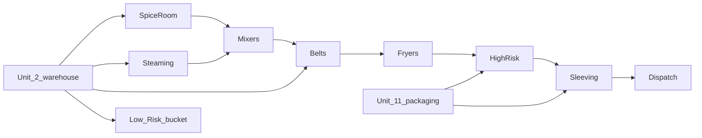

# Low Risk production — product dropdown + chain

## What the picking lists prove

Plan #10 (Vegetable Samosa) chain:



| Picking page | Product made there | Deliver to |
|---|---|---|
| Spice Room | `…-Spice` | Mixers |
| Steaming | steamed carrot/potato | Mixers |
| Mixers | `…-Mixer` | Belts |
| Belts | `…-Belt` | Fryers |
| Fryers | `…-Frying` | High Risk |
| High Risk | finished tray | Sleeving |
| Sleeving | boxed FG | Dispatch |
| Unit 2 / Unit 11 | raw / packaging **supply** | various (not MADE on a Low Risk line) |

**Low Risk internal process** = the middle cells (Spice Room, Steaming, Mixers, Belts, Fryers, Cooking, Deboxing, Forming, Marination, Mincing, Ovens, Pasteurising, Soaking, …).

**Not** Low Risk production screens: Unit 2, Unit 11, High Risk, Sleeving, Dispatch.

---

## Product dropdown (“Product made on this line”)

In `DeptProductionPage.tsx` (~792–801), when the open dept is e.g. **Cooking** or **Belts**:

```
GET /product/?source_container_id={currentDeptLocationId}
```

That returns only SKUs whose `source_container` = this process cell (the item this line makes).  
`destination_container` on each product is the default **Deliver to** (Fryers for Belt SKU, Mixers for Spice SKU, High Risk for Fryers SKU, …).

| Screen open | Dropdown shows | Typical To |
|---|---|---|
| Cooking | products with `source_container = Cooking` | next hop on product |
| Belts | `…-Belt` style SKUs | Fryers |
| Fryers | `…-Frying` | High Risk |
| Mixers | `…-Mixer` | Belts |
| Spice Room | `…-Spice` | Mixers |

Do **not** load Unit 2 / Unit 11 catalogs into this dropdown. Those are warehouse picks, not “made on this line.”

Backend already supports this filter: [`product/views/product_master_view.py`](product/views/product_master_view.py) + [`product/query.py`](product/query.py).

---

## Same stock APIs (no new production register)

| Action | API |
|---|---|
| List MADE for Belts today | `GET /stock/production/?from_location_id={beltsId}&date=…` |
| Save MADE | `POST /stock/production/` with `resource_id`, `counterparty_location_id={beltsId}`, product/qty/use_by; omit `location_id` → uses product `destination_container` |
| BOM | `GET /stock/production/{entryId}/requirements/?location_id={beltsId}` |
| Consume | `POST /stock/production/{entryId}/consume/` |

High Risk / Sleeving already use this path; Low Risk cells only change the Location id.

---

## FE wiring (gazeboo-cloud-web)

1. **Low Risk nav** — submenu of process Location names/ids only (allowlist or zone children of Low Risk). Exclude Unit 2, Unit 11, High Risk, Sleeving.
2. **Route** — reuse `DeptProductionPage` with `deptLocationId` (or name→id resolve) like High Risk.
3. **Product dropdown** — always `source_container_id = deptLocationId` (fix if Cooking dropdown currently uses a wrong id / parent “Low Risk” bucket / unfiltered list).
4. **Resources** — `GET /planning/resources/?location_id={deptLocationId}&is_active=1`.
5. **To Location** — default from selected product’s `destination_container_id` (matches picking “Deliver to”).

---

## Data prerequisite

Each intermediate SKU must have:

- `source_container` = process cell that makes it (Belts / Fryers / Mixers / …)
- `destination_container` = next hop (Fryers / High Risk / Belts / …)

If Cooking dropdown is empty, products are likely still pointed at a generic “Low Risk” Location or Unit 2 — fix product master, don’t invent a new API.

---

## Backend (this repo) — only if FE is already correct and data is wrong

1. Audit products for the 13 process Locations: `source_container` / `destination_container` match the picking chain.
2. No new endpoints required for the dropdown.
3. Skip `resource_id` list filter unless the grid needs it later.
