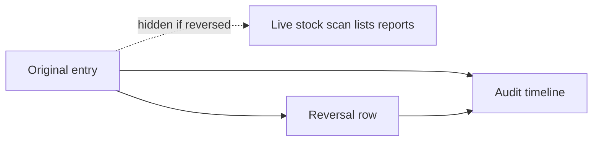

# Manager stock-ledger access (traceable, no deletes)

Ledger rows are **already append-only** (DB trigger: `stock_entry: deletes forbidden`). “Delete” today means **cancel** (queued, never posted) or **reversal** (posted: new opposite row). Do not add hard delete.

## Who can do what

**Do not grant IT.** IT (`has_global_access`) bypasses every gate.

Manager grant (existing RBAC, user-mgmt UI / `PUT` grants) — once we have their Cognito user:

- departments: `admin`, `warehouse`
- `admin_areas`: `operational`
- warehouse: unit_1 / unit_2 / unit_11 with `goods_in` + `goods_out` and all goods-in periods

New check: `has_ledger_amend_access` = IT **or** (`Department.ADMIN` + `AdminAccess` operational). Wire `gate_ledger_amend` in [users_rbac/permissions.py](users_rbac/permissions.py) / [users_rbac/grants.py](users_rbac/grants.py).

| Action | Floor (warehouse) | Manager (operational admin) |
|---|---|---|
| Receipt, transfer, issue, disposal, labels, post | yes | yes (via warehouse grants) |
| Count adjustment | **403** | yes + required `remarks` |
| Reversal | **403** | yes + required `remarks` |
| Cancel queued posting | keep warehouse (unposted intent) | yes |

Stamp `actor_user_id` from the Bearer user (already in `_common_write_kwargs`). Ignore client `authorised_by_user_id`; set it to the logged-in manager on amend writes.

Endpoints to switch to `gate_ledger_amend`:

- `POST /stock/count-adjustment/` ([stock_ledger/views.py](stock_ledger/views.py) `count_adjustment_api`)
- `POST /stock/reversal/` (`reversal_api`)

## Hide “deleted” from live; keep trace

Treat reversed **and** cancelled as gone from operational views. Timeline keeps both rows.

1. **Sticker remaining** — [stock_ledger/util/stickers.py](stock_ledger/util/stickers.py) `remaining_for_entry`: if the receipt has `reversed_by`, remaining is `0`. Scan of a reversed `E1067` then 409s like empty stock ([scan_goods_out_api](stock_ledger/views.py)).
2. **Payload flags** — `entry_dict` / `audit_event_dict`: add `reversed_by_id`, `is_reversed`. Admin movements list can hide `is_reversed` / `entry_type=reversal` without losing timeline.
3. **Goods-in report** — [stock_ledger/util/reports.py](stock_ledger/util/reports.py) `_posted_entries`: exclude `reversed_by__isnull=False` on receipts so reversed GI does not still look received.
4. **Timeline** — keep original + reversal. Do **not** exclude reversed originals. Frontend groups by `reverses_entry_id` / `reversed_by_id`.

Queued/cancelled already hidden from timeline and reports.

## Safety on the write

- `remarks` required (non-empty) on reversal and count-adjustment.
- Reversal must refuse **queued** receipts (those were never on balance) — cancel instead. Fixes the known “reverse queued → negative stock” hole in [stock_ledger/util/services.py](stock_ledger/util/services.py) `reversal()`.
- Still no UPDATE/DELETE on `stock_entry`. Count-adjust against `source_entry_code` stays the way to change a sticker qty without a new barcode.

Out of scope unless you ask: lot amend API (`StockLotAmendment` exists, no write path), auto-reverse of transfer pairs, PO qty undo on receipt reverse.

## Tests

- Floor warehouse user: 403 on count-adjust and reversal; 201 on receipt.
- Operational admin: 201 on both; 400 if `remarks` missing.
- Reverse a receipt → `remaining_for_entry` is 0; goods-out scan 409; timeline still has original + reversal.
- Reverse queued receipt → 400.

## Admin website (other repo)

- Grant the manager as above (not IT).
- Movements / balances / scan: hide `is_reversed` and reversal rows.
- Audit timeline: show the pair with who / `remarks` / time.
- Sticker recon (`source_entry_code` + `counted_quantity`) is this manager-only count-adjust path.
