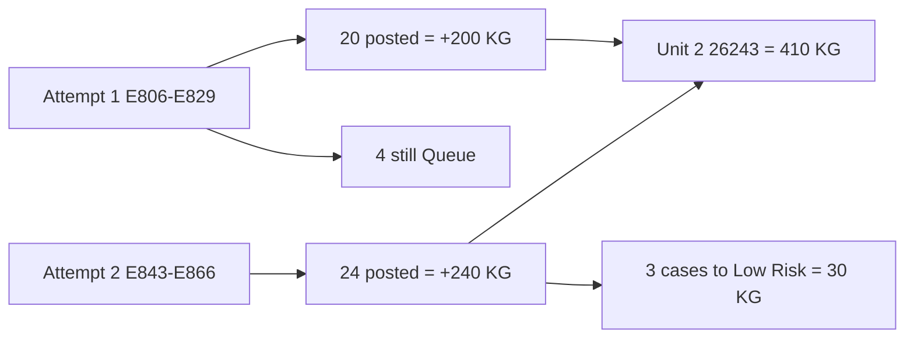

# PASTRY-17: duplicate goods-in (trace 26243)

## What went wrong

Not a posting bug. Meghna goods-in’d **the same 24 × 10 KG cases twice**, eight minutes apart, same trace, same location.

| Attempt | When | Barcodes | What happened |
|---|---|---|---|
| 1 | 31 Aug 16:47 | E806–E829 | 24 box labels printed. She verified/posted **20**. **4 never scanned** (still Queue). |
| 2 | 31 Aug 16:55 | E843–E866 | New goods-in of the same 24 cases. All 24 posted. |

Queue only shows E816, E819, E825, E829 because those four never left `queued`. The other 20 from attempt 1 **are already in the 410 KG**.

Timeline looks like a double list because it lists **every box barcode**. E843 “24 boxes” is attempt 2 collapsed. E806–E809 “Not on hand” are attempt 1 leftovers (same receive, not a second post of the same sticker).

Warehouse is using attempt 2 labels: Amit moved E847, E854, E855 to Low Risk on 2 Sept.

**26243 on books today:** Unit 2 410 KG + Low Risk 30 KG = 440 KG = 44 cases. Physical should be **24 cases** if she only received once.

## Count first (you asked)

Count cases of **trace 26243** only:

- Unit 2
- Low Risk

Expected if one physical delivery: **21 at Unit 2 + 3 at Low Risk = 24**.

## After the count

**If ~24 cases (duplicate confirmed):**

1. Queue tab: **Cancel** E816, E819, E825, E829. Do not Post.
2. Stock Management: **Remove** the 20 posted attempt-1 receipts (E806–E828 except those four). Reason: duplicate goods-in, keep second labels.
3. Bin stickers **E806–E829**. Keep **E843–E866**.
4. Result: Unit 2 26243 → **210 KG**, Low Risk stays **30 KG**, total **240 KG**.

**If ~44 cases:** she did receive 48 (or 44) physically. Leave stock. Only cancel the 4 Queue rows if those labels were never stuck on cases.

Stock reverse still waits on the count. History APIs can ship without it.

## Separate GI / GO history APIs (do not use audit timeline)

`GET /stock/audit/timeline/` is the full ledger dump (queued, posted, transfers, recon, every box). Move → Goods In currently calls it. That is why E806–E829 all appear.

Leave timeline as audit. New product history endpoints:

- `GET /stock/products/<product_id>/history/goods-in/`
- `GET /stock/products/<product_id>/history/goods-out/`

**Goods in:** posted `receipt` only. No queued (Queue tab). No cancelled/reversed. Collapse `:u:1..N` into one parent + `units[]` (posted units only). Newest first. Optional `location_id`, `limit`, `offset`. No `date_from` required (unlike `/stock/reports/goods-in/`).

**Goods out:** posted `issue` + `transfer_out` (that is how warehouse goods-out is stored). No `transfer_in`. No recon/`count_adjustment`. Same consolidate + paging.

**Not in these APIs:** transfer history, recon. Move → Transfer / Recon stay as they are for now.

Reuse `_operational_movement_entries`, `audit_event_dict` (or the same row shape the panel already maps), `consolidate_audit_items`. Parent qty/status from **posted** siblings only so a mixed 20-posted/4-queued receive shows 20 boxes, not “Not on hand”.

Tests: PASTRY-17-style split — queued siblings omitted; parent `unit_count` / qty is posted only; goods-out excludes transfer_in and count_adjustment.

**Frontend** [ProductStockPanel.tsx](file:///home/gazebo/projects/gazebo-cloud/gazeboo-cloud-web/src/pages/product/ProductStockPanel.tsx): Goods In / Goods Out history fetch the new APIs. Timeline tab keeps audit timeline. Transfer and Recon tabs unchanged.

## Same pattern elsewhere (same qty, both live, within 60 min)

Rule: two or more goods-in groups, same product + trace + kg, both still on the books, started within an hour. That is the PASTRY-17 mistake, not a later pallet of the same lot.

**8 incidents. If each is a true double, books are ~4,418 KG high.**

- **INGRAD-01 RAPSEED OIL / 26197** — Amit, 3× 910 KG in 3 min (E832, E837, E838). Extra **1,820 KG** if only one tote.
- **VEGFRO-01 PEAS (FROZEN) / 26239** — Amit, 2× 900 KG in 45s (E1811, E1814). Extra **900 KG**.
- **SAUCE0-15 ONION RTU 10MM / 26238** — Amit, 2× 600 KG in 2 min (E587, E588). Extra **600 KG**.
- **PASTRY-18 SAMOSA PASTRY - PLAIN ALDI / 26245** — Ashish, 2× 500 KG in 1 min (E1777, E1778). Extra **500 KG**.
- **PROTEIN-04 LAMB MINCE COOKED / 26243** — Amit, 2× 288 KG in 1 min (E1045, E1046). Extra **288 KG**.
- **PASTRY-17** (this one) — Meghna, 200+240 KG in 8 min. Extra **200 KG**.
- **PASTRY-04 SAMOSA PASTRY - THICK CUT / 26243** — Meghna, 2× 100 KG (10+10 boxes) 30 min apart (E790, E965). Extra **100 KG**.
- **VEGFRO-01 PEAS (FROZEN) / 26242** — Utsav, 2× 10 KG in 3 min (E7, E10). Extra **10 KG**.

Same-lot later deliveries with **different kg** are excluded (not this bug).

## Related but not overstated: leftover Queue

Operator started goods-in, left it queued, did it again and posted the second. Balances are fine **unless someone Posts the leftovers**. Cancel, do not Post.

Biggest leftovers still queued: PASTRY-06 / 26243 **20 boxes (200 KG)**, BAKING POWDER / 26069 **25**, THAI GREEN CURRY PASTE / 25273 **14**, CUMIN SEED / 26211 **10**, TURMERIC / 26131 **6**, plus smaller one-offs (PASTRY-17’s 4, yoghurt, black rice, tomato crushed, panko chicken, Kongmoon rice).
