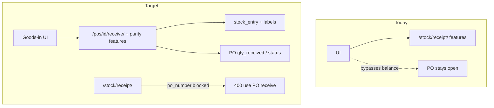

# PO goods-in: feature parity + stop duplicate receive

## Confirmed incident (PO7)

| Artifact | State |
|---|---|
| Entries **605**, **606** | Both `receipt` qty 2 SALT, `po_number=PO7`, `source_document_type=po`, **different** idempotency keys |
| **PO7** | Still `ordered`; line 19 `qty_received=0`, `qty_balance=2` |

UI used **`POST /stock/receipt/`** with PO metadata → stock moved, PO balance never updated → second receive allowed.

## Why UI stayed on stock receipt

[`POST /stock/receipt/`](stock_ledger/views.py) has floor features that [`POST /purchasing/pos/{po_id}/receive/`](purchasing/services/receive.py) lacks. Closing that gap first, then enforcing one door.

## Feature gap matrix

| Capability | `/stock/receipt/` | PO `/receive/` | Plan |
|---|---|---|---|
| PO balance / over-receive / close line | No | **Yes** | Keep (this is why PO API must win) |
| Header/line QC gates | No | **Yes** | Keep |
| Quarantine receive flag | No | **Yes** | Keep |
| Multi-line in one call | No | **Yes** | Keep |
| Pack → stock qty (`qty × multiplier`) | Via `product_supplier` | Via `line.multiplier` | Align: pass `product_supplier` into `services.receipt` so entry gets `base_unit_factor` / `pack_quantity` |
| **Label print** (`print_unit_count`, `print_quantity_per_unit` → `units[]`) | **Yes** | **Missing** | **Add per line** |
| **Rich entry payload** (`entry_dict`: shape, pack, from/to, actor, …) | **Yes** | Only `stock_entry_id` + qty strings | **Embed `entry` = entry_dict** |
| **Audit**: workstation / IP / JWT actor helpers | Via `_common_write_kwargs` | Body-only `actor_user_id` / `lan_username` | **Wire same audit kwargs** |
| **RBAC** `gate_warehouse_write(goods_in)` | **Yes** | **Missing** on `po_receive_api` | **Add gate** |
| Direct `lot_id` | Yes | Resolve from line + lot attrs | Keep PO resolve (line owns product); allow lot overrides already in `lines[].lot` |
| Free `po_number` on stock API | Yes (bypass) | N/A | **Block** after parity |



## Implementation plan

### A. Feature parity on PO receive ([`purchasing/services/receive.py`](purchasing/services/receive.py), [`purchasing/views.py`](purchasing/views.py))

**1. Label print (per line)** — same contract as stock receipt:

```json
"lines": [{
  "line_id": 19,
  "quantity": "2",
  "idempotency_key": "...",
  "print_unit_count": 2,
  "print_quantity_per_unit": "10",
  "print_idempotency_key_prefix": "optional"
}]
```

After successful `stock_services.receipt`, if print fields present → `stock_units.create_units_for_entry(...)`; put `units` on that line’s `receive_results` row.

**2. Rich entry in results** — each result includes `"entry": entry_dict(entry)` (import from stock_ledger views/serialize helper; prefer extracting `entry_dict` usage without circular imports — call from view layer or move shared serialize if needed). Minimum fields FE needs: `id`, `quantity`, `unit_name`, `pack_quantity`, `pack_unit_name`, `shape_format_label`, `shape_format_name`, `product_name`, `trace_number`, `from/to`, actor, `recorded_at`.

**3. Pack factor alignment** — when `line.product_supplier_id` set, pass `product_supplier=line.product_supplier` into `stock_services.receipt` and treat `quantity` as **purchase/pack count** (already true via `_stock_quantity`). Avoid double-multiplying: today receive does `stock_qty = purchase_qty * line.multiplier` then calls receipt with that stock qty; stock receipt with `product_supplier` multiplies again. **Choose one path:**

- **Chosen:** Pass **pack count** (`purchase_qty`) + `product_supplier=line.product_supplier` into `services.receipt` (let stock layer apply multiplier + `base_unit_factor`). Remove local `_stock_quantity` multiply when product_supplier present; keep `_stock_quantity` only when no product_supplier (multiplier on line / default 1).

**4. Audit + RBAC**

- `po_receive_api`: decorate `@gate_warehouse_write(action='goods_in')`.
- Build audit from request like stock (`attach_user` / workstation / IP); pass into `receipt(...)` instead of only body actor fields.

**5. Idempotency fix** — before bumping `qty_received`, detect pre-existing entry for `idempotency_key`; if already exists, skip qty bump and return prior result (no double PO progress).

### B. Hard gate on free stock receipt

In `receipt_api`: if `po_number` or `source_document_type == 'po'` → **400**  
`"Use POST /purchasing/pos/<po_id>/receive/ for PO goods-in."`

Ad-hoc / non-PO receipts unchanged.

### C. Frontend switch

- PO goods-in → **only** `POST /purchasing/pos/{po_id}/receive/`.
- Map existing stock-receipt print + display fields onto **per-line** body / `receive_results[].entry` + `units`.
- Stop sending `po_number` to `/stock/receipt/`.

### D. Remediate PO7

1. Reverse **606** (and ideally **605** too for clean audit).
2. Re-receive once via PO API after QC (or sync line from kept entry if ops prefer).
3. Confirm PO status `received`, `qty_balance=0`.

### E. Tests

- PO receive with print fields → units created; response has `units` + rich `entry`.
- PO receive with product_supplier line → `pack_quantity` / stock kg correct (no double multiply).
- Same idempotency key → no second `qty_received` bump.
- Over-receive / closed line → 400.
- `/stock/receipt/` with `po_number` → 400.

## Frontend API cheat sheet (after parity)

```http
POST /purchasing/pos/7/receive/
```

```json
{
  "location_id": 8,
  "lines": [{
    "line_id": 19,
    "quantity": "2",
    "idempotency_key": "uuid",
    "lot": { "use_by": "2026-08-13", "trace_number": "26224" },
    "print_unit_count": 2,
    "print_quantity_per_unit": "10"
  }]
}
```

Display from `data.receive_results[0].entry`: pack + `shape_format_label` + stock kg; labels from `units`.

## Out of scope

- Soft-sync (stock receipt updates PO) — not doing; one door.
- Bulk historical repair of all `po_number` stock rows beyond PO7 ops fix.
