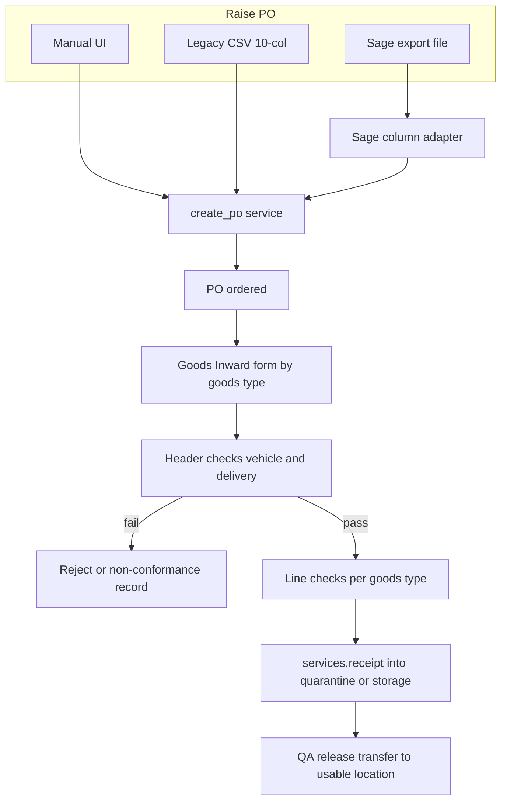

# PO + Goods-IN rebuild (legacy, Sage, QA/QC)

## Chunk list (build one at a time)

| # | Name | Depends on | Outcome |
|---|------|------------|---------|
| 1 | Product masters | — | `storage_regime` + `goods_in_type` on product |
| 2 | Supplier + quarantine flags | — | Approved-supplier gate + quarantine location |
| 3 | PO schema | 1 | `PurchaseOrder` / `Line` / `History` models |
| 4 | Manual raise API | 3 | Create/list/get/edit PO, mark ordered |
| 5 | Check templates | 1 | Config tables + seed food & packaging forms |
| 6 | Resolve goods-in form | 3, 5 | `GET …/goods-in-form/` returns checklist for a PO |
| 7 | Header QC | 6 | Vehicle/packaging checks, reject, Checked By + QC/TL |
| 8 | Line QC | 6, 7 | Product temp, UBD, spec check, line_check_ok |
| 9 | Stock-in / receive | 4, 8 | Call existing receipt; update qty_received/balance |
| 10 | Quarantine + release | 2, 9 | Hold location + QA release transfer |
| 11 | Attachments | 7 | COA / delivery note / photo S3 keys |
| 12 | Legacy CSV import | 4 | 10-col raise path |
| 13 | Sage import | 4 | File adapter (blocked on sample export) |
| 14 | Print PDF | 7, 8 | GFF001F-style printable record |
| 15 | Postman | 4–14 | Gazebo-style request docs |

**Rule:** explain one chunk → you approve → build that chunk only → then next.

## Is the first plan bulletproof? No — these gaps are now folded in

| Gap | Why it breaks | Fix in this plan |
|-----|---------------|------------------|
| QC modelled as fixed legacy flags | Cannot cover ambient vs chilled/frozen vs packaging | Config-driven check templates |
| No storage regime anywhere | `Location` has no ambient/chilled/frozen; product only has class/category | Add `storage_regime` + `goods_in_type` |
| No QA hold / quarantine | `StockLot` has origin only; no blocked state | Receive into quarantine location, release by transfer |
| Supplier approval not modelled | BRC needs approved-supplier gate at intake | Approval status + expiry on supplier |
| No attachments | Delivery note / COA photos have nowhere to live | S3 keys, same pattern as `product/category_images.py` |
| No PDF renderer installed | Cannot print the form; env has no PDF lib | Add `reportlab`; explicit dependency decision |
| Over-receipt tolerance undefined | Legacy allowed balance only | Block over-receipt; variance needs QA override + reason |
| Sage format unknown | Cannot write a real column map | Adapter interface now, map when sample arrives |

## Architecture verdict (locked)

Purchasing logic lives in **app code** (`purchasing`), not MySQL procs. Inventory write = existing [`stock_ledger.services.receipt`](stock_ledger/util/services.py) / `POST /stock/receipt/` with `source_document_type='po'` + `source_document_id=po.id` (legacy `procSTKstockIN` / soft `poID` parity).

Masters already here: suppliers (`Location` role supplier), products + purchasing fields, [`ProductSupplier`](product/models.py) (≈ legacy MappingSupplier), units, [`ProductShelfLife`](product/models.py), [`ProductTechnical`](product/models.py) (`requires_temperature_check`, temp bounds), [`ProductAcceptance.min_acceptable_shelf_life_days`](product/models.py).

## One form, four goods types (config, not four forms)

**Goods type** resolves per line from the product, not chosen by the operator:

- Add `ProductTechnical.storage_regime`: `ambient` \| `chilled` \| `frozen` \| `non_food`
- Add `Product`-level `goods_in_type`: `raw_material` \| `packaging` \| `other` (derive from `ProductClass` / `Category` at import; overridable)
- Template key = `(goods_in_type, storage_regime)`, falling back to `goods_in_type` then a global default.

**Config tables**

- **`GoodsInCheckTemplate`**: key fields above, `version`, `is_active`, `scope` (`header` \| `line`), plus the printed document-control block (`document_no`, `issue_no`, `issue_date`, `review_date`, `previous_issue_date`, `reason_for_change`).
- **`GoodsInCheckItem`**: `code`, `label`, `input_type` (`bool` \| `decimal` \| `text` \| `date`), `required`, `fail_when` (`false` \| `true` \| `out_of_range`), `min_value` / `max_value` or `source` (`product.temp_bounds`, `product.min_shelf_life`) so limits come from product master rather than being duplicated, `sort_order`, `is_critical`.

**Answers**: `checks` JSON snapshot on PO header and on each line, plus stamped `template_id` + `template_version`, and first-class columns for the ones you filter/report on (`vehicle_temperature`, `product_temperature`, `reject_delivery`, `line_check_ok`). JSON keeps the schema stable as QA edits checklists; the stamped version keeps old records auditable.

## Exact fields from the hard copy (GFF001F)

The scan shows **two printed variants**, which map exactly onto two templates.

**Document control block** (prints on every form, QMS requirement): `document_no` (GFF001F), `issue_no` (15), `issue_date`, `review_date`, `previous_issue_date`, `reason_for_change` ("QC or Team leader check added"). Store these on `GoodsInCheckTemplate` so a template revision is a document revision.

**Supplier block**: name, address, tel, fax — from the supplier `Location` + `LocationAddress` / `LocationContact`.

**Header fields — food form**: Delivery Date, Order No, Trace No, Vehicle Temp (°C), Vehicle Clean / Free from FB, Pest and Odour (Y/N), Primary & Outer packaging damaged (Y/N), COA/COC received (Y/N), Reject Delivery (Y/N), Checked By, Comment, Random QC or TL Check.

**Header fields — packaging form**: Delivery Date, Order No, Trace No, Vehicle Clean / Free from FB, Pest and Odour (Y/N), Primary Packaging Damaged (Y/N), Damaged Product (Y/N), Reject Delivery (Y/N), Checked By, Comment, Random QC or TL Check. **No** vehicle temp, **no** COA/COC, **no** date coding.

**Line columns — food**: Qty, Product Description, Pack Size (`1 x 1kg`), UBD/BBE, Product Temp, Spec Check, Total Qty (+ form total).  
**Line columns — packaging**: Qty Received, Product Description, Pack Size (`1 x 3400`), Spec Check, Total Qty (+ form total).

Three consequences for the model:

- The `If Yes Please comment` column means every check answer is `{value, comment}`, not a bare boolean.
- **Trace No sits on the header**, not the line (legacy had it per line). Capture once per delivery and default it onto lines, overridable.
- `Random QC or TL Check` is a **second sign-off** distinct from `Checked By`: store `qc_tl_checked_by`, timestamp and comment.

`Pack Size` and `Total Qty` are already derivable — pack shape from `ProductSupplier` and total from qty × multiplier — so they are rendered, not typed.

## Temperature acceptance rules (from the form footnote)

The form states: chilled `0–8 °C`, frozen `-18 °C ± 3 °C`, and tighter product rules — chicken `< 4 °C`, lamb and beef `< 7 °C`. So limits are **two-level**: a regime default plus a product/category override.

- Regime defaults live in config keyed by `storage_regime`.
- Product overrides use the existing [`ProductTechnical.temp_check_lower_bound` / `temp_check_upper_bound`](product/models.py); a check item with `source = product.temp_bounds` falls back to the regime default when the product has none.
- Out-of-range does not silently reject: it raises a non-conformance requiring QC/QA sign-off, matching "inform QC/QA" on the form.

**Seeded templates** (editable by QA — not code):

- Food ambient: packaging intact, no pest/foreign body, date code legible, shelf life ≥ product minimum, spec check, COA/COC.
- Food chilled / frozen: everything above plus vehicle temp and per-line product temp against the bands above, no thaw/refreeze evidence.
- Packaging: primary packaging damaged, damaged product, spec check, cleanliness, food-contact declaration; no temperature or shelf-life items.
- Other: quantity, damage, documentation only.

## QA/QC compliance mechanics

1. **Approved supplier gate**: add `approval_status` + `approval_expires_on` to supplier location; block or warn at goods-in when unapproved/expired.
2. **Critical fail = no stock-in**: any `is_critical` item failing sets `reject_delivery` (header) or blocks `line_check_ok`; `stock_in_done` is impossible without `line_check_ok`.
3. **Quarantine instead of a new stock state**: when the template says hold (or a non-critical fail is recorded), receive into a location flagged `is_quarantine`; QA release does an existing `transfer` to the usable location. No new ledger concepts.
4. **Non-conformance record**: reject or partial-accept writes a `PurchaseOrderHistory` row (accept/reject, reason, remarks, actor) — legacy `posheaderhistory` parity, plus attachments.
5. **Attachments**: `GoodsInAttachment` (S3 key, kind: delivery note / COA / photo), same S3 pattern as [`product/category_images.py`](product/category_images.py).
6. **Traceability**: force production date / use-by / trace number driven by existing `ProductShelfLife.force_*`; shelf life validated against `ProductAcceptance.min_acceptable_shelf_life_days` and location `min_shelf_life` (legacy `GINSLFLFMULT` becomes a config value).
7. **Sign-off**: `checked_by_user_id` + timestamp on header and per line, from the existing RBAC actor; reuse `can_goods_in` grant, add `can_qa_release` for quarantine release.
8. **Printable record**: render the paper form from stored answers with `reportlab` so the audit copy matches the hard copy.

## Raise paths (one service, three fronts)

| Path | Contract | Notes |
|------|----------|--------|
| Manual | supplier + lines from `GET /product/supplier-products/` | Legacy Management poheader |
| Legacy CSV | fixed 10 cols, no header (F1–F10) | Port Validation tab |
| Sage file | mapped columns → same internal DTO | Adapter only differs |

**Sage**: user exports POs from Sage → upload → adapter maps columns → resolve supplier `external_code` and item code against masters → same `create_po`, with `source='sage'`, `external_number=sage_po_number`, unique `(source, external_number)` so re-import cannot duplicate. `?dry_run=1` returns per-row errors without writing. Live Sage API is a later adapter behind the same interface.

## Domain model (legacy-aligned, FKs fixed)

**`PurchaseOrder`**: `number` (`PO{id}`), supplier FK, `ship_to_location_id`, `status` (`draft` \| `ordered` \| `partial` \| `received` \| `cancelled`), create/expected dates, totals, header QC snapshot + `vehicle_temperature` / `reject_delivery`, `source` / `external_number`, created/checked users.

**`PurchaseOrderLine`**: product FK, optional `product_supplier_id`, pack/shape + multiplier snapshot, `qty_ordered` / `qty_received` / `qty_balance`, lot fields (production date, use-by, trace), line QC snapshot + `line_check_ok` / `line_closed` / `stock_in_done`, unit ordered/received, price.

**`PurchaseOrderHistory`**: accept/reject/non-conformance events.

Drop legacy `poheadertechnical` unless needed; if kept, its line FK points at the **line** table — never repeat the header-pointing bug.

## Receive rules

- `qty_received ≤ qty_balance`; remainder stays on the same line as balance (no Access-style split row).
- Stock qty = received qty × `ProductSupplier.multiplier` × purchase→stock unit factor, mirroring `fnSTKtransactionMultiplier` only where the stock path needs it.
- Idempotency via the existing receipt `idempotency_key`; store the resulting entry id on the line.

## APIs

| Method | Path | Purpose |
|--------|------|---------|
| `POST/GET/PATCH` | `/purchasing/pos/` … | CRUD + status |
| `POST` | `/purchasing/imports/legacy-csv/` | Legacy 10-col raise |
| `POST` | `/purchasing/imports/sage/?dry_run=1` | Sage file raise |
| `GET` | `/purchasing/pos/<id>/goods-in-form/` | Resolved checklist per line by goods type |
| `POST` | `/purchasing/pos/<id>/qc/header/` | Header answers, reject path |
| `POST` | `/purchasing/pos/<id>/lines/<line_id>/qc/` | Line answers |
| `POST` | `/purchasing/pos/<id>/receive/` | Stock-in + qty update |
| `POST` | `/purchasing/pos/<id>/release/` | QA release out of quarantine |
| `GET` | `/purchasing/pos/<id>/print/` | PDF of the completed form |
| `GET/POST` | `/purchasing/check-templates/` | QA-managed checklists |

## Build order

1. Masters: `storage_regime`, `goods_in_type`, supplier approval, quarantine flag  
2. PO schema + history  
3. `create_po` + manual API  
4. Check template config + seed the four checklists  
5. Goods-in form resolve + QC endpoints  
6. Receive + quarantine + release  
7. Legacy CSV importer  
8. Print PDF  
9. Sage adapter (after sample export)  

## Open inputs needed

- One sample Sage PO export, or the Sage edition in use — blocks the real column map only; the adapter interface can be built now.

## Out of scope for v1

- Live Sage API / two-way sync, invoice 3-way match  
- Separate GRN document  
- Copying miswired Access ControlSources  
- Migrating legacy PO rows (dump has none)  
