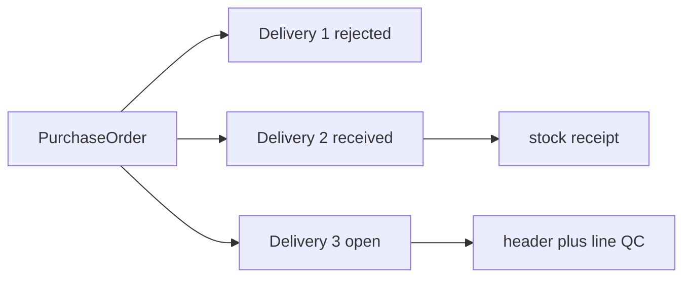
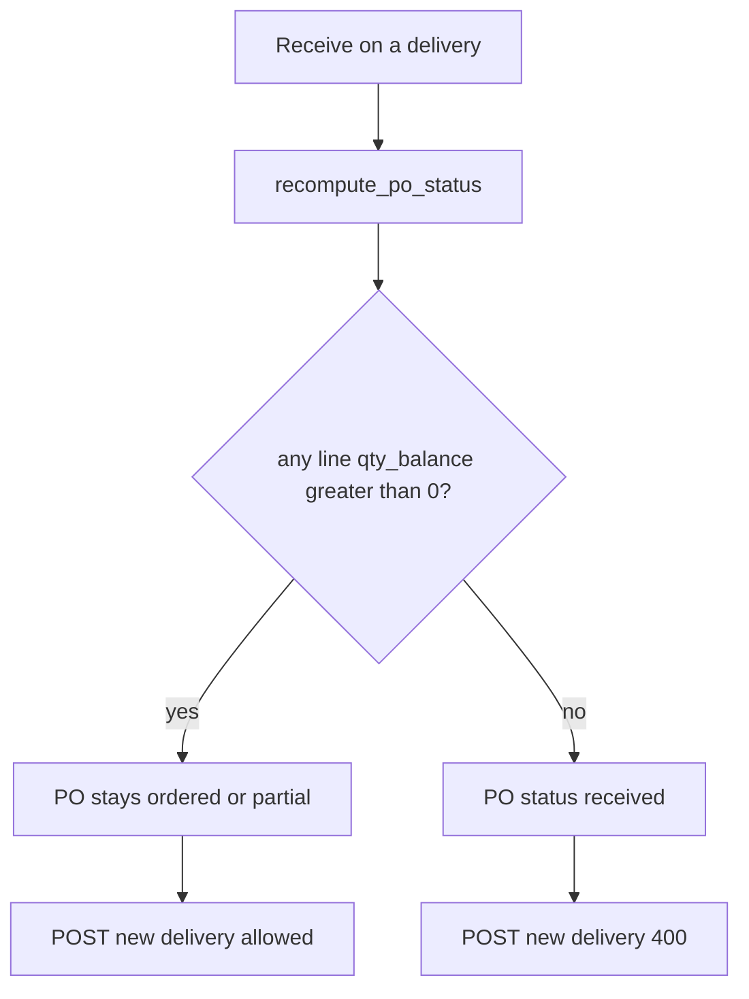

# Nested deliveries on one PO

Today goods-in **is** the PO: `delivery_at`, `delivery_trace_number`, `reject_delivery`, `header_checks`, `checked_at` live on [`PurchaseOrder`](purchasing/models.py). Header reject sets `reject_delivery=True`, then receive / line QC / release all refuse. There is no second visit.

Qty is already multi-receipt (`qty_balance`, `PARTIAL`, `short_delivery`). What’s missing is **one QC session per truck**.

**Reject whole truck:** no stock, PO qty unchanged, delivery status `rejected`. **Replacement:** `POST` a new delivery. **Split drop:** first delivery `received` with leftover balance; later truck is another delivery with its own lots / use-by.

**PO auto-close:** when every line has `qty_received + qty_rejected == qty_ordered` (`qty_balance == 0`), `recompute_po_status` sets PO to `received`. That PO is closed. `POST /deliveries/` returns 400. Receive already refuses quantity above remaining balance.

## Model

New table `po_purchase_order_delivery` (child of PO):

- `status`: `open` | `rejected` | `received`
- Session fields **moved here** from PO: `delivery_at`, `delivery_trace_number`, `vehicle_temperature`, `reject_delivery`, `header_checks`, template ids, checked-by / QC-TL
- Unique: **at most one `open` delivery per PO** (DB constraint)

New table `po_purchase_order_delivery_line` (unique on `delivery` + `po_line`):

- This visit’s QC: `line_checks`, `line_check_ok`, `use_by`, `production_date`, `trace_number`, `product_temperature`
- This visit’s qty: `qty_received`, `qty_rejected` (aggregates still on PO line)

`GoodsInAttachment` and `PurchaseOrderHistory` get a nullable `delivery` FK so photos / ACCEPT / REJECT stay on that visit.

**Keep PO session columns.** Sync them from the latest delivery so existing `GET /pos/:id/` and goods-in form still show the current visit. Do not use `po.reject_delivery` as a global lock.

## Rules

- `POST /pos/:id/deliveries/` only if PO is `ordered`/`partial`, some line has `qty_balance > 0`, and no `open` delivery exists. Previous may be `rejected` or `received`.
- Once all lines are satisfied (`qty_balance == 0`), PO auto-closes to `received`. No new delivery. Header-rejected visits do not close the PO (qty unchanged). Line credit/`qty_rejected` does close that line’s remaining qty (same as today).
- Header reject → delivery `rejected`, **do not** bump `qty_rejected`. Truck turned away.
- Line shortfall / quality fail on receive stays as today (credit vs `short_delivery`).
- Receive and line QC run **on a delivery**, and only if that delivery is `open` and header QC passed (`checked_at` set, `reject_delivery` false).
- Receive still updates PO line totals + `recompute_po_status`. Delivery → `received` once this visit has posted (or queued) stock.
- `release` stays on the PO (quarantine stock). Drop the PO-level reject gate so a later accepted delivery can release.

## API

Canonical (nest under PO, same style as lines):

- `GET/POST /purchasing/pos/:po_id/deliveries/`
- `GET /purchasing/pos/:po_id/deliveries/:delivery_id/` — goods-in form **for that visit**
- `POST .../deliveries/:delivery_id/qc/header/`
- `POST .../deliveries/:delivery_id/lines/:line_id/qc/`
- `POST .../deliveries/:delivery_id/receive/`
- `GET/POST .../deliveries/:delivery_id/attachments/`
- `GET .../deliveries/:delivery_id/print/`

Existing PO goods-in routes (`goods-in-form`, header/line QC, receive, attachments, print) **alias the open delivery**. If none is open: header QC / receive return 400 asking to create a delivery; `GET goods-in-form` can still resolve templates but `reject_delivery` / answers come from latest delivery (or empty). Warehouse app keeps working for the happy path; retry after reject is an explicit `POST deliveries/`.

## Worked example — Mitaka salt 5 bags (1×10 kg)

PO line: `qty_ordered=5`, `qty_received=0`, `qty_balance=5`, status `ordered`.

1. Truck 1 arrives (wrong / fail header QC). `POST deliveries/` → D1. Reject delivery. D1=`rejected`. Stock=0. PO still `ordered`, balance still 5. Photos stay on D1.
2. Truck 2 brings 3 bags. `POST deliveries/` → D2 (allowed: no open delivery, balance>0). Header QC pass, line QC, receive 3 with `short_delivery`. D2=`received`. Line: received=3, balance=2. PO=`partial`.
3. Truck 3 brings the last 2. `POST deliveries/` → D3. Receive 2. Line: received=5, balance=0. PO auto-closes=`received`.
4. `POST deliveries/` now 400. Cannot book a 4th truck against this PO.

## Code touch

- Models + migration + backfill: one delivery (+ lines with existing QC) for POs that already have `checked_at` / `header_checks`
- Rewrite [`header_qc.py`](purchasing/services/header_qc.py), [`line_qc.py`](purchasing/services/line_qc.py), [`receive.py`](purchasing/services/receive.py), [`goods_in_form.py`](purchasing/services/goods_in_form.py) to take `delivery_id`
- Small [`purchasing/services/delivery.py`](purchasing/services/delivery.py): create / list / get + open-delivery lookup
- [`purchasing/urls.py`](purchasing/urls.py) + views
- Tests: reject then new delivery receives remaining qty; two `received` deliveries on one PO; cannot open a second while one is `open`; after full qty received, `POST /deliveries/` is 400 and PO is `received`

Skipped: extra delivery workflow (abort, confirm, multi-open). Add if warehouse needs to cancel an in-progress visit without reject.

Postman: new **Deliveries** folder on the purchasing collection, Gazebo request docs (path params, body, status table) — not one-liners.