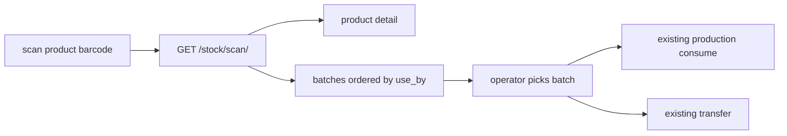

# Product-level barcode + FIFO batch picker

## What changes vs the old plan

The old plan ([barcode_stock_journey_e0b1d6fa.plan.md](.cursor/plans/barcode_stock_journey_e0b1d6fa.plan.md)) assumed one printed serial label per physical bag. That fails in the freezer (50 bags on a frozen pallet) and on high-risk trays (350 trays). New default:

- Barcode carries **product identity only** — reusable forever, printed once, no batch data.
- Scanning it opens **product stock detail with a FIFO batch dropdown**; the operator picks the batch.
- `Product.label_mode` decides whether a product wants a product label, one label per batch, or per-unit serials.
- Nothing in the ledger changes. `StockUnit` / serial scanning stays but becomes the exception (`per_unit` products), not the default.



## Barcode payload

No GS1 needed. Plain Code128 of the product code:

- `Product.external_barcode` when set (already exists, `max_length=16`, e.g. `5012345678901`)
- otherwise fallback internal code `P<product_id>`

Existing GS1 serial payloads in [build_gs1_payload()](stock_ledger/util/stock_units.py) are untouched and still scan.

## Chunk A — `Product.label_mode`

Add one field to `Product` in [product/models.py](product/models.py) (sits next to `external_barcode`, line 128 block) — no new table:

```python
class ProductLabelMode(models.TextChoices):
    PRODUCT = 'product', 'Product label (reusable, FIFO picked on scan)'
    BATCH = 'batch', 'One label per batch'
    PER_UNIT = 'per_unit', 'One label per physical unit'

label_mode = models.CharField(
    max_length=16,
    choices=ProductLabelMode.choices,
    default=ProductLabelMode.PRODUCT,
)
```

- Migration `product/migrations/0009_product_label_mode.py` (latest is `0008_expand_category`).
- Expose in [product_master_view.py](product/views/product_master_view.py): add `'label_mode'` to `product_detail_dict` (line 76 area) and to the writable field tuple (lines 245–257), plus the create path. That is the whole "settings" surface — no new endpoint.

Chicken pallet, high-risk trays → `product`. Low-risk items needing batch labels → `batch`. Anything genuinely scanned bag-by-bag → `per_unit`.

## Chunk B — scan resolve + backend FIFO

New `stock_ledger/util/fifo.py`:

```python
def fifo_balances(*, product_id, location_id=None):
    qs = StockBalance.objects.filter(
        lot__product_id=product_id, quantity__gt=0,
    ).select_related(*BALANCE_SELECT_RELATED)
    if location_id is not None:
        qs = qs.filter(location_id=location_id)
    return qs.order_by(
        F('lot__use_by').asc(nulls_last=True),
        F('lot__production_date').asc(nulls_last=True),
        'lot_id',
    )
```

New endpoint `GET /stock/scan/?code=<scanned>&location_id=<dept>` → `scan_resolve_api` in [views.py](stock_ledger/views.py), route in [urls.py](stock_ledger/urls.py) as `stock-scan`.

Resolution order in `stock_ledger/util/scan.py`:
1. `Product.external_barcode == code`
2. `code` matches `P<digits>` → product id
3. `StockUnit.unit_serial` via existing `resolve_unit_serial()` → return its product **and** pre-select its lot

Response `data`:
- `match_type`: `product` | `unit_serial`
- `product`: id, name, recipe_code, unit, `label_mode`
- `selected_lot_id`: set only for `unit_serial` matches, else `null`
- `batches`: FIFO-ordered rows reusing `serialize_balance_row()` plus `trace_number`, `use_by`, `days_left`, and `fifo_rank` (0 = oldest / recommended)
- 404 with a plain message when the code resolves to nothing

Also accept `?order=fifo` on the existing [balance_list_api](stock_ledger/views.py) (currently `order_by('lot_id','location_id')`, line 1176) so the same ordering is available to the stock list screen.

The frontend then posts to the **existing** `POST /stock/production/<entry_id>/consume/` or `POST /stock/transfer/` with the chosen `lot_id`. No new write endpoints.

## Chunk C — enforce `label_mode` on print

In [create_units_for_entry()](stock_ledger/util/stock_units.py) (line 115), read `source_entry.lot.product.label_mode` and reject mismatches:

- `product` → refuse: "This product uses a reusable product label; no batch labels to print."
- `batch` → force `unit_count == 1` and `quantity_per_unit == abs(entry.quantity)`
- `per_unit` → current behaviour unchanged

Same guard covers the `print_unit_count` path inside the receipt view (views.py line 922), so a bulk pallet cannot accidentally request 50 stickers.

## Chunk D — tests

Extend [tests_stock_units.py](stock_ledger/tests_stock_units.py):

- scan product barcode → batches returned oldest `use_by` first, nulls last
- scan with `location_id` → only that department's batches
- scan an existing `unit_serial` → `selected_lot_id` populated
- unknown code → 404
- `label_mode=product` product → print rejected
- `label_mode=batch` → `unit_count=2` rejected, `unit_count=1` full-qty accepted
- consume via existing lot-based endpoint after a scan still posts the same ledger rows

## Not doing

- No per-bag stickering as a default, no ZPL/printer integration, no new ledger tables, no department-level label settings (config lives on the product), no auto-FIFO enforcement on the backend — FIFO is a recommended ordering, the operator still chooses the batch.
