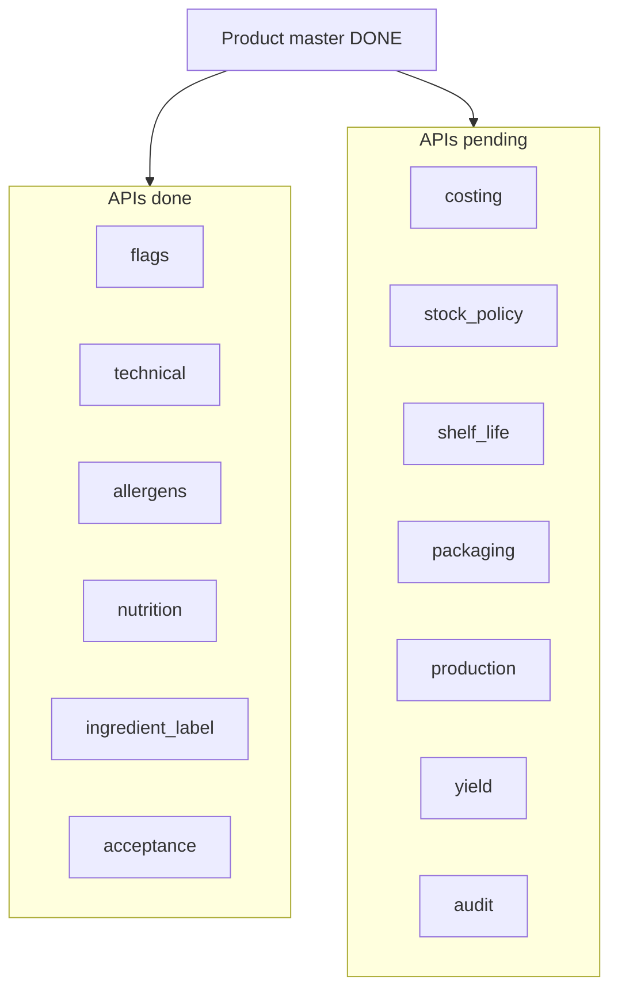

# Product satellite APIs — status and next work

## Where we are

Tracked against [`.cursor/plans/table_products.md`](.cursor/plans/table_products.md) + [`.cursor/plans/food_compliance_schema_3d356a4a.plan.md`](.cursor/plans/food_compliance_schema_3d356a4a.plan.md) in this Django service (ORM + API only; no legacy compatibility view / SP redirect yet).

| Layer | Status |
|---|---|
| Models + migrations | **Done** — all satellites in [`product/models.py`](product/models.py) |
| Demo seed | **Done** — `seed_demo_product` fills all satellites |
| Product master CRUD | **Done** — `/product/` |
| Food-compliance APIs | **Done in code** — flags, technical, allergens, nutrition, ingredient-label, acceptance |
| Product flags Postman | **Done** — remote **Gazebo - Food API** + local collection |
| Ops satellite APIs | **Pending** — models exist, no views/urls |
| Postman for other compliance APIs | **Pending** — APIs exist, docs missing |
| Legacy backfill / compat view | **Out of scope** for this service (table_products phases 2–8) |

**You are correct: product flags are complete** (view, route, seed, Postman).

**Still pending after flags:**
1. Postman docs for the 5 other compliance APIs already in [`product/urls.py`](product/urls.py)
2. New APIs for 7 ops satellites (largest remaining coding work)
3. Tests (empty stub) — after APIs if needed

---

## Implementation plan (chunks)

### Chunk A — Postman docs for existing compliance APIs (no code)

Push to remote **Gazebo - Food API** (same pattern as flags), under Products:

- `/product/:id/technical/` GET/PUT/DELETE
- `/product/:id/allergens/` GET/POST + `/allergens/:code/` PATCH/DELETE
- `/product/:id/nutrition/` GET/PUT/DELETE
- `/product/:id/ingredient-label/` GET/PUT/DELETE
- `/product/:id/acceptance/` GET/PUT/DELETE

Mirror descriptions from existing views; also extend local [`postman/Gazebo-Locations-Products.postman_collection.json`](postman/Gazebo-Locations-Products.postman_collection.json).

### Chunk B — Ops satellite APIs (code)

Clone the flags/technical pattern (`GET` 404 if missing, `PUT` upsert, `DELETE`, Decimal as strings):

| Route | Model |
|---|---|
| `/product/<pk>/yield/` | `ProductYield` |
| `/product/<pk>/costing/` | `ProductCosting` |
| `/product/<pk>/shelf-life/` | `ProductShelfLife` |
| `/product/<pk>/stock-policy/` | `ProductStockPolicy` |
| `/product/<pk>/packaging/` | `ProductPackaging` |
| `/product/<pk>/production/` | `ProductProduction` |
| `/product/<pk>/audit/` | `ProductAudit` |

Per satellite: new `product/views/*_views.py`, wire in [`product/urls.py`](product/urls.py). Reuse helpers from [`product/views/technical_views.py`](product/views/technical_views.py) / [`flags_views.py`](product/views/flags_views.py).

Build order (Items form priority from [GAZEBO_Items_Form_Field_Mapping.md](product/documents/GAZEBO_Items_Form_Field_Mapping.md)): **yield → costing → shelf-life → stock-policy → packaging → production → audit**.

### Chunk C — Postman for ops satellites

After each Chunk B satellite (or in one batch), add folders/requests to Gazebo - Food API + local collection.

### Explicitly not in this plan

- Legacy `tblproducts` ETL / compatibility view
- Schema defects in mapping doc (§5 tray/vessel lookups, `default_length` misfile, recipe-line yield)
- `tblproductsyields` actuals table
- Stock ledger / recipe work

---

## Recommended next step

Start **Chunk A** (docs only, APIs already live), then **Chunk B yield** as the first new API.