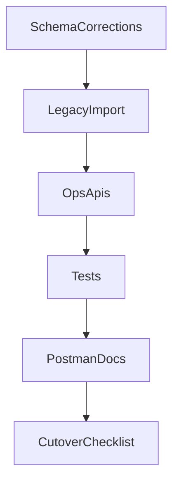

# Product Setup Completion Plan

## Current State (verified)

Completed:
- Product domain schema exists in [`C:/Users/varun/projects/gazeboo-cloud/microservice/svc-locations-django/product/models.py`](C:/Users/varun/projects/gazeboo-cloud/microservice/svc-locations-django/product/models.py) with master + satellites (`ProductCosting`, `ProductStockPolicy`, `ProductShelfLife`, `ProductPackaging`, `ProductProduction`, `ProductYield`, `ProductFlags`, `ProductTechnical`, `ProductAudit`, `ProductAllergen`, `ProductNutrition`, `ProductIngredientLabel`, `ProductAcceptance`).
- Product APIs already present for master + compliance + yield in [`C:/Users/varun/projects/gazeboo-cloud/microservice/svc-locations-django/product/urls.py`](C:/Users/varun/projects/gazeboo-cloud/microservice/svc-locations-django/product/urls.py): `/product/`, `/flags/`, `/technical/`, `/allergens/`, `/nutrition/`, `/ingredient-label/`, `/acceptance/`, `/yield/`.
- Demo seeding exists in [`C:/Users/varun/projects/gazeboo-cloud/microservice/svc-locations-django/product/management/commands/seed_demo_product.py`](C:/Users/varun/projects/gazeboo-cloud/microservice/svc-locations-django/product/management/commands/seed_demo_product.py).

Pending:
- No legacy import command for products (only demo seed; no `import_legacy_products`).
- Ops satellite APIs missing for costing, shelf-life, stock-policy, packaging, production, audit.
- Tests are effectively empty in [`C:/Users/varun/projects/gazeboo-cloud/microservice/svc-locations-django/product/tests.py`](C:/Users/varun/projects/gazeboo-cloud/microservice/svc-locations-django/product/tests.py).
- Requirement defects from [`C:/Users/varun/projects/gazeboo-cloud/microservice/svc-locations-django/product/documents/GAZEBO_Items_Form_Field_Mapping.md`](C:/Users/varun/projects/gazeboo-cloud/microservice/svc-locations-django/product/documents/GAZEBO_Items_Form_Field_Mapping.md) still unresolved in code (notably tray/vessel/box FK mapping, timestamp importability, `defaultlength` placement, recipe line-yield gap).

## Delivery Sequence

## Work Plan

### 1) Correct schema mismatches before import
- Update packaging lookups: replace `ProductPackaging.container_vessel`, `tray`, `box` mapping to correct lookup entities (not `locations.Location` for all three).
- Make legacy timestamps importable by removing strict auto-managed behavior on product/audit-related created/updated fields and preserving source values during import.
- Move `defaultlength` domain ownership from packaging to production (`default_execution_minutes` style field).
- Decide/implement final home for `leadtime` (keep in costing or move to stock policy as per requirement doc).
- Add recipe-component yield/cost fields required for net-batch parity if migration includes recipe tree import.

### 2) Build production import command
- Create `product/management/commands/import_legacy_products.py` mirroring the existing import pattern used in locations service commands (transactional upsert + parity checks + dry-run option).
- Import `tblproducts` into `Product` + 1:1 satellites + compliance tables with Access boolean normalization (`-1/0`).
- Add explicit reconciliation output (row counts, null-heavy columns, rejected rows report).

### 3) Finish missing product APIs
- Add GET/PUT/DELETE endpoints and views for:
  - `/product/<pk>/costing/`
  - `/product/<pk>/shelf-life/`
  - `/product/<pk>/stock-policy/`
  - `/product/<pk>/packaging/`
  - `/product/<pk>/production/`
  - `/product/<pk>/audit/`
- Follow the existing API behavior pattern in current product views (404 on GET missing, PUT upsert, DELETE idempotent-style response behavior).

### 4) Add tests for product setup completeness
- Replace placeholder tests with API + model-import behavior tests:
  - Product master CRUD baseline.
  - Each satellite endpoint happy-path + validation + not-found.
  - Import command smoke test on a small fixture sample.
  - Regression tests for identified defect fixes (tray/vessel mapping, timestamp preservation, defaultlength placement).

### 5) Documentation and release readiness
- Update local Postman collection and remote workspace docs for all available product endpoints.
- Add a short runbook: migration command usage, verification queries, rollback assumptions.
- Execute a final checklist for “product setup complete” sign-off: schema parity, import parity, API parity, and test pass.

## Immediate Next Step

Start with Step 1 (schema corrections), because import and API behavior correctness depends on those decisions.