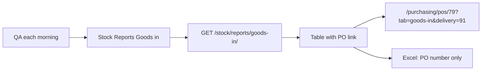

# Morning QA goods inward report

This is **not a new report**. QA already generate it from [StockReportsPage.tsx](gazeboo-cloud-web/src/features/stock/pages/StockReportsPage.tsx) → **Goods in**.

## What QA do each morning

1. Open **Stock → Reports → Goods in**.
2. Set **date from / date to** (yesterday → today). Optional Type / Product / Location.
3. Run. Table is posted receipts (`GET /stock/reports/goods-in/`).
4. Click **PO** on a row → that delivery’s goods inward form.
5. **Excel** still exports PO number only (no link, no URL).

Today the PO column is plain text (`r.poNumber`). The API already returns `source_document_id` (PO id, e.g. 79) but the mapper drops it. `/purchasing/pos/79` opens the PO on the **Detail** tab, not the form.

## Link target (what you picked)

`/purchasing/pos/{poId}?tab=goods-in&delivery={deliveryId}`

- Lands on **Goods in**.
- Selects that visit (D3), so they see the paper form (lots, use-by, received qty).
- Adhoc / no PO: no link (`—`).
- Missing `delivery_id` (older receipts): `/purchasing/pos/{poId}?tab=goods-in` (latest visit).

Reuse the same pattern as [ProductStockPanel.tsx](gazeboo-cloud-web/src/pages/product/ProductStockPanel.tsx) `poLink`.

## API (small)

[stock_ledger/util/reports.py](svc-locations-django/stock_ledger/util/reports.py) `movement_row` already has `source_document_id` + `po_number`. Add:

- `purchase_order_id`: `source_document_id` when `source_document_type == 'po'`
- `delivery_id`: `posting.meta.delivery_id` (already stamped on queued receive)

No new endpoint. Same query params: `date_from`, `date_to`, optional `goods_in_type`, `product_id`, `location_id`.

## Frontend

- [types.ts](gazeboo-cloud-web/src/features/stock/types.ts) `StockReportMovementRow`: add `poId`, `deliveryId`
- [stockMappers.ts](gazeboo-cloud-web/src/features/stock/api/stockMappers.ts) `mapReportMovementRow`: map those ids
- [StockReportsPage.tsx](gazeboo-cloud-web/src/features/stock/pages/StockReportsPage.tsx): goods-in PO column → `<Link>` (goods-out stays text)
- [exportStockReportsExcel.ts](gazeboo-cloud-web/src/features/stock/utils/exportStockReportsExcel.ts): unchanged (`r.poNumber`)

## Open the form from the URL

[PurchaseOrderDetailPage.tsx](gazeboo-cloud-web/src/features/purchasing/pages/PurchaseOrderDetailPage.tsx) reads `?tab=goods-in&delivery=91`.

[DeliveryHistory.tsx](gazeboo-cloud-web/src/features/purchasing/components/DeliveryHistory.tsx): new `initialDeliveryId` (do **not** reuse `cancelDeliveryId` — that opens the cancel modal). Prefer that id when the delivery list loads.

## Out of scope

- New report card / new page
- Putting URLs in Excel
- Changing report filters or the 200-row default cap
