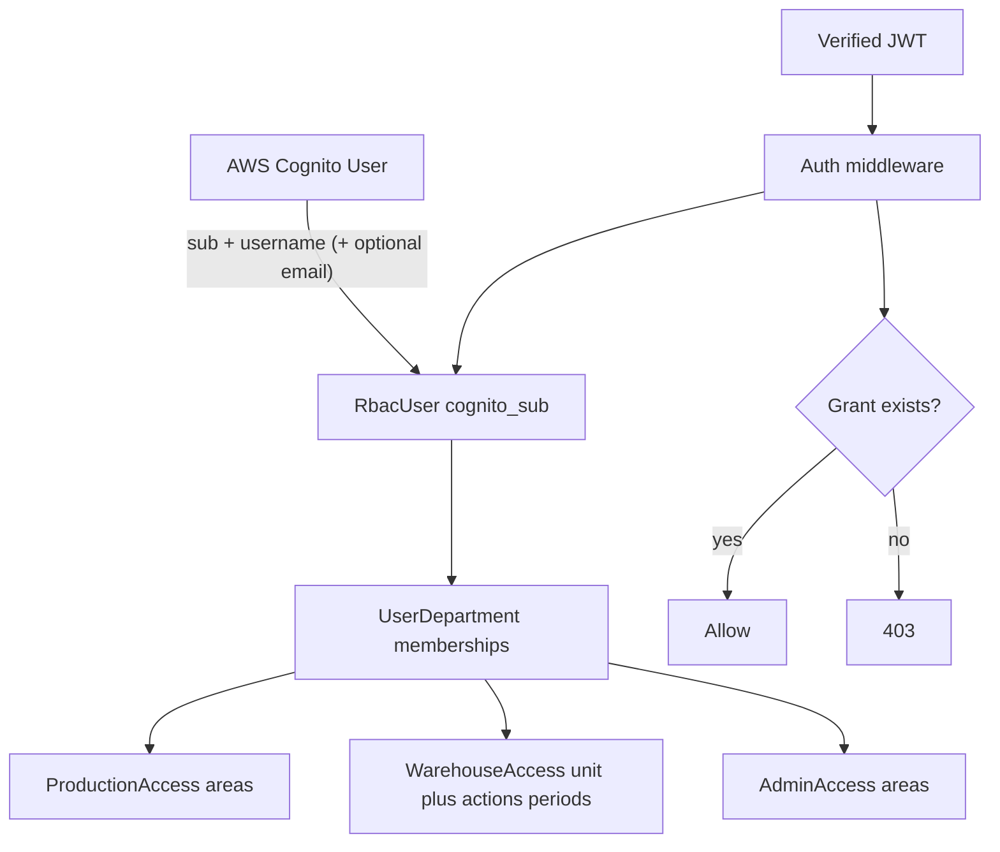

# RBAC organizational governance

## Implementation chunks (build one at a time)

| Chunk | Name | Delivers | Depends on |
|-------|------|----------|------------|
| **1** | **Schema** | DB tables only: `RbacUser`, departments/areas/warehouse/admin grants, `RbacAuditEvent` + migration | — |
| **2** | **Cognito identity ops** | Create/disable/reset password in Cognito; local profile row; login still works; no-email usernames | 1 |
| **3** | **Request auth** | Verify Cognito JWT (JWKS); `@require_auth`; `request.rbac_user`; client IP | 1 |
| **4** | **User & grant APIs** | `POST/GET/PATCH` users, `PUT` grants, `GET /auth/me/` | 2, 3 |
| **5** | **Admin audit APIs** | Persist audit on create/grants/login; `GET /auth/audit/`, `GET /users/:id/audit/` | 4 |
| **6** | **Permission helpers** | `require_production_area` / `require_warehouse` / `require_admin_area`; log `auth.access_denied` | 3, 1 |
| **7** | **Enforce + activity** | Gate real production/warehouse writes; stamp product/stock actor from JWT; `GET .../activity/` | 5, 6 |

**Current:** Chunks 1–7 done.

### Chunk 1 detail (next to build)

**Goal:** schema foundation — nothing callable yet.

**Add to** [`users_rbac/models.py`](users_rbac/models.py):

- `RbacUser` — `cognito_sub` (unique), `username` (unique, required), `email` (nullable), `display_name`, `is_active`, timestamps, `created_by_sub`
- `UserDepartment` — `user`, `department` ∈ production \| warehouse \| admin
- `ProductionAccess` — `user`, `area` ∈ low_risk \| high_risk \| sleeving \| dispatch
- `WarehouseAccess` — `user`, `unit` ∈ unit_1 \| unit_2 \| unit_11 + goods_in/out + period flags
- `AdminAccess` — `user`, `area` ∈ technical \| operational \| npd \| finance
- `RbacAuditEvent` — append-only fields (actor/target/action/before/after/ip/ua/…); no business writes yet

**Also:** `makemigrations` / migrate; register models in admin optional (skip if unused); one small model test or `__str__` smoke.

**Out of this chunk:** Cognito calls, HTTP routes, JWT, grant apply logic.

**Done when:** migration applies cleanly; tables exist in DB.

### Chunk 2 detail (next)

**Goal:** Cognito owns identity; Django `RbacUser` is created/updated beside it. **No public admin HTTP APIs yet** (those are Chunk 4). Service functions only + login copy fix + mocked tests.

**Extend** [`users_rbac/services.py`](users_rbac/services.py):

| Function | Cognito | Django |
|----------|---------|--------|
| `create_identity(username, password, *, email=None, display_name='', created_by_sub=None)` | `AdminCreateUser` (`MessageAction=SUPPRESS`) + `AdminSetUserPassword` (permanent) + `AdminGetUser` for `sub` | insert `RbacUser` |
| `set_active(user, is_active)` | `AdminEnableUser` / `AdminDisableUser` | `RbacUser.is_active` |
| `reset_password(user, password)` | `AdminSetUserPassword` | no password stored locally |
| `login` (existing) | unchanged flow; friendlier errors (“username or password”) | no profile create on login (Chunk 4/5 can attach audit) |

Wire `COGNITO_USER_POOL_ID` (required for admin APIs; already in `.env.examples`).

**Login view:** accept `email` or `username`; message → “Username or email and password are required.”

**Not in this chunk:** `POST /auth/users/`, grants, JWT verify, `RbacAuditEvent` writes (Chunk 5), MFA, refresh/logout, `NEW_PASSWORD_REQUIRED` challenge.

**Done when:** mocked boto3 tests cover create (with/without email), disable, reset; login still works.

### Chunk 3 detail (next)

**Goal:** trust the Bearer token. Every later human API uses `@require_auth` so `request.rbac_user` is a real local profile, not a spoofable JWT payload.

**Add** [`users_rbac/auth.py`](users_rbac/auth.py):

1. Fetch Cognito JWKS (`https://cognito-idp.{region}.amazonaws.com/{pool}/.well-known/jwks.json`), cache in memory.
2. Verify JWT: signature + `iss` + `token_use` (`id` or `access`) + `exp` + audience/`client_id` = `COGNITO_CLIENT_ID`.
3. Lookup `RbacUser` by claim `sub`. Missing or `is_active=False` → 401/403.
4. `@require_auth` decorator: set `request.rbac_user`, `request.cognito_claims`, `request.client_ip`, `request.user_agent`.
5. `client_ip(request)`: first `X-Forwarded-For` hop else `REMOTE_ADDR`.

**Login** stays public (no decorator). Product/stock unsigned decode **not** replaced yet (Chunk 7).

**Lib:** `PyJWT[crypto]` (not already in requirements).

**Not in this chunk:** user/grant HTTP APIs, permission helpers, audit writes, gating production/warehouse routes.

**Done when:** tests cover valid token → user attached; bad/expired/unsigned token → 401; inactive user → 403; X-Forwarded-For IP.

---


## Decisions (locked)

- **Cognito** = identity only (`AdminCreateUser`, password/MFA, sessions, CloudTrail).
- **Django DB** = authorization source of truth.
- **Multi-department** allowed (same user can hold Production + Warehouse + Admin scopes).
- **Deny by default**: no grant row → no access.
- **Email optional** — floor users sign in with a **username** (badge / staff code). Office/admin users may still use email.

## Floor users without company email

Works fine. Cognito identity key is `Username`, not email.

| Field | Floor (Production) | Office / Admin |
|-------|--------------------|----------------|
| Cognito `Username` | Required — e.g. `amit01`, badge `GZ-1042` | Email or username |
| Email attribute | **Omit** / leave blank | Optional but usual |
| Login body | `{ "username", "password" }` | `{ "email" }` or `{ "username" }` |
| Invite email | `MessageAction=SUPPRESS` on create (no mailbox) | Optional invite or suppress + set password |
| Audit label | `display_name` + `username` + `sub` | Same; email when present |

**User pool prerequisite:** pool must allow **username** sign-in (not email-only aliases). Confirm in Cognito console: sign-in options include username. If the pool was created email-only, either recreate/adjust aliases or use a synthetic non-mailbox username (still no real company email needed).

Create path for floor users:

1. `AdminCreateUser(Username=staff_code, MessageAction=SUPPRESS)` — no email attr.
2. `AdminSetUserPassword` (temp or permanent) — supervisor sets PIN/password.
3. Local `RbacUser` with `username`, nullable `email`, `display_name`.
4. Assign Production grants as today.

Existing [`users_rbac/views.py`](users_rbac/views.py) already accepts `email` **or** `username`; fix the error copy to say “Username or email and password are required.”

## Mental model



Your list maps to **dimensions**, not flat roles:

| Dimension | Values |
|-----------|--------|
| Department | `production`, `warehouse`, `admin` |
| Production area | `low_risk`, `high_risk`, `sleeving`, `dispatch` |
| Warehouse unit | `unit_1`, `unit_2`, `unit_11` |
| Warehouse action | `goods_in`, `goods_out` |
| Goods IN period | `previous`, `today`, `future` |
| Admin area | `technical`, `operational`, `npd`, `finance` |

Warehouse nesting is **unit → actions → Goods IN periods** (periods only apply when `goods_in` is granted).

## Data model ([`users_rbac/models.py`](users_rbac/models.py))

Keep it to four tables — no Cognito groups, no Django `auth.User` as identity.

```python
# RbacUser: cognito_sub (unique), username (unique, required),
#           email (nullable), display_name, is_active,
#           created_by_sub, created_at, updated_at

# UserDepartment: user FK, department (choices), unique(user, department)

# ProductionAccess: user FK, area (choices), unique(user, area)
# AdminAccess: user FK, area (choices), unique(user, area)

# WarehouseAccess: user FK, unit (choices), unique(user, unit)
#   can_goods_in, can_goods_out
#   goods_in_previous, goods_in_today, goods_in_future
#   (period flags only meaningful when can_goods_in=True; validate on write)
```

**Integrity rules (service layer):**

1. Area/unit grants require matching `UserDepartment` membership.
2. Period flags require `can_goods_in=True`.
3. Soft-disable via `RbacUser.is_active=False` + Cognito `AdminDisableUser` (both).
4. Deleting a department membership cascades its child grants for that department.

Seed choices as `TextChoices` (not a permission catalog table) until values must be admin-editable at runtime.

## Cognito responsibilities ([`users_rbac/services.py`](users_rbac/services.py))

Extend existing boto3 client (today: login only):

| Op | Cognito API |
|----|-------------|
| Create user | `admin_create_user` (`Username` required; email attr optional; `MessageAction=SUPPRESS` for no-email users) |
| Set/reset password | `admin_set_user_password` (primary path for floor users) |
| Enable/disable | `admin_enable_user` / `admin_disable_user` |
| Login | existing `initiate_auth` with Cognito `Username` |
| Refresh / logout | `initiate_auth` refresh + `global_sign_out` (phase 2 OK) |

Use `COGNITO_USER_POOL_ID` (already in `.env.examples`, unused today). Store Cognito `sub` on `RbacUser.cognito_sub` and local `username` matching Cognito `Username`.

**Do not** put the grant matrix in Cognito custom attributes (size/multi-value pain). Optional later: write a coarse `custom:departments` claim for FE nav only — never trust it for API authz.

## Request auth (new)

Add shared helpers under `users_rbac/`:

1. **JWT verify** — fetch Cognito JWKS, verify signature / `iss` / `aud`/`client_id` / `exp` (library: `PyJWT` + `cryptography`, or `python-jose`). Replace unsigned base64 decode in [`product/audit_log.py`](product/audit_log.py) / [`stock_ledger/views.py`](stock_ledger/views.py).
2. **Middleware or decorator** `@require_auth` — set `request.rbac_user`, `request.cognito_claims`, capture IP (`X-Forwarded-For` first hop else `REMOTE_ADDR`) + UA.
3. **Checks** — small helpers, e.g. `require_production_area("low_risk")`, `require_warehouse(unit="unit_1", action="goods_in", period="today")`, `require_admin_area("finance")`. Missing grant → **403**. Inactive user → **403**.

Container static token ([`locations/urls.py`](locations/urls.py)) stays for machine routes; human APIs use Cognito JWT.

## Admin APIs (under `/auth/`)

All write APIs require an existing **Admin** grant (start: any `AdminAccess`; tighten later to `technical` only if needed).

| Method | Path | Purpose |
|--------|------|---------|
| `POST` | `/auth/users/` | Body: required `username` (+ password); optional `email`; Cognito create + `RbacUser` + optional grants |
| `GET` | `/auth/users/` | List local profiles (+ filters) |
| `GET` | `/auth/users/:id/` | Profile + full grant tree |
| `PATCH` | `/auth/users/:id/` | Display name, `is_active` (sync Cognito enable/disable) |
| `POST` | `/auth/users/:id/reset-password/` | Cognito temp password / force change |
| `PUT` | `/auth/users/:id/grants/` | Replace departments + nested grants (idempotent body) |
| `GET` | `/auth/me/` | Caller profile + effective permissions (for FE) |
| `POST` | `/auth/login/` | Existing |

**Example grant body** (supports multi-department):

```json
{
  "departments": ["production", "warehouse"],
  "production_areas": ["low_risk", "dispatch"],
  "warehouse": [
    {
      "unit": "unit_1",
      "actions": ["goods_in", "goods_out"],
      "goods_in_periods": ["today", "future"]
    }
  ],
  "admin_areas": []
}
```

Postman descriptions must follow Gazebo Food API style (title, route, tables, status codes) per workspace rule.

## Audit trail (CloudTrail-style)

Two layers — both needed:

| Layer | Covers | Does **not** cover |
|-------|--------|---------------------|
| **AWS CloudTrail** (Cognito) | `AdminCreateUser`, password reset, enable/disable, login APIs at AWS | Django grant matrix (areas/units/actions) |
| **Django `RbacAuditEvent`** (append-only) | Who changed grants, exact before/after, IP, UA, app logins, disable, etc. | Raw Cognito control-plane (use CloudTrail for that) |

Domain work (product/stock) keeps existing timelines but **must** stamp verified `actor_sub` / username / IP — same actor identity as RBAC events so you can answer “what did amit01 do today?” across systems.

### `RbacAuditEvent` (immutable rows)

Never update/delete. One row per action.

```python
# RbacAuditEvent
#   id, at (UTC), action (TextChoices)
#   actor_sub, actor_username, actor_display_name   # who did it (null = system)
#   target_user_id, target_username, target_sub     # who was affected (nullable)
#   request_method, request_path, request_id        # correlation
#   source_ip, user_agent
#   before_json, after_json                         # full grant/user snapshot delta
#   detail_json                                     # extra (e.g. cognito username created)
```

**Actions to log (minimum):**

| `action` | When | `before` / `after` |
|----------|------|--------------------|
| `user.created` | Admin creates user | `after` = profile + initial grants |
| `user.updated` | Patch name / flags | before/after profile fields |
| `user.enabled` / `user.disabled` | Active toggle (+ Cognito sync) | status flip |
| `user.password_reset` | Admin reset | no password values — flag only |
| `grants.replaced` | `PUT .../grants/` | **full grant tree** before and after |
| `auth.login_success` | Login OK | username, ip |
| `auth.login_failure` | Bad password / unknown | username attempted, ip (no password) |
| `auth.access_denied` | Grant check 403 | required grant vs held grants |

Grant replace example (what you need for “admin gave these permissions”):

```json
{
  "action": "grants.replaced",
  "actor_username": "jane.admin",
  "target_username": "amit01",
  "at": "2026-08-09T21:15:00Z",
  "source_ip": "10.0.1.22",
  "before_json": { "departments": [], "production_areas": [], "warehouse": [], "admin_areas": [] },
  "after_json": {
    "departments": ["production"],
    "production_areas": ["low_risk", "dispatch"],
    "warehouse": [],
    "admin_areas": []
  }
}
```

Write the event **in the same DB transaction** as the grant apply so a failed write never leaves orphan grants without a trail (or trail without grants).

### Read APIs (admin-only)

| Method | Path | Purpose |
|--------|------|---------|
| `GET` | `/auth/audit/` | Filter: `actor`, `target`, `action`, `from`, `to`; paginated |
| `GET` | `/auth/users/:id/audit/` | Everything done **to** this user + optionally **by** them (`?as=actor\|target\|both`) |

Response rows are the event fields above — FE can render a timeline like CloudTrail Event history.

### “What did Amit (Low Risk) do after login?”

Yes — same identity (`cognito_sub` / `amit01`) on every event. Example day:

| Time | Source | What you see |
|------|--------|----------------|
| 08:01 | `RbacAuditEvent` `auth.login_success` | Amit logged in from IP … |
| 08:12 | Stock/product audit | Posted production consume on Low Risk … (`actor_sub` = Amit) |
| 08:40 | `RbacAuditEvent` `auth.access_denied` | Tried High Risk → 403 (no grant) |
| 09:05 | Stock/product audit | Updated line / scanned barcode … |

**Rules**

1. Login always writes `auth.login_success` / `auth.login_failure` (IP + username).
2. Every **mutating** API behind auth/grant checks stamps verified `actor_sub` + username + IP on the **domain** audit (product/stock/planning) — never trust body `actor_*`.
3. Every **403 grant denial** writes `auth.access_denied` (`detail_json`: required grant vs what he has).
4. Do **not** log every GET; mutations + auth events are the trail.

**Admin read: one timeline**

`GET /auth/users/:id/activity/?from=&to=` — merged list by time:

- RBAC events where he is **actor** (login, denials, grants he changed if also admin)
- Domain audit hits keyed by his `actor_sub`

FE shows one CloudTrail-like history. Aggregator in `users_rbac` queries RBAC + existing product/stock audits by `actor_sub` (no duplicate full stock payloads into RBAC).

### Cognito / CloudTrail ops note

Enable CloudTrail for Cognito IdP API calls. Django `RbacAuditEvent` = permission admin truth. Domain audits + `/activity/` = what Amit did in the app.

## Audit / IP / session (summary)

| Concern | Where |
|---------|--------|
| Cognito control plane | AWS CloudTrail |
| User create / grant / login / disable / access denied | `RbacAuditEvent` |
| Floor user app actions (Amit Low Risk writes) | Domain audits stamped with his `actor_sub` + IP |
| One screen “Amit’s day” | `GET /auth/users/:id/activity/` |
| Client IP | `X-Forwarded-For` first hop else `REMOTE_ADDR` |
| Sessions | Cognito tokens; no Django session for API identity |

## Enforcement rollout

See **Implementation chunks** at top. Chunks 1–5 = identity + grants + audit. Chunks 6–7 = enforce on APIs + Amit activity trail.

## Out of scope (YAGNI for now)

- Cognito Groups as authz store
- Django `Permission` / `Group` tables
- Per-endpoint permission catalog UI
- Mapping warehouse units ↔ `locations.Location` IDs (add later if portal lock needs it)
- Refresh/logout endpoints (add when FE needs them)
- Logging every read/GET
- Shipping passwords or tokens into audit JSON (never)

## Key files to touch

- [`users_rbac/models.py`](users_rbac/models.py) — grant tables + `RbacAuditEvent`
- [`users_rbac/services.py`](users_rbac/services.py) — Cognito admin + grant apply + audit writes
- New: `users_rbac/auth.py`, `permissions.py`, `views_users.py`, `audit.py` (list + activity merge), migrations
- [`core/settings.py`](core/settings.py) — Cognito pool settings
- [`product/audit_log.py`](product/audit_log.py) / stock helpers — verified claims only
