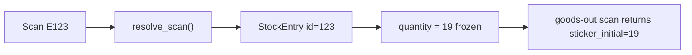
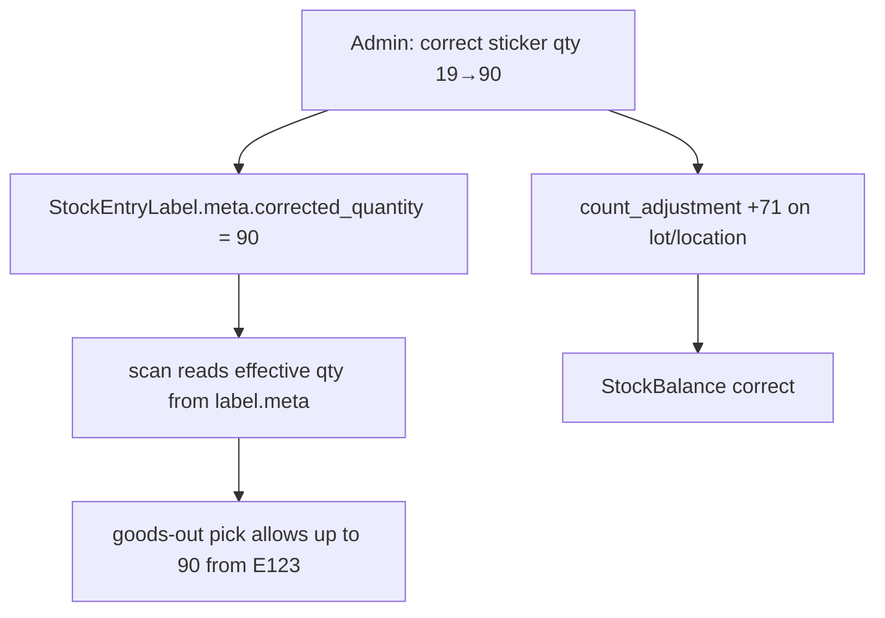

# Receipt quantity correction (19 → 90, keep same barcode)

## How it works today



| Piece | What it stores | Can change after print? |
|---|---|---|
| Physical barcode | Entry ID only (`E123`) | N/A — **same label stays valid** |
| `StockEntry.quantity` | Receipt qty (19) | **No** — immutable ledger row; MySQL trigger `stock_entry_bu` rejects all UPDATEs |
| `StockEntryLabel` | Print/verify state only | Yes, but **no qty field today** |
| `StockBalance` | On-hand at lot/location | Yes — via new ledger rows |

When someone scans for goods-out, [`scan_goods_out_api`](stock_ledger/views.py) reads sticker qty from the entry:

```3284:3286:stock_ledger/views.py
    elif entry is not None:
        qty = stickers.remaining_for_entry(entry, lot_quantity=lot_qty)
        sticker_initial = abs(entry.quantity)
```

So **scan will keep showing 19** until something changes how sticker qty is resolved — not because the barcode is wrong.

**Important:** There is **no** `PATCH /stock/entries/{id}/` or “update qty” API. [`count_adjustment`](stock_ledger/util/services.py) fixes **lot balance** only; it does **not** update what `E{id}` scans as.

---

## What you can do right now (no code)

### Step 1 — Fix warehouse balances (do this first)

For each affected lot/location, post a count adjustment for the **missing qty** (e.g. +71 per pallet where 19 was posted but 90 arrived):

- `POST /stock/count-adjustment/`
- Use `quantity_delta: 71` (or `counted_quantity` = true physical count)
- Same `lot_id`, `location_id`, `unit_id` as the receipt

This makes **on-hand stock correct** for planning and lot-level picks.

**Limitation:** Scanning the existing `E{id}` label still returns **19** for sticker-based picks. Warehouse can still move stock by lot/product scan, but sticker FIFO picks will cap at 19.

### Step 2 — Per receipt audit (many entries)

For each wrong receipt, note from the barcode or admin:

1. `entry_id` (from `E{id}`)
2. Posted qty (19)
3. Actual qty (90)
4. Delta (+71)

You likely need a spreadsheet: `entry_id | posted | actual | delta | lot_id | location_id`.

### Step 3 — Do **not** use reversal + new receipt at scale

`POST /stock/reversal/` + new `POST /stock/receipt/` would fix scan qty but creates a **new** `E{new_id}` — new barcode. Fine for one pallet; **not** for 270+ labels.

### Step 4 — Do **not** direct SQL UPDATE on `stock_entry`

Even a one-off `UPDATE stock_entry SET quantity=90` is blocked by the DB trigger and would break the hash chain audit. Not a safe ops path.

---

## Recommended fix (small feature — keeps all existing barcodes)

Add a **sticker quantity correction** path that uses the **mutable** [`StockEntryLabel.meta`](stock_ledger/models.py) sidecar (already exists) instead of editing `StockEntry`.

### Design



1. **New API** (admin/floor only): `POST /stock/entries/{entry_id}/correct-quantity/`
   - Body: `corrected_quantity`, `reason`, `idempotency_key`
   - Validates: entry is `receipt`, posted, has label, no picks already exceeding corrected qty
   - Computes `delta = corrected - abs(entry.quantity)`
   - If `delta != 0`: calls existing `count_adjustment()` for balance
   - Writes `label.meta['corrected_quantity']` + audit fields (`corrected_at`, `corrected_by`, `reason`)

2. **Teach scan/sticker logic** to use effective qty:
   - Add helper in [`stock_ledger/util/stickers.py`](stock_ledger/util/stickers.py): `effective_entry_quantity(entry)` → reads `label.meta.corrected_quantity` if set, else `abs(entry.quantity)`
   - Use in `remaining_for_entry()`, `scan_goods_out_api`, `build_goods_in_label()` human-readable display

3. **Bulk tool** for yesterday’s mess:
   - Management command `correct_receipt_quantities --csv corrections.csv` calling same service logic row-by-row

4. **Physical label text** still prints “19” — only scan/API shows 90. Acceptable trade-off vs reprinting 270 labels. Optional: re-print endpoint can show corrected qty if meta is set.

### Files to touch

- [`stock_ledger/views.py`](stock_ledger/views.py) — new endpoint + wire scan responses
- [`stock_ledger/util/stickers.py`](stock_ledger/util/stickers.py) — effective qty helper
- [`stock_ledger/util/entry_labels.py`](stock_ledger/util/entry_labels.py) — label display uses effective qty
- [`stock_ledger/util/services.py`](stock_ledger/util/services.py) — `correct_receipt_quantity()` service
- [`stock_ledger/urls.py`](stock_ledger/urls.py) — route
- Tests in `stock_ledger/tests/`

---

## Answer to your question

| Question | Answer |
|---|---|
| Can we update 19 → 90 **without changing the barcode**? | **Yes — the barcode never encodes qty.** But **not with today’s app**; qty is frozen on `StockEntry`. |
| When user scans, can it show 90? | **Not today.** Needs label-meta override feature (above) or new receipt (new barcode). |
| Must we print new barcodes? | **No** — keep all existing `E{id}` labels. Physical “19” text may stay wrong; scans/API can show 90 after correction feature. |
| What to do today before dev? | **Count adjustments** per lot to fix balances; warn warehouse sticker scans still read 19 until correction feature is deployed. |

---

## Suggested rollout

1. **Today:** Run count adjustments from your spreadsheet so stock on-hand is correct.
2. **This week:** Ship `correct-quantity` API + bulk CSV command; run against all yesterday’s wrong entries.
3. **Process:** Add mobile validation (confirm qty before print) or supervisor review queue to prevent repeat.
