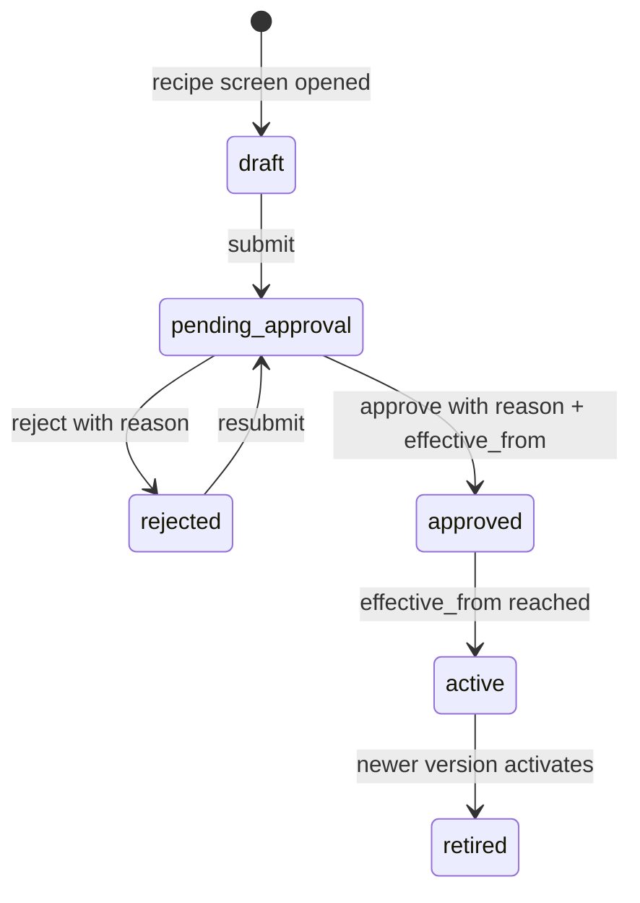

# Recipe auto-provisioning, approval workflow, and visual instructions

## Findings first

**1. `recipe_component.recipe_version_id` is a foreign key, not a version number.** It holds 16, 17, 18 because those are `recipe_version.id` values — the global primary key. A foreign key must reference the primary key, so this column cannot hold 1/2/3. Verified against the live DB:

```
comp_id 25  recipe_version_id 16  -> recipe 11  product 910119  version_number 1
comp_id 27  recipe_version_id 17  -> recipe 12  product 910121  version_number 1
comp_id 30  recipe_version_id 18  -> recipe 13  product 3229    version_number 1
```

Every one of those rows sits on **version 1** of its own recipe. The numbering is already correct. The fix is to return `version_number` alongside the FK in API payloads so no screen ever shows the raw id.

**2. `version_number` is already per-recipe** and protected by `UniqueConstraint(fields=['recipe','version_number'], name='uq_recipe_version_number')` in [recipe/models.py](recipe/models.py). No change needed.

**3. Recipe endpoints currently have zero RBAC.** Every route in [recipe/views.py](recipe/views.py) is unauthenticated. The approval work is where auth gets introduced.

## Target lifecycle



Component lines are editable only in `draft` and `rejected`. Once submitted, the recipe is frozen — that is the point of the approval gate.

---

# Phase 1 — Kill the create-recipe step

No schema changes in this phase.

### 1.1 `recipe/utils.py` — new helpers

```python
def next_version_number(recipe: Recipe) -> int:
    last = recipe.versions.order_by('-version_number').first()
    return (last.version_number + 1) if last else 1


@transaction.atomic
def get_or_create_recipe_with_draft(product_id: int, request=None) -> tuple[Recipe, bool]:
    """Resolve recipe for a product, creating it plus an empty draft v1 if absent."""
    recipe, created = Recipe.objects.get_or_create(
        product_id=product_id,
        defaults={'name': Product.objects.get(pk=product_id).name},
    )
    if not recipe.versions.exists():
        RecipeVersion.objects.create(
            recipe=recipe,
            version_number=1,
            status=RecipeVersionStatus.DRAFT,
        )
    return recipe, created


@transaction.atomic
def clone_version(source: RecipeVersion) -> RecipeVersion:
    """New draft on the same recipe with source header fields + all component lines."""
```

`clone_version` copies `process_loss`, `batch_quantity`, `batch_unit_id`, `sum_batch_quantity`, `sum_net_quantity`, `sum_gross_quantity`, `location_id`, `remarks`, then `bulk_create`s components preserving `line_no`, `component_product_id`, `quantity`, `unit_id`, `batch_quantity`, `gross_batch_quantity`, `step_instructions`, `is_implicit`. Status is forced to `draft`. Approval fields and dates are **not** copied — a clone must earn its own approval.

### 1.2 New endpoint: resolve-or-create by product

Add to [recipe/urls.py](recipe/urls.py) above the existing `product/<int:product_id>/tree/` route:

```python
path('product/<int:product_id>/', recipe_by_product_api, name='recipe-by-product'),
```

`recipe_by_product_api` (GET and POST both accepted): 404 if the product is missing or inactive, otherwise call `get_or_create_recipe_with_draft` and return `recipe_detail_dict`. `201` when newly created, `200` when it already existed. This single call replaces the create-recipe form.

### 1.3 `recipe_create_api` — idempotent + auto-draft

In [recipe/views.py](recipe/views.py) lines 210-241: replace the `409` at line 222 with a `200` returning the existing recipe, and route creation through `get_or_create_recipe_with_draft`.

### 1.4 `recipe_version_collection_api` — server numbering + copy

In [recipe/views.py](recipe/views.py) lines 306-371:

- Delete the client `version_number` branch at lines 325-328; always use `next_version_number(recipe)`. A client-sent value is ignored.
- Add optional `copy_from_version_id`: absent or `null` gives an empty version; a value must belong to this recipe or return `400`, and `404` if the id does not exist.
- Wrap create plus component copy in one `transaction.atomic`, then call `sync_has_recipe`.

### 1.5 Response shape additions

- `recipe_version_list_dict`: add `version_label` (`f'v{version_number}'`) and `component_count`.
- `component_dict`: add `version_number` so a component row can display "v1" instead of the FK. This is the direct fix for the 16/17/18 confusion.
- Create-version response: add `copied_from_version_id`.

---

# Phase 2 — Audit and approval

### 2.1 Model changes — [recipe/models.py](recipe/models.py)

Extend `RecipeVersionStatus`:

```python
class RecipeVersionStatus(models.TextChoices):
    DRAFT = 'draft', 'Draft'
    PENDING_APPROVAL = 'pending_approval', 'Pending approval'
    REJECTED = 'rejected', 'Rejected'
    APPROVED = 'approved', 'Approved'
    ACTIVE = 'active', 'Active'
    RETIRED = 'retired', 'Retired'
```

The existing `chk_recipe_version_status` CheckConstraint hardcodes the four current values, so the migration must **drop and recreate it** with all six.

New fields on `RecipeVersion` (all nullable, following the flat `actor_sub` / `actor_name` style already used by `ProductAudit`):

- `created_by_sub`, `created_by_name` — who drafted it
- `submitted_by_sub`, `submitted_by_name`, `submitted_at`
- `approved_by_sub`, `approved_by_name`, `approved_at`, `approval_reason` (TextField)
- `rejected_by_sub`, `rejected_by_name`, `rejected_at`, `rejection_reason` (TextField)
- `next_review_date` (DateField) — the "next date to look into for updates"
- `activated_at` (DateTimeField)

`effective_from` and `effective_to` already exist and become the go-live and expiry dates.

New fields on `Recipe`: `created_by_sub`, `created_by_name`.

Add an index on `['status', 'effective_from']` so the daily activation command stays cheap.

### 2.2 New model — `RecipeAttachment`

Mirrors `GoodsInAttachment` in [purchasing/models.py](purchasing/models.py), which is the established multi-file pattern:

```python
class RecipeAttachmentKind(models.TextChoices):
    HERO = 'hero', 'Finished product'
    STEP = 'step', 'Process step'
    PACKAGING = 'packaging', 'Packaging'
    OTHER = 'other', 'Other'


class RecipeAttachment(models.Model):
    recipe_version = models.ForeignKey(
        RecipeVersion, on_delete=models.CASCADE, related_name='attachments',
    )
    component = models.ForeignKey(
        RecipeComponent, on_delete=models.SET_NULL,
        null=True, blank=True, related_name='attachments',
    )
    kind = models.CharField(max_length=32, choices=RecipeAttachmentKind.choices,
                            default=RecipeAttachmentKind.STEP)
    s3_key = models.CharField(max_length=512)
    content_type = models.CharField(max_length=64, null=True, blank=True)
    original_filename = models.CharField(max_length=255, null=True, blank=True)
    caption = models.CharField(max_length=255, null=True, blank=True)
    sort_order = models.IntegerField(default=0)
    uploaded_by_sub = models.CharField(max_length=64, null=True, blank=True)
    created_at = models.DateTimeField(auto_now_add=True)

    class Meta:
        db_table = 'recipe_attachment'
        ordering = ['sort_order', 'id']
```

A null `component` means the image belongs to the whole version. A set `component` means it illustrates that ingredient or step.

### 2.3 Permissions — new `recipe/permissions.py`

The RBAC system has no generic permission-code table; it uses department and admin-area grants, and `Department.IT` is a global bypass via `has_global_access`. So put the policy behind one swappable function:

```python
from users_rbac.auth import attach_user
from users_rbac.permissions import require_any_admin


def require_recipe_approver(request):
    """
    Today: IT (global) or any admin-area grant.
    Later: narrow to require_admin_area(request, AdminArea.TECHNICAL) for the
    technical/key-manager sign-off. One-line change, no caller churn.
    """
    denied = attach_user(request)
    if denied:
        return denied
    return require_any_admin(request)
```

Every approval endpoint calls only this. When the key-manager role is defined, swap the body for `require_admin_area(request, AdminArea.TECHNICAL)` and nothing else moves.

### 2.4 New endpoints

Added to [recipe/urls.py](recipe/urls.py):

- `POST /recipe/versions/<pk>/submit/` — `draft` or `rejected` to `pending_approval`. Requires at least one component line, else `400`. Stamps `submitted_by_*`. Auth: `attach_user` only.
- `POST /recipe/versions/<pk>/approve/` — gated by `require_recipe_approver`. Body: `reason` (**required**, else `400`), `effective_from` (**required**), `next_review_date` (optional), `effective_to` (optional). Version must be `pending_approval`, else `409`. Stamps `approved_by_*`, `approved_at`, `approval_reason`. If `effective_from <= today` it calls the existing `activate_version` and sets `activated_at`; otherwise it stays `approved` and waits.
- `POST /recipe/versions/<pk>/reject/` — gated by `require_recipe_approver`. Body: `reason` (**required**). Sets `rejected`, unlocking component edits.
- `GET /recipe/versions/<pk>/history/` — the approval trail for that version: who drafted, who submitted, who approved or rejected, reasons, timestamps, dates.

Changes to existing endpoints:

- `recipe_version_activate_api` — now gated by `require_recipe_approver` and rejects anything not in `approved` status with `409`. Direct draft-to-active is no longer possible.
- `recipe_component_collection_api` and `recipe_component_detail_api` — return `409 "This version is locked while it is awaiting approval."` when the parent version status is not `draft` or `rejected`.
- `recipe_version_update_api` — same lock, and `status` can no longer be set through PATCH at all; the submit/approve/reject endpoints own status transitions.

### 2.5 Audit trail — reuse the product timeline

**Current state: recipe has no audit logging at all.** There is not one call to `capture_product_audit` anywhere in `recipe/`. Product, by contrast, already audits ten satellite views — `flags`, `nutrition`, `technical`, `shelf_life`, `stock_policy`, `production`, `costing`, `supplier_product`, `ingredient_label`, `yield` — each capturing who, when, before JSON, after JSON, and changed fields. Recipe gets the same treatment, reusing the same machinery rather than inventing a second one.

**Why reuse and not a new `recipe_audit` table.** `capture_product_audit` in [product/audit_log.py](product/audit_log.py) already does everything asked for: it resolves the actor from the Cognito JWT (`actor_sub`, `actor_name`, `actor_email`), records IP and user agent, stores `before_json` / `after_json`, and computes `changed_fields` via `_changed_fields`. A recipe always belongs to exactly one product, so recipe events land on that product's existing timeline and the whole history of a product — including its formula — reads as one stream. It also fails silently by design (the `except Exception: return` at the bottom), so a broken audit can never fail a business write.

**The house pattern to copy**, straight from [product/views/flags_views.py](product/views/flags_views.py):

```python
existing = ProductFlags.objects.filter(pk=pk).first()
before_data = flags_dict(existing) if existing else None
flags, created = ProductFlags.objects.update_or_create(product_id=pk, defaults=defaults)
after_data = flags_dict(flags)
capture_product_audit(
    request,
    product_id=pk,
    entity='flags',
    action='create' if created else 'update',
    before_data=before_data,
    after_data=after_data,
)
```

The before snapshot is taken **with the same serializer used for the response**. Recipe already has those serializers — `recipe_detail_dict`, `recipe_version_detail_dict`, `component_dict` — so no new snapshot code is needed.

**Every call site to add.** `ProductAuditAction` has only `create` / `update` / `delete`, so the specific event is carried by `entity` plus the payload:

- `recipe_create_api` / `get_or_create_recipe_with_draft` — entity `recipe`, action `create`, before `None`, after `recipe_detail_dict`
- `recipe_update_api` — entity `recipe`, action `update`, before/after `recipe_detail_dict`
- `recipe_delete_api` — entity `recipe`, action `delete`, before `recipe_detail_dict`, after `None`
- `recipe_version_collection_api` — entity `recipe_version`, action `create`, after `recipe_version_detail_dict` plus `copied_from_version_id` so a clone is traceable to its source
- `recipe_version_update_api` — entity `recipe_version`, action `update`, before/after `recipe_version_detail_dict`
- **submit** — entity `recipe_version`, action `update`, before `{'status': 'draft'}`, after `{'status': 'pending_approval', 'submitted_by_name': ..., 'component_count': N}`
- **approve** — entity `recipe_version`, action `update`, before `{'status': 'pending_approval'}`, after `{'status': ..., 'approval_reason': reason, 'effective_from': ..., 'next_review_date': ..., 'approved_by_name': ...}`. This is the row a BRC or customer auditor will ask for.
- **reject** — entity `recipe_version`, action `update`, with `rejection_reason` in the after payload
- **activate** (manual and the scheduled command) — entity `recipe_version`, action `update`, before/after status, with `'source': 'scheduled'` when the cron flips it so an unattended change is distinguishable from a human one
- `recipe_component_collection_api` — entity `recipe_component`, action `create`, after `component_dict`
- `recipe_component_detail_api` PATCH — entity `recipe_component`, action `update`, before/after `component_dict`. This gives "quantity went 50000 to 52000, changed by X" for free via `changed_fields`.
- `recipe_component_detail_api` DELETE — entity `recipe_component`, action `delete`, before `component_dict`
- attachment upload and delete — entity `recipe_attachment`, action `create` / `delete`

For the scheduled command there is no HTTP request, so pass a lightweight stub (`RequestFactory().post(...)` style or a small object exposing `method`, `path`, `headers`, `META`) and let the actor fields land as null with `'source': 'scheduled'` recording why.

**Reading it back.** `GET /product/<pk>/timeline/` already returns the full reversed event list and needs no change. Add `GET /recipe/<pk>/audit/` that reads the same `ProductAudit` row for `recipe.product_id` and filters to `entity in ('recipe','recipe_version','recipe_component','recipe_attachment')`, optionally narrowed by `?version_id=`, so the recipe screen shows just formula history rather than the entire product's life.

**Two things to be aware of.**

First, `_actor_stamp` falls back to decoding the bearer token without verification, and returns all-null actor fields when there is no token at all. Since recipe endpoints are unauthenticated today, any write made before the auth work in section 2.4 lands records "who: null". Audit is only as trustworthy as the gate in front of it, which is another reason 2.3 and 2.4 come before this.

Second, `timeline_events` is a single JSON column per product that only ever grows, and component-line edits are chatty. Product already has this exposure; recipe will accelerate it. Recommendation: add trimming in `capture_product_audit` to keep the most recent 500 events, and an `?entity=` filter on the timeline endpoint. That touches shared product code, so flag it before doing it rather than slipping it in.

The denormalised `created_by_*` / `approved_by_*` columns on `RecipeVersion` from section 2.1 stay as the fast path, so the version list can render "approved by X on Y" without parsing timeline JSON. The timeline is the forensic record; the columns are the display cache.

### 2.6 Scheduled activation

New command `recipe/management/commands/activate_due_recipe_versions.py`:

```python
RecipeVersion.objects.filter(
    status=RecipeVersionStatus.APPROVED,
    effective_from__lte=date.today(),
)
```

For each, call `activate_version` (which already retires the prior active version for that recipe under `select_for_update`) and set `activated_at`. Supports `--dry-run`. Run daily via cron.

A `next_review_date` report is a filter on the same table, so no extra machinery: `GET /recipe/versions/?review_due_before=YYYY-MM-DD`.

---

# Phase 3 — Visual instructions

### 3.1 `recipe/attachments.py` — S3 service

Copy the house pattern from [purchasing/services/attachments.py](purchasing/services/attachments.py) and [product/category_images.py](product/category_images.py): boto3 `put_object` into `MEDIA_S3_BUCKET` with `ServerSideEncryption='AES256'`, private object, and a presigned GET URL (~1h) returned to the client. No `django-storages`, no `ImageField` — that is not how this codebase works.

- Key prefix: `Recipe-version/{version_id}/{uuid}.{ext}`
- Allowed: JPEG, PNG, WebP. Max 5 MiB.
- Helper `attachment_url(row)` returns the presigned URL, `None` on failure.

### 3.2 Endpoints

- `GET|POST /recipe/versions/<pk>/attachments/` — multipart, field `file` or `image`, plus optional `kind`, `component_id`, `caption`, `sort_order`. GET lists with presigned URLs.
- `DELETE /recipe/attachments/<pk>/` — removes the row and best-effort deletes the S3 object.

Uploads are allowed while the version is `draft` or `rejected`, matching the component lock.

### 3.3 Payload wiring

- `recipe_version_detail_dict` gains `attachments: []` (version-level, `component_id` null).
- `component_dict` gains `attachments: []` for that line.

That gives each ingredient line its own photo sequence, so a worker who reads none of your five languages can follow the pictures down the line, with the finished-product hero photo at the top.

---

## Tests

Extend [recipe/tests.py](recipe/tests.py):

- Opening `/recipe/product/:id/` on a product with no recipe returns 201 with one draft version numbered 1; a second call returns 200 and does not add a version
- Two different products each get `version_number = 1`
- Copy clones header and all lines, status `draft`, number is previous max + 1; cross-recipe copy returns 400; client `version_number: 99` is ignored
- Submit with zero components returns 400
- Approve without a reason returns 400
- Approve as a non-admin returns 403; as IT returns 200
- Approve with a past `effective_from` activates immediately and retires the prior active version
- Approve with a future `effective_from` leaves status `approved`; the command then activates it on the day
- Adding a component to a `pending_approval` version returns 409
- Editing a component quantity writes a timeline event with the actor, `before_json`, `after_json`, and `changed_fields == ['quantity']`
- Approving writes a timeline event carrying `approval_reason` and `effective_from`
- `GET /recipe/<pk>/audit/` returns only recipe-scoped entities, not unrelated product events

## Postman

Per the workspace Postman standard, add fully documented requests for the by-product endpoint, submit, approve, reject, history, and both attachment routes, each with path/query/body tables, response shape, and status codes. Update Create Recipe (now idempotent, 200 not 409), Create Version (`copy_from_version_id`, server-assigned number), and Activate (now approver-gated, requires `approved`).

---

# Frontend instructions (apply after backend is merged)

### 1. Delete the "Create Recipe" step
Remove the form asking for recipe `name` and `remarks` — they duplicate `product.name` and `product.remarks`.

### 2. Entry point is one call

```
GET /recipe/product/{product_id}/
```

Returns the full recipe with `versions[]`, always containing at least a draft v1, so the ingredient table renders immediately. Treat 200 and 201 the same. Store `data.id` as `recipe_id`.

### 3. Fix the version label bug
Anywhere showing 16/24/25/26, switch the display field:

- **Display:** `version_label` ("v1", "v2") or `version_number`
- **Send in URLs:** `id`

On component rows, use the new `version_number` field rather than `recipe_version_id`. Never render a raw id or FK to a user.

### 4. New version modal
Replace the `version_number` input with a copy-source picker:

```json
POST /recipe/{recipe_id}/versions/
{ "copy_from_version_id": 31 }
```

Omit or send `null` to start empty. Never send `version_number`.

### 5. Approval UI
The ingredient editor must go read-only when `status` is not `draft` or `rejected`. Drive the buttons off `status`:

- `draft` / `rejected` — editable, show **Submit for approval**. When `rejected`, show `rejection_reason` in a banner.
- `pending_approval` — locked. Show **Approve** and **Reject** only to approvers.
- `approved` — locked. Banner: "Goes live on {effective_from}".
- `active` — locked. Banner: "Live since {activated_at}. Next review {next_review_date}".

Approve dialog fields: **Reason** (required), **Effective from** (required, date), **Next review date** (optional), **Effective to** (optional). Reject dialog: **Reason** (required).

All approval calls need `Authorization: Bearer <jwt>`. A `403` means the signed-in user is not an approver — show the message from the response envelope, do not invent your own.

### 6. Images
Upload as multipart `POST /recipe/versions/{id}/attachments/` with field `file`, plus `kind`, optional `component_id`, `caption`, `sort_order`. Render `attachments[].url` (presigned, expires in about an hour — refetch rather than caching the URL). Show the `hero` image at the top of the recipe and `step` images inline on their component row, so the sheet is followable without reading any text.

### 7. History tab
Add a History tab on the recipe screen backed by `GET /recipe/{recipe_id}/audit/`. Each event has `at`, `actor_name`, `entity`, `action`, `changed_fields`, `before_json`, `after_json`. Render one row per event as "{actor_name} changed {changed_fields} on {entity}" with an expandable before/after diff, newest first. Approval events carry `approval_reason` — surface that prominently, since it is the answer to "why was this version approved".

### 8. Unchanged
Component CRUD contracts and the tree endpoint keep their current shapes.

### 9. Net user journey
1. Create product (spice mix / fry stage / packing / FG — each with its own code)
2. Open recipe screen — recipe and draft v1 appear on their own
3. Add ingredient lines and photos
4. Submit for approval
5. Technical approver approves with a reason and a go-live date
6. It activates on that date; the review date drives the next look
