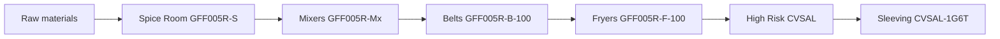

# Recipe dependency tree API

## Goal

For a finished good (e.g. veg samosa `CVSAL-1G6T`), return a walkable **recipe tree** the UI can draw as a graph:



Links come from existing data: each product’s **active** recipe components + `source_container` / `destination_container` on [`product/models.py`](product/models.py). No new tables. No BOM qty/yield engine (that stays Phase 2).

## Endpoint

`GET /recipe/product/<product_id>/tree/`

Register in [`recipe/urls.py`](recipe/urls.py) **before** `<int:pk>/` so it does not clash:

```python
path('product/<int:product_id>/tree/', recipe_product_tree_api, ...)
```

## Response shape (graph-ready)

One payload with both a nested tree (easy debugging) and flat `nodes` / `edges` (React Flow / similar):

```json
{
  "root_product_id": 123,
  "nodes": [
    {
      "product_id": 123,
      "name": "...",
      "recipe_code": "CVSAL-1G6T",
      "from_location_id": 1,
      "from_location_name": "Sleeving",
      "to_location_id": 2,
      "to_location_name": "Dispatch",
      "has_recipe": true,
      "recipe_id": 10,
      "version_id": 20,
      "version_number": 1
    }
  ],
  "edges": [
    {
      "parent_product_id": 123,
      "child_product_id": 99,
      "quantity": "6.000000",
      "unit_name": "EA",
      "line_no": 1
    }
  ],
  "tree": { "...nested children..." }
}
```

## Walk rules (in [`recipe/utils.py`](recipe/utils.py))

New helper `build_recipe_tree(product_id)`:

1. Load product (+ source/destination containers).
2. Find `Recipe` for that product; pick **active** version, else latest (same rule as list API).
3. For each component on that version, recurse into `component_product_id`.
4. Cycle guard: track `seen` product ids; stop branch if already visited.
5. Depth cap (e.g. 20) to avoid runaway trees.
6. Leaves = products with no recipe / no components (raw materials).

Prefetch recipes/versions/components/locations in bulk where cheap; otherwise accept N queries for v1 (small trees).

## View

Thin view in [`recipe/views.py`](recipe/views.py): 404 if product missing; else `api_success(..., build_recipe_tree(...))`.

## Frontend use

- Draw **nodes** as cards (name + from → to).
- Draw **edges** parent → child (ingredient link).
- Layout left-to-right by depth, or by `from_location_name` columns if preferred.

## Out of scope

- Yield / process_loss / batch explode math
- “Where-used” reverse graph (parent search) — add later if needed
- Canvas / in-repo visual UI (FE owns rendering)
