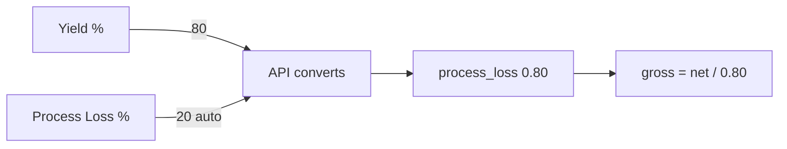

# Recipe process loss and yield as linked percents

## What is stored today

[`recipe_version.process_loss`](recipe/models.py) is **not** a percent. Default `1.0000` means no extra material. Planning / allocation divide by it:

`gross = net / process_loss`

So `0.80` means keep 80% (20% shrinkage) → ~1.25× more raw. Typing `0.30` into this field is treated as **30% yield** (~3.33×), which is the trap in your table.

No schema change. Imports and planning stay on the factor.

## Conversion (API boundary only)

**Yield is the driver.** Process loss is always `100 - yield`.

| User types | Stored `process_loss` | Auto field |
|---|---|---|
| Yield **80** (%) | `0.80` | Process loss **20** |
| Process loss **20** (%) (optional) | `0.80` | Yield **80** |

```
yield_pct         = process_loss * 100
process_loss_pct  = 100 - yield_pct
process_loss      = yield_pct / 100
```

Percents round to **2 decimal places** (77.23 / 22.77). Stored factor stays **4 decimals** (`0.7723`).

Reject `yield_pct <= 0` with **400**: `Yield must be greater than 0. 0% yield would mean infinite raw material.` Allow yield **> 100%** so existing rows like `1.0500` still round-trip (loss **-5.00**).

**Single source of truth:** if `yield_pct` is present, **always ignore `process_loss_pct`**, even when 80 + 20 = 100. Avoids float twins (77.23 vs 22.77).

## Backend (this repo)

In [`recipe/views/helpers.py`](recipe/views/helpers.py):

```python
def pcts_from_factor(factor):
    yield_pct = (factor * 100).quantize(Decimal('0.01'))
    loss_pct = (Decimal('100') - yield_pct).quantize(Decimal('0.01'))
    return yield_pct, loss_pct

def factor_from_body(body):
    if 'yield_pct' in body:
        factor = parse_decimal(body['yield_pct'], 'yield_pct') / 100
        if factor is None or factor <= 0:
            raise ValueError(
                'Yield must be greater than 0. 0% yield would mean infinite raw material.'
            )
        return factor.quantize(Decimal('0.0001'))
    if 'process_loss' in body:  # legacy factor 0.80
        return parse_decimal(body['process_loss'], 'process_loss')
    if 'process_loss_pct' in body:
        yield_pct = Decimal('100') - parse_decimal(body['process_loss_pct'], 'process_loss_pct')
        factor = yield_pct / 100
        if factor <= 0:
            raise ValueError(
                'Yield must be greater than 0. 0% yield would mean infinite raw material.'
            )
        return factor.quantize(Decimal('0.0001'))
    return None  # caller keeps default 1.0000
```

Precedence: **`yield_pct` → legacy `process_loss` → `process_loss_pct` → default 1.0000**.

Wire into list/detail dicts and create / clone / PATCH in [`recipe/views/version_views.py`](recipe/views/version_views.py). Live-202 still sends `process_loss: 1.0000`.

## Tests and Postman

- PATCH `yield_pct: 80` → `0.8000`, `process_loss_pct: 20.00`, `yield_pct: 80.00`
- PATCH `yield_pct: 77.23` → `0.7723`, loss `22.77`
- PATCH `yield_pct: 80` **and** `process_loss_pct: 99` → still `0.8000` (loss ignored)
- PATCH `yield_pct: 0` → 400 with the infinite-raw message
- GET `1.0000` → yield `100.00` / loss `0.00`
- Postman create/patch: document `yield_pct` (preferred), `process_loss_pct` (only if yield omitted), legacy `process_loss` factor

## UI (not in this service)

- Row: **Yield % (Retention)** then **Process Loss %** (read-mostly, 2 dp)
- On yield change: `loss = round(100 - yield, 2)`
- Save **only `yield_pct`**. Do not send loss or the 0.80 factor.



## Planning (already uses this)

No planning code change. Explode already reads `recipe_version.process_loss` in [`planning/adapters/recipe.py`](planning/adapters/recipe.py) / [`get_product_spec`](planning/adapters/product.py) and [`chain_net.py`](planning/services/chain_net.py): `gross = net / process_loss`.

Save yield **80%** → DB **0.8000** → next plan run asks for **1.25×** more input (`net / 0.80`). Save **100%** → **1.0000** → no extra.

Already-exploded plan rows keep old factors until you **re-run** the plan. Product `yield_factor` (per-SKU retention on BOM lines) is a different field and is unchanged.

Skipped: migrating historical `process_loss` values; changing planning formulas; product `yield_factor`.
