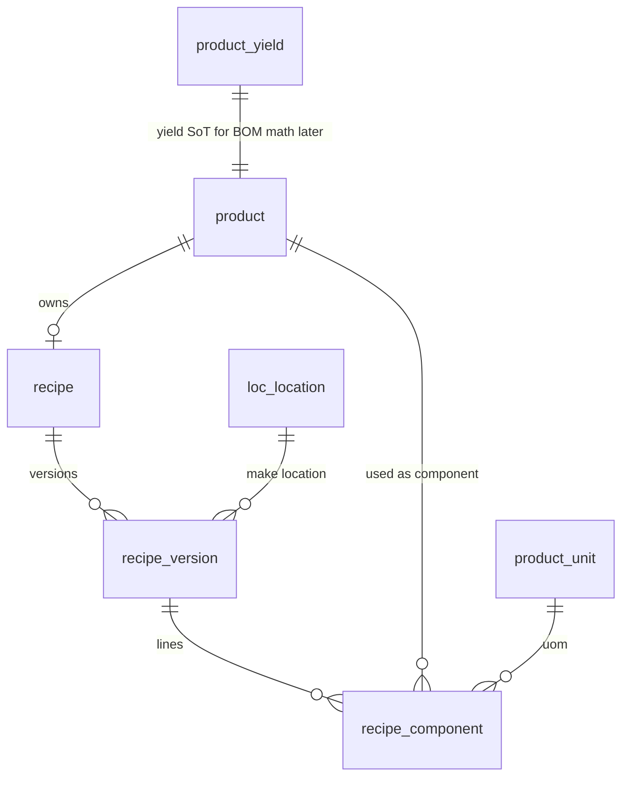

# Recipe + BOM Tree Module — Working Plan

**Status:** Phase 1 schema **locked**. BOM engine = Phase 2 (not now).  
**Live DB inspected:** `DB_LOCATIONS` @ `3.10.84.186` (product + locations already present; `product` row count = **0**).  
**Do not store DB passwords in this file.**

---

## Decisions locked (from you)

| # | Decision |
|---|----------|
| 1 | **Phase 1** = `recipe` + `recipe_version` + `recipe_component` only |
| 2 | **Phase 2** = Production BOM Engine (separate) |
| 3 | FKs target live tables in `DB_LOCATIONS`: `product`, `product_unit`, `loc_location` |
| 4 | Food-standard versioning: `draft` / `approved` / `active` / `retired` (not empty `tblProductsVersions`) |

---

## Live schema facts (verified)

- Apps migrated: `locations` (0001–0002), `product` (0001–0003).
- `product.id` = `int` PK, **no AUTO_INCREMENT** (legacy IDs preserved when backfilled).
- Containers/locations = `loc_location` (product FKs `source_container_id` / `destination_container_id`).
- Yield SoT already exists: `product_yield.yield_factor` `decimal(10,4)`.
- Flag exists: `product_flags.has_recipe`.
- Conventions: `utf8mb4_unicode_ci`, `datetime(6)`, `tinyint(1)` bools, qty weights `decimal(16,6)`.

**Bullshit to acknowledge:** DB name is `DB_LOCATIONS` but it already holds the full product catalog. Recipe tables go in the **same DB** for now (matches shared-RDS architect diagram). Rename later if you split services.

---

## Phase 1 ERD



**Yield rule (locked):** BOM math (Phase 2) reads **`product_yield.yield_factor`**, not a copy on the component line. `recipe_version.process_loss` holds NPD `processLoss`. Do not invent a second yield SoT.

---

## Phase 1 DDL (apply to `DB_LOCATIONS`)

```sql
-- ============================================================
-- Phase 1: Recipe master (food-industry names)
-- Target: DB_LOCATIONS
-- Depends on: product, product_unit, loc_location
-- ============================================================

CREATE TABLE recipe (
  id              INT NOT NULL AUTO_INCREMENT,
  product_id      INT NOT NULL,
  name            VARCHAR(128) NULL,          -- optional display override; default = product.name
  remarks         LONGTEXT NULL,
  created_at      DATETIME(6) NOT NULL,
  updated_at      DATETIME(6) NOT NULL,
  PRIMARY KEY (id),
  UNIQUE KEY uq_recipe_product (product_id),  -- one recipe book per product; versions live under it
  CONSTRAINT fk_recipe_product
    FOREIGN KEY (product_id) REFERENCES product (id)
) ENGINE=InnoDB DEFAULT CHARSET=utf8mb4 COLLATE=utf8mb4_unicode_ci;

CREATE TABLE recipe_version (
  id                   INT NOT NULL AUTO_INCREMENT,
  recipe_id            INT NOT NULL,
  version_number       INT NOT NULL,
  status               VARCHAR(16) NOT NULL,   -- draft | approved | active | retired
  process_loss         DECIMAL(10,4) NOT NULL DEFAULT 1.0000,  -- legacy NPD processLoss
  batch_quantity       DECIMAL(16,6) NULL,     -- standard make qty (NotaZone batch size)
  batch_unit_id        INT NULL,               -- unit for batch_quantity
  sum_batch_quantity   DECIMAL(16,6) NULL,     -- denorm totals from NPD header (cache OK)
  sum_net_quantity     DECIMAL(16,6) NULL,
  sum_gross_quantity   DECIMAL(16,6) NULL,
  location_id          INT NULL,               -- make location (NotaZone); FK loc_location
  effective_from       DATE NULL,
  effective_to         DATE NULL,
  remarks              LONGTEXT NULL,
  created_at           DATETIME(6) NOT NULL,
  updated_at           DATETIME(6) NOT NULL,
  PRIMARY KEY (id),
  UNIQUE KEY uq_recipe_version_number (recipe_id, version_number),
  -- MySQL 8.0.13+: partial unique — at most one active version per recipe
  UNIQUE KEY uq_recipe_one_active (recipe_id, (IF(status = 'active', 1, NULL))),
  KEY idx_recipe_version_status (recipe_id, status),
  CONSTRAINT fk_recipe_version_recipe
    FOREIGN KEY (recipe_id) REFERENCES recipe (id),
  CONSTRAINT fk_recipe_version_batch_unit
    FOREIGN KEY (batch_unit_id) REFERENCES product_unit (id),
  CONSTRAINT fk_recipe_version_location
    FOREIGN KEY (location_id) REFERENCES loc_location (id),
  CONSTRAINT chk_recipe_version_status
    CHECK (status IN ('draft', 'approved', 'active', 'retired')),
  CONSTRAINT chk_recipe_version_process_loss
    CHECK (process_loss > 0)
) ENGINE=InnoDB DEFAULT CHARSET=utf8mb4 COLLATE=utf8mb4_unicode_ci;

CREATE TABLE recipe_component (
  id                      INT NOT NULL AUTO_INCREMENT,
  recipe_version_id       INT NOT NULL,
  line_no                 INT NOT NULL,              -- legacy idx
  component_product_id    INT NOT NULL,              -- was item
  quantity                DECIMAL(16,6) NOT NULL,    -- qty per batch / standard make
  unit_id                 INT NOT NULL,              -- FK product_unit
  batch_quantity          DECIMAL(16,6) NULL,        -- net batch mass (legacy batchquantity)
  gross_batch_quantity    DECIMAL(16,6) NULL,        -- raw/gross (legacy grossbatchquantity)
  step_instructions       LONGTEXT NULL,
  is_implicit             TINYINT(1) NOT NULL DEFAULT 0,
  -- intentionally NO yield_factor / item_cost / line_cost as SoT
  -- yield → product_yield; costs → product_costing (avoid legacy drift)
  created_at              DATETIME(6) NOT NULL,
  updated_at              DATETIME(6) NOT NULL,
  PRIMARY KEY (id),
  UNIQUE KEY uq_version_component (recipe_version_id, component_product_id),
  UNIQUE KEY uq_version_line_no (recipe_version_id, line_no),
  KEY idx_component_product (component_product_id),
  CONSTRAINT fk_recipe_component_version
    FOREIGN KEY (recipe_version_id) REFERENCES recipe_version (id)
    ON DELETE CASCADE,
  CONSTRAINT fk_recipe_component_product
    FOREIGN KEY (component_product_id) REFERENCES product (id),
  CONSTRAINT fk_recipe_component_unit
    FOREIGN KEY (unit_id) REFERENCES product_unit (id),
  CONSTRAINT chk_recipe_component_qty
    CHECK (quantity > 0)
) ENGINE=InnoDB DEFAULT CHARSET=utf8mb4 COLLATE=utf8mb4_unicode_ci;
```

### Why this shape (and what we refuse)

| Choice | Why |
|--------|-----|
| Table = `recipe_component` not `recipe_line` | Matches architect diagram + your naming |
| `UNIQUE(recipe_id)` on `recipe` | One formula book per product; versions under it |
| Status on `recipe_version` | Replaces broken live-only snapshot + empty `tblProductsVersions` |
| `UNIQUE(version, component)` | Fixes legacy `UNIQUE(parent,item)` that blocked multi-version |
| No yield/cost on component | Legacy denorm drifted; SoT is `product_yield` / `product_costing` |
| `process_loss` on version | Matches real NPD header behaviour |
| No `recipe_journal` in Phase 1 | Empty in legacy; add when you need audit UI |
| No BOM explosion tables | Phase 2 |

### App rules (DB cannot do alone)

- Reject `component_product_id = recipe.product_id` (self-loop).
- Deep cycle detection (A→B→A) — port NPD BEFORE INSERT logic into Django service.
- Activate version = transactional: set prior `active` → `retired` (or `approved`), set target → `active`. Do **not** delete history (unlike `procNPDsetActivePublish` wipe of live tree).
- Keep `product_flags.has_recipe` in sync when first/last component exists (or compute; do not leave client-only drift).

---

## Legacy → new column map (Phase 1 backfill later)

| Legacy | New |
|--------|-----|
| product (`parentprod`) | `recipe.product_id` (1 row per parent that has a tree) |
| `tblnpdproducttreeversion` | `recipe_version` (`version`→`version_number`, `active=-1`→`status=active`, `processLoss`→`process_loss`, sums→sum_*) |
| `tblnpdproducttree` | `recipe_component` (all versions) |
| `tblproducttree` | Prefer as check that active version lines match live snapshot; do **not** invent versions from it alone |
| `tblProductsVersions` | **Ignore** (empty) |
| tree `productyield` / costs | **Drop as SoT**; read `product_yield` / `product_costing` |

---

## Phase 2 (out of scope now)

- `bom_explosion_run`, `bom_requirement_line`
- Port `BOMrecursive001–005` with parity:  
  `net = parent_gross × qty / product_yield.yield_factor`  
  `gross = net / recipe_version.process_loss`
- Plan working tables stay derived

---

## Brutal risks still open

1. **`product` has 0 rows** — FKs work, but you cannot insert real recipe components until products exist.
2. **Partial unique on `active`** needs MySQL 8.0.13+ functional index; if server is older, enforce one-active in Django + trigger.
3. **Activate ≠ legacy publish** — we keep history; Access-era “wipe live tree” goes away. That is intentional and correct.
4. Credentials were pasted in chat — **rotate** `gazebo_dev` password; never commit it.

---

## Next step (needs your go-ahead to execute)

Say **“apply DDL”** and I will `CREATE TABLE` the three tables on `DB_LOCATIONS` (read-check first that they do not already exist).  
BOM engine stays untouched until you open Phase 2.