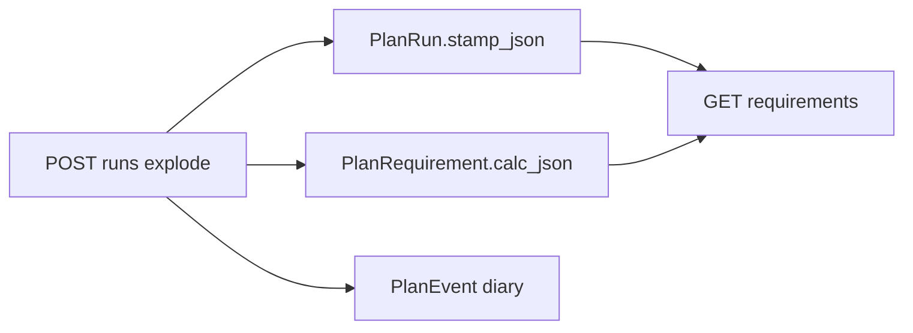

# Requirement calc transparency + audit stamp

Give planners a readable worksheet for every exploded requirement, and a durable who/when/what trail for the explode itself. Numeric columns stay the source of truth. JSON is display + audit, never edited.



## Storage (one migration)

[`planning/models.py`](planning/models.py) + `planning/migrations/0005_run_stamp_req_calc.py`:

- `PlanRun.stamp_json` JSONField null — **once per run** (do not copy onto every requirement; a plan can have thousands of rows, current GET is already ~140KB).
- `PlanRequirement.calc_json` JSONField null — **per row** math.

Old runs stay `null` until the planner re-explodes. History = previous `PlanRun` rows, not mutating JSON.

## Audit stamp (who / when / what)

Reuse the product audit actor helper ([`product/audit_log.py`](product/audit_log.py) `_actor_stamp`) from the explode view so JWT name/email/sub/IP is captured even when the body omits `actor_user_id`.

Write `PlanRun.stamp_json`:

```json
{
  "v": 1,
  "what": "explode",
  "actor_sub": "...",
  "actor_name": "Harvi",
  "actor_email": "...",
  "source_workstation_ip": "...",
  "at": "2026-08-22T14:50:38Z",
  "plan_id": 2,
  "run_id": 7,
  "run_number": 7,
  "driver": "explode-1.1",
  "line_count": 12
}
```

Also copy that object onto existing `PlanEvent` payloads for `run_started` / `run_complete` / `run_failed` (diary already at `GET /planning/plans/{id}/events/`). Keep `actor_user_id` as today.

Pass a `stamp` dict into [`run_explode`](planning/services/explode.py) — do not pass `HttpRequest` into the service.

## Calc JSON v1 (on each requirement)

Built in explode at create time. Decimals as **strings**. Frontend renders `steps` in order; switches on `v`.

**Demand root** (`kind: demand`) — from [`_explode_line`](planning/services/explode.py):

- inputs: plan line qty, process_loss, recipe_version_id + version_number, consider_stock / full_batches / align flags (after line overrides)
- steps: `gross = net / process_loss` → stock net (or skipped) → batch split
- result: net, gross, batch_number, batch_count

**Child** (`kind: child`) — from [`_explode_children`](planning/services/explode.py):

- inputs: parent_gross, parent_product_id/name, bom_qty, bom_sum, batch_quantity, denom used, yield_factor, process_loss, recipe_version_number
- steps: `scaled_child_net` (this is the working the API currently throws away) → gross from loss → stock net → full-batch qty bump if any
- `summary`: one English sentence, same idea as chain-net `explanation`

Example child:

```json
{
  "v": 1,
  "kind": "child",
  "summary": "60000 from parent 5000 × BOM 12 / yield 1. Stock not applied.",
  "inputs": { "parent_gross": "5000", "bom_qty": "12", "denom": null, "yield_factor": "1" },
  "steps": [
    { "op": "scale_bom", "formula": "parent_gross × bom_qty / yield", "from": "5000 × 12 / 1", "to": "60000" }
  ],
  "result": { "net": "60000", "gross": "60000" }
}
```

Widen [`apply_stock_netting`](planning/services/netting.py) to return a small dict (`net`, `gross`, `on_hand`, `available`, `min_stock_held`, `applied`) so the stock step can show **what was deducted**, not only leftover `stock_on_hand`. Two call sites in explode.

Bump `DRIVER_VERSION` to `explode-1.1`.

## API

[`requirement_dict`](planning/views.py) adds `calc_json` (null on old runs).

[`plan_run_requirements_api`](planning/views.py) returns stamp once at the payload root:

```json
{ "stamp": { "...who when what..." }, "items": [ { "...req...", "calc_json": {} } ] }
```

[`plan_run_dict`](planning/views.py) adds `stamp_json` so run list/detail also show who exploded.

Explode POST: build stamp from request, pass into `run_explode`.

**Confidence extras (include now — small, high value):**

- `product_name` + `unit_name` on each requirement (`select_related('product__unit')`). Today the tree is IDs only; that is why the UI feels like magic.
- `recipe_version_number` inside `calc_json.inputs` (already on `RecipeVersionSpec`).

Update the requirement example in [`docs/planning-redesign/chunk-03-api/PLANNING_API.md`](docs/planning-redesign/chunk-03-api/PLANNING_API.md).

## Tests

Extend [`planning/tests_explode.py`](planning/tests_explode.py):

- Child `calc_json.steps` contains `scale_bom` and `to` matches `net_required`
- Demand row has `kind: demand` and process_loss step
- Stock skipped when `consider_stock` is off
- Requirements GET includes `stamp` + `product_name`

## Out of scope (say so in the PR)

- Editing `calc_json` / treating it as an override (line flags + re-explode remain the control surface)
- Backfilling old runs
- Per-lot ATP dump inside the JSON (size bomb; totals only)
- Chain-net already has `explanation` / `demand_breakdown` — leave it
- New audit table (PlanEvent + run stamp is the trail)

Frontend can ship a “Working” panel: stamp header (who/when) + `summary` + step list. `calc_json` null = hide panel.
