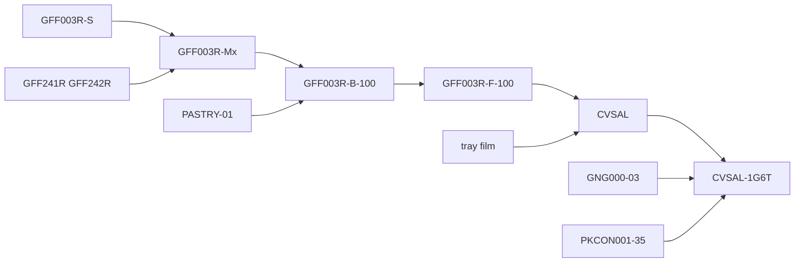

# CVSAL-1G6T Harvi cross-check (MD only)

Pilot SKU from [live-202-product.md](docs/Recipe-import-task/live-202-product.md): **CVSAL-1G6T** / DB id **1227** / Gazebo G&G Vegetable Samosa 100G x 6.

No import, no seed changes, no DB. The existing demo seed ([seed_demo_recipe_samosa.py](recipe/management/commands/seed_demo_recipe_samosa.py)) uses **GFF005R** and fake RM codes (`RM-SUGAR`) — leave it alone.

## Sources (read-only)

| Role | File |
|------|------|
| Live BOM (SoT for ERP tree) | [Dump20260819 - Pedro.sql](docs/Recipe-import-task/source-of-truth/Dump20260819%20-%20Pedro.sql) `tblproducttree` |
| Mixer / fill recipe | [harvi/1 LR/.../GFF003R VEGETABLE SAMOSA V.17.pdf](docs/Recipe-import-task/harvi/1%20LR/Signed%20copy-Print%20from%20here/GFF003R%20VEGETABLE%20SAMOSA%20V.17.pdf) |
| Spice recipe | [harvi/2 SPICES/.../GFF003R-S VEGETABLE SAMOSA - SPICES V.14.pdf](docs/Recipe-import-task/harvi/2%20SPICES/Signed%20copy%20SPICE/GFF003R-S%20VEGETABLE%20SAMOSA%20-%20SPICES%20V.14.pdf) |
| High-risk QAS (names CVSAL-1G6T) | [harvi/HIGH RISK-QAS/Gazebo/Grab & Go-QAS/GFF186MC - G&G  Vegetable Samosa 100g V.6.xlsx](docs/Recipe-import-task/harvi/HIGH%20RISK-QAS/Gazebo/Grab%20%26%20Go-QAS/GFF186MC%20-%20G%26G%20%20Vegetable%20Samosa%20100g%20V.6.xlsx) |
| RM catalogue | [harvi/threat_extracted_Master ERP - Raw Materials Refrence.xlsx](docs/Recipe-import-task/harvi/threat_extracted_Master%20ERP%20-%20Raw%20Materials%20Refrence.xlsx) |

Pedro tree already walked in the prior session: spice → steam → mixer → belt+pastry → fry → HR pack (tray/film) → sleeving (6× CVSAL + sleeve + box).

## Already visible drift (confirm in the report)

PDF mix total **186080 g**; Pedro mixer batch **232800 g** (same 8 lines). Ratio is **1.25×** on every mixer and spice line (e.g. potatoes 96000 vs 120000, spice 11040 vs 13800). Formula ratios match; batch size does not. That is the main finding to lock.

Pastry / tray / film / sleeve / box are **not** on the GFF003R sheet — they live on belt / HR / sleeving in Pedro and on the QAS pack spec.

## Work

1. **Parse the two PDFs** with `pypdf` (already works). Pull product name, issue, mix grams, spice trace code.
2. **Parse GFF186MC V.6** with `openpyxl`. Pull SKU codes, filling = GFF003R 100g, tray/film/sleeve/box, allergens.
3. **Map PDF ingredient names → Pedro `productreceipecode` → RM master Sage/stock codes** (Balti Paste, Salt, Peas, etc.). Flag unmatched names.
4. **Write one report:** [docs/Recipe-import-task/pilot-CVSAL-1G6T.md](docs/Recipe-import-task/pilot-CVSAL-1G6T.md)
   - Process chain (src→dest containers)
   - Line table: PDF qty vs Pedro qty vs ratio
   - QAS pack vs Pedro pack lines
   - RM code map
   - Gaps (PDF vs dump batch scale, demo seed GFF005R mismatch, `Copy of recipe.xlsx` has no CVSAL-1G6T row)

Skip: OCR (these PDFs already have text), full 202-SKU extract, any `manage.py` / API writes.

