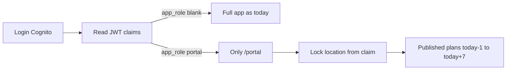

# Simple department portal + Amit RBAC

## Why it felt broken

Portal only returned **one calendar day** (default today). Your published plans were on **other dates**, so Amit saw empty. Date picking is the wrong UX for shop floor when there are 2–3 plans/day.

## Product defaults (locked)

1. **Portal content:** for the user’s department, return **all published, non-closed plans** with `plan_date` in **`today − 1` … `today + 7`**, grouped by plan. No required date picker.
2. **RBAC:** Cognito custom attributes on the user (no Django ACL table yet). FE enforces redirect + nav + locked department. Backend still accepts `location=` for planners; portal users never get a free selector.

---

## 1) Backend: portal date window

Update [`planning/services/portal.py`](planning/services/portal.py):

- If `plan_date` is passed → keep single-day behavior (backward compatible).
- If omitted → filter `plan_date__gte=today-1`, `plan_date__lte=today+7`.
- Response already has `items[]` with `plan_id` / `plan_date` / `lines` — keep that; FE will group.

Touch: [`planning/views.py`](planning/views.py) (no new params required), tests in [`planning/tests.py`](planning/tests.py), short note in [`docs/planning-redesign/chunk-07-http-api/NOTES.md`](docs/planning-redesign/chunk-07-http-api/NOTES.md).

---

## 2) Frontend: easy portal UI

Update [`PortalPage.tsx`](file:///Users/utsavgohel/projects/gazebo-erp/fronten/notazone-frontend-web/src/features/planning/pages/PortalPage.tsx):

- Call `fetchPortalToday` **without** `planDate` (use new default window).
- Show sections **per plan** (`Plan #10 · 2026-08-04` then its lines).
- Keep Outbound / Inbound tabs.
- Optional small “narrow to one day” filter later — not required for MVP.
- If user is portal-bound: **hide department dropdown**, show department name only.

---

## 3) RBAC for Amit (Cognito + FE)

**AWS (manual, one-time):**

1. User pool → custom attributes:
   - `custom:app_role` (string) — value `portal`
   - `custom:portal_location_id` (string) — Spice Room id, e.g. `15`
2. App client: mark both readable (and writable by admin).
3. On user **amit**: set `app_role=portal`, `portal_location_id=<Spice Room id>`.
4. User must re-login so id token includes claims.

**FE code:**

| File | Change |
|------|--------|
| [`cognito.ts`](file:///Users/utsavgohel/projects/gazebo-erp/fronten/notazone-frontend-web/src/auth/cognito.ts) | Extend `CognitoUser` with `appRole?: 'portal'`, `portalLocationId?: number`; parse from id token |
| [`App.tsx`](file:///Users/utsavgohel/projects/gazebo-erp/fronten/notazone-frontend-web/src/App.tsx) | If `appRole === 'portal'`: default route → `/portal`; any other path → `<Navigate to="/portal" />` |
| [`SideNav` / `nav.ts`](file:///Users/utsavgohel/projects/gazebo-erp/fronten/notazone-frontend-web/src/data/nav.ts) | Portal users: only Portal (+ Profile/logout if already in shell) |
| `PortalPage` | Seed/lock `deptId` from `user.portalLocationId` |

**Not in this chunk:** full Django permission checks on every planning/stock API (ponytail: FE gate is enough for shop-floor demo; add server enforce when you harden).

---

## 4) How you configure Amit

After deploy + Cognito attrs:

1. Look up Spice Room id (portal or `/container/departments/`).
2. Set Amit’s attributes in Cognito console.
3. Amit logs in → lands on Spice Room portal with that week’s published lines only.

Planners (no `app_role`) keep full nav and can still open `/portal` and pick any department.

---

## Out of scope

- Notifications when a plan is published
- Closing requirements after transfer (B4)
- Multi-department users (one location id only for now)
