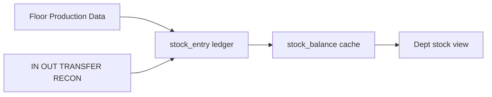

# Simple Production + Stock Design

## How legacy did your screenshot

That form (`Production Data - High Risk`) does **not** write a separate production table. Each row is a **stock movement**:

- Made qty → `stkin` (e.g. 3840)
- To Location → `destcontainer` (e.g. Sleeving)
- Trace / Use By / Vers → soft lot columns on the same row
- Action code → `PRODHIGHRISK` / `PRODLOWRISK` / `PRODSLEEVING`

Then trigger rebuilds `tblstockcache`:

```
balance = Σ(stkrecon) + Σ(stkin) − Σ(stkout)
```

keyed by `(item, destcontainer, productiondate, useby, tracenumber, recipeVersion, shapeformat)`.

Component usage (optional second step) writes child `STK*` outs linked by `source = parent id`, formula:

```
component_out = (parent_stkin × recipe_qty) / yield
```

So floor entry **is** stock entry. That is why the stock table must be strong.



---

## Design choice (locked)

**Legacy-light balance identity** — not full Claude lot/hash/genealogy stack.

Balance key:

- `product_id`
- `location_id` (department: High Risk, Low Risk, Sleeving, …)
- `use_by` (nullable)
- `trace_number` (nullable/string)
- optional later: `recipe_version_id`

Do **not** require for MVP:

- Hash chain / S3 anchors
- Forced kg conversion on every move
- Reservations / ATP
- Full genealogy graph (parent↔child link by `source_entry_id` is enough)

Strip / ignore existing heavy pieces in [`stock_ledger`](C:\Users\varun\projects\gazeboo-cloud\planning\svc-locations-django\stock_ledger) until ops need them. Keep APIs that already work (receipt/issue/transfer/count) but change identity from mandatory `StockLot` create-first to **attrs on the entry**.

---

## Strong but simple tables

### 1. `stock_entry` (append-only ledger — source of truth)

One row per event. Floor production and warehouse ops share this table.

| Field | Role |
|---|---|
| `id` | PK |
| `entry_type` | `production` / `receipt` / `issue` / `transfer_out` / `transfer_in` / `recon` / `disposal` |
| `product_id` | what |
| `location_id` | department where qty applies (legacy `destcontainer`) |
| `counterparty_location_id` | from/to for transfer or production src |
| `quantity_signed` | `+` in/production/recon baseline delta; `-` out |
| `unit_id` | always product stock unit for MVP |
| `use_by`, `trace_number`, `production_date` | soft lot attrs |
| `recipe_version_id` | Vers |
| `transfer_group_id` | pairs transfer out/in |
| `source_entry_id` | links usage rows to production parent |
| `effective_at`, actor, remarks | audit |
| `idempotency_key` | safe retries |

**Rules**

- Never UPDATE qty rows; void via reversal row.
- All qty in **product.stock_unit** only (no conversion on move). Pack→unit conversion only at receipt UI if needed, once, before write.
- Recon = write delta so cache becomes counted qty (UI shows counted; service computes `delta = counted − current`).

### 2. `stock_balance` (read model — strong for floor/queries)

PK / unique:

`(product_id, location_id, use_by, trace_number)`  
(nulls treated as distinct, same as legacy)

| Field | Role |
|---|---|
| `quantity` | running on-hand |
| `last_entry_id` | watermark |
| `updated_at` | |

On every ledger insert: `quantity += quantity_signed`. Delete/hide rows at 0.

This is the “strong stock table” people look at — but **ledger remains authority**.

### 3. No mandatory `stock_lot` table for MVP

Trace/use-by live on entry + balance key (legacy style). Add a real lot master only if recall tooling needs it later.

---

## Department production screens

Locations already exist as [`Location`](C:\Users\varun\projects\gazeboo-cloud\planning\svc-locations-django\locations\models.py) with roles. Seed/configure:

- Internal Process (Low Risk) / High Risk / Sleeving as process locations
- Each has default “To Location” from product `destination_container` (already on product)

### Product list for dept pages (done)

`GET /product/?source_container_id={from}&destination_container_id={to}` — both query params optional. List rows include `source_container_id` / `destination_container_id`.

Dept screens filter by **`source_container_id` only** (the process dept). Destination is per-product default for “To Location”, not a fixed screen→to pair. List also returns `shelf_life_days` (null if unset) for Use By defaults.

| Screen | Filter (`source_container_id`) | Typical destination (data-driven) |
|---|---|---|
| High Risk | High Risk | often Sleeving |
| Low Risk | Low Risk | whatever’s on the product |
| Sleeving | Sleeving | often Warehouse/Dispatch |

FE: use the query filter now (prefer over loading full catalog + client filter).

**Floor UI** (mirror screenshot columns that matter for stock):

Date, Resource, Shift, Item, Start/End, Quantity, Use By, To Location, Vers, Trace  
(+ timing/rate fields can stay on a thin `production_run` sidecar later if needed for OEE — **not required for stock**)

**On Save (production row):**

1. Resolve lot attrs: `trace`, `use_by`, `recipe_version`
2. Insert `stock_entry` type `production`, `quantity_signed = +qty`, `location_id = To Location`, `counterparty = process dept`
3. Project `stock_balance` at To Location ↑

**Phase 2 (usage):** same screen or child action → explode recipe → insert `issue`-like consumption rows with `source_entry_id = production entry`, qty = `(made × recipe_qty) / yield` at component location.

---

## Same ledger for later stock ops

| Op | Effect |
|---|---|
| Stock IN (receipt) | `+qty` at location |
| Stock OUT (issue) | `−qty` at location |
| Transfer A→B | `−qty` at A + `+qty` at B, same group id, same product/use_by/trace |
| Reconcile | delta so balance = counted |

Transfer is how stock “moves department”: reduce source balance, increase dest balance. No mysterious department field — **location is the department**.

---

## What to change in current `stock_ledger`

Target files:

- [`stock_ledger/models.py`](C:\Users\varun\projects\gazeboo-cloud\planning\svc-locations-django\stock_ledger\models.py)
- [`stock_ledger/util/services.py`](C:\Users\varun\projects\gazeboo-cloud\planning\svc-locations-django\stock_ledger\util\services.py)
- [`stock_ledger/views.py`](C:\Users\varun\projects\gazeboo-cloud\planning\svc-locations-django\stock_ledger\urls.py) / urls
- Frontend [`gazeboo-cloud-web/src/features/stock`](C:\Users\varun\projects\gazeboo-cloud\planning\gazeboo-cloud-web\src\features\stock)

**MVP implementation order**

1. Redefine balance key to `(product, location, use_by, trace)` — stop requiring pre-created `StockLot` for every move (or auto-resolve/get-or-create lot behind the scenes from those attrs so UI stays simple).
2. Expose `POST /stock/production/` wrapping existing `services.production()` **or** a simpler production-only insert that only does output first.
3. Build Production Data page per department (High Risk / Low Risk / Sleeving) — grid like legacy; save → production stock entry.
4. Keep IN/OUT/TRANSFER/RECON on same balances.
5. Defer: hash verify, S3, reservations, genealogy mass-balance, unit-conversion fail-loud (enter in product unit only).

**Parked (chunk 5 — do not block floor/ops):**

| Area | Status |
|---|---|
| Forced kg on every move | Softened — qty in product stock unit; kg null if no conversion |
| Reservations / ATP | Routes kept; not part of MVP floor flow |
| Trace / mass-balance | Routes kept; useful after recipe consume has kg edges |
| Hash-chain / S3 anchors | Triggers + management commands stay; not required to post stock |
| Production Data UI | Chunk 3 — separate frontend |
| Component usage / floor allocate | Chunk 6 |

**Pragmatic bridge:** if migrations already depend on `StockLot`, keep the table but **hide it from floor UX** — service get-or-creates lot from `(product, trace, use_by, production_date, recipe_version)` so floor never “defines a lot first”.

---

## Success criteria

- Floor can enter “made 3840 → Sleeving, Trace 26124, Use By …” in one step
- Sleeving balance for that product/trace/use-by increases by 3840
- Later transfer Sleeving → Dispatch reduces Sleeving and increases Dispatch for same pile
- Recon and OUT work without kg/lot ceremony
- No separate fragile production table fighting the ledger
