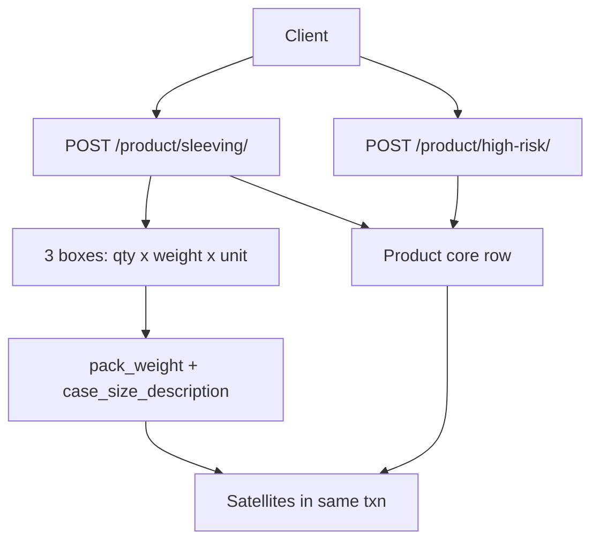

# Sleeving + High Risk create APIs

Keep [`POST /product/`](product/urls.py) unchanged (generic core row). Add two template POSTs that create the same `Product` row **plus** the satellites that today require extra PUTs (`/flags/`, `/shelf-life/`, `/packaging/`, `/production/`, `/costing/`).

## Routes

In [`product/urls.py`](product/urls.py) (string paths; they will not collide with `<int:pk>`):

- `POST /product/sleeving/` → `product_sleeving_create_api`
- `POST /product/high-risk/` → `product_high_risk_create_api`

Both POST-only. Updates stay on existing `PATCH /product/<pk>/` + satellite PUTs.

## Shared core

Extract the body-validate + `Product(...)` save from [`product_create_api`](product/views/product_master_view.py) into a helper (e.g. `_create_core_product(body) -> Product`) used by generic create and both templates.

Still required on both templates (same as today): `name`, `product_class_id`, `category_id`, `unit_id`, `source_container_id`, `destination_container_id`, `storage_regime`. Client still chooses category/locations — do **not** hardcode Sleeving/High Risk location IDs.

No new `Product` columns. Packed item is identity-only (which tray this sleeve is for); it is **not** stored as an FK and is **not** used to copy shelf life or weights.

## Case size — same pattern as supplier shape

Supplier already does this in [`ProductSupplier.apply_shape_calc`](product/models.py): three inputs in, two derived fields out. Sleeving case size is the same, smaller:

UI boxes:

- Box 1 — units per case → `items_per_unit`
- Box 2 — weight of each unit → `unitary_weight`
- Box 3 — weight unit → `case_size_unit_id` (`product_unit` lookup, e.g. gm)

Server derives (do not accept as input):

- `ProductPackaging.pack_weight` = `items_per_unit × unitary_weight` (same as `multiplier = outer_qty × inner_qty`, no kg conversion)
- `ProductCosting.case_size_description` = `"{qty} x {weight} {UNIT}"` e.g. `4 x 400 GM`

`case_size_unit_id` is request-only: its name is baked into the description, no extra FK column. Reuse the supplier `_fmt` style (drop trailing zeros, unit name uppercased).

Example body fragment: `{ "items_per_unit": 4, "unitary_weight": 400, "case_size_unit_id": <gm> }` → `pack_weight=1600`, `case_size_description="4 x 400 GM"`.

## `POST /product/sleeving/`

**Extra required:** `packed_product_id`, `items_per_unit`, `unitary_weight`, `case_size_unit_id`, `shelf_life_days`

**Optional:** `external_barcode`, `force_trace_number` (no silent default — 50/50), `default_resource_id`, `shelf_life_depot_days`

| Input / derive | Writes | Default / rule |
| --- | --- | --- |
| `packed_product_id` | read-only picker | Must exist. Does not copy weights or shelf life |
| Box 1 `items_per_unit` | `ProductPackaging.items_per_unit` | Required, > 0 |
| Box 2 `unitary_weight` | `ProductPackaging.unitary_weight` | Required, > 0 |
| Box 3 `case_size_unit_id` | name only, for label | Must be an existing `Unit` |
| case weight | `ProductPackaging.pack_weight` | Derived: `items_per_unit × unitary_weight` |
| case size | `ProductCosting.case_size_description` | Derived: `"4 x 400 GM"` |
| barcode | `Product.external_barcode` | Optional |
| shelf life | `ProductShelfLife.shelf_life_days`, `shelf_life_depot_days` | Client-entered. Do **not** copy from packed |
| force flags | `force_production_date`, `force_use_by`, `force_trace_number` | First two **True**; trace from body |
| default line | `ProductProduction.default_resource_id` | Optional |
| sales/plan | `ProductFlags.is_sales_item`, `has_plan`, `include_in_projections` | All **True** (cased) |

Skip: `range`, `tblProductsMappingCustomer`.

400 if packed item missing, unit missing, or any of the 3 boxes is missing / not positive.

## `POST /product/high-risk/`

**Extra required:** `tray_id`, `pack_weight`, `shelf_life_days`

**Optional:** `is_gas_flush` (default **True**, Access `-1` majority), `avg_staff_min_per_unit`, `avg_staff_per_minute`

| Input | Writes | Default / rule |
| --- | --- | --- |
| `tray_id` | `ProductPackaging.tray_id` **and** `container_vessel_id` | Same id (legacy 318/320 match). Must be an existing product |
| `is_gas_flush` | `ProductPackaging.is_gas_flush` | Default True |
| `pack_weight` | `ProductPackaging.pack_weight` | Weight of one tray (kg) |
| `shelf_life_days` | `ProductShelfLife.shelf_life_days` | Required. Force flags left at model defaults |
| labour rates | `ProductProduction.avg_staff_min_per_unit`, `avg_staff_per_minute` | Optional |
| sales/projection | `ProductFlags.is_sales_item`, `include_in_projections` | Both **False** (packed items aren't sold) |

Skip: `range`, customer mapping.

## Response

201. Core `product_detail_dict` plus nested `packaging`, `shelf_life`, `flags`, `production`, `costing` so the UI does not chain five PUTs.

One `capture_product_audit` `create` on the product (same as generic create). Do not fan out into five satellite audits for this first pass.

## Tests / files

- New [`product/views/template_views.py`](product/views/template_views.py) — short view + derive helpers. Direct model writes, do not loop through the PUT views.
- [`product/urls.py`](product/urls.py) — two paths
- [`product/views/product_master_view.py`](product/views/product_master_view.py) — extract core create helper
- [`product/tests.py`](product/tests.py) — two tests:
  - Sleeving: `items_per_unit=4`, `unitary_weight=400`, unit `GM` → `pack_weight=1600`, `case_size_description="4 x 400 GM"`; shelf life from body (not packed); flags all on; force date/use-by true
  - High Risk: tray set on both FKs, gas-flush on, sales flags off

Skipped: Low Risk API, recipe BOM, range, customer mapping, Postman. Add when asked.
