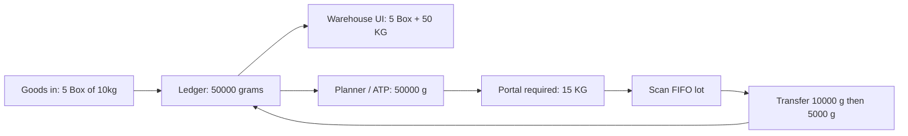

# Solid UoM (warehouse Box/Kg, planner grams)

You were unsure which model to pick. Use **one ledger unit**. The other option (store boxes, convert at goods-out) is what blows the project: mixed 10kg/20kg/1kg bags cannot add, FIFO lots lie, and planning ATP in grams becomes fiction.

## Rule

`product.unit` is the only quantity in `stock_entry.quantity` and `stock_balance.quantity`. For PEAS that is **grams**.

Pack shapes on `product_supplier` are **how the warehouse handles it**, not a second ledger:

| Shape | Packs → stock grams |
|---|---|
| 1 BAG × 1000 GRAMS | 1 pack = 1000 g |
| 1 BOX × 10 KG | 1 pack = 10000 g |
| 1 BOX × 20 KG | 1 pack = 20000 g |

```
grams_per_pack = outer_qty × inner_qty × (to_kg(inner_unit) / to_kg(product.unit))
```

`to_kg` already exists in [`stock_ledger/util/conversions.py`](stock_ledger/util/conversions.py) (`grams` → 0.001, `Kg` → 1).

**Goods-out does not change shape.** The lot is still grams. Only the phone label changes (Box / KG).



## Who sees what

**Warehouse list / goods-in / goods-out cards**

- Never show `grams` / `Each`.
- Required line: **15 KG** (convert remaining grams → kg). Optional second figure: boxes **of the scanned lot’s shape**, not the product default (10kg vs 20kg would lie).
- On-hand for one lot: **5 Box** + **50 KG**.
- Product-level stock (mixed 10kg and 20kg lots): **KG only** (boxes are ambiguous).

**After scan (goods-out)**

- This lot is `1BOX x 10KG`.
- Need 15 KG, lot has 10 KG → take **1 Box (10 KG / 10000 g)**.
- Remaining 5 KG → next scan, or same lot if leftover: **5 KG (5000 g)** — a partial box is normal.

**Planner / `GET /planning/plans/{id}/progress/` / ATP**

- Always `product.unit` (grams). Optional kg helper is display-only.

**Wire (API body)**

- `POST /stock/transfer/` `quantity` stays **stock grams** (`min(remaining_quantity, scan.total_quantity)`).
- FE converts for humans; backend converts on receive.

## What is broken today (this is the 128000 g / 5 Box bug class)

1. Goods-in writes `packs × multiplier` in **inner_unit (KG)** and sets `entry.unit_id = inner_unit`, not `product.unit`. See [`receipt()`](stock_ledger/util/services.py) (~380–386). Five 10kg boxes become `50` with unit Kg on a grams product.
2. Planning `net_required` is grams. Portal [`_pack_fields`](planning/services/picking.py) does `net_qty / multiplier` with no kg↔g → 15000 / 10 = **1500 boxes**.
3. Lots do not remember **which** supplier shape they were received as. [`_product_supplier_for_entry`](stock_ledger/views.py) only works on receipts and guesses default mapping. A 10kg lot displayed with the 20kg default is wrong.
4. Scan `total_quantity` is raw ledger qty. If ledger is 50 kg stored as 50 on a grams item, goods-out and planner both see 50 g.

## Implementation (small, in order)

### 1. One helper — do not scatter math

Add to [`stock_ledger/util/conversions.py`](stock_ledger/util/conversions.py):

- `to_product_unit(qty, from_unit_id, product)` via `resolve_to_kg`
- `packs_to_stock(pack_count, mapping, product)` → grams
- `stock_to_packs(stock_qty, mapping, product)` → boxes
- `stock_to_kg(stock_qty, product)` → warehouse kg column

If inner_unit or product.unit has no `stock_unit_conversion`, fail loud (already the rule in `resolve_to_kg`). Seed grams/Kg if missing.

### 2. Goods-in always posts product.unit

In `receipt()`: `stock_qty = packs_to_stock(...)`, `unit_id = product.unit_id`. Keep response `pack_quantity` = packs received.

Stamp the mapping on the lot so 10kg and 20kg never share identity. Smallest durable stamp: **`product_supplier_id` on `StockLot`** (today only optional `shape_format` name-lookup). Include it in lot uniqueness with the existing identity fields, or require a new lot when the pack shape differs (same as different `shape_format` today).

### 3. Warehouse payloads: Box + KG, hide grams

On scan, balances, entry_dict, portal lines — additive fields:

- `quantity` / `remaining_quantity` = grams (for transfer)
- `display_kg` / `remaining_kg`
- `pack_quantity` / `remaining_pack_quantity` + `pack_unit_name` **only when mapping is known** (lot or default)
- `shape_format_label`

Portal **required** card: show `remaining_kg` as **15 KG**. Do not show boxes on the list when the product has more than one active outer pack (PEAS). After scan, show that lot’s boxes.

### 4. Goods-out quantity

No new unit on transfer. FE:

```
quantity = min(remaining_quantity, scan.total_quantity)  // both grams
```

Show the human line: `1 Box (10 KG)` / `5 KG`. Backend already rejects qty > lot.

### 5. Planner

No change to explode/progress **once** balances are actually grams. ATP already returns ledger qty. After (2), Unit 2 peas ATP is 50000 not 50.

### 6. Existing stock

Rows where `stock_entry.unit_id != product.unit_id` must be converted with the helper (or they stay a landmine). One data pass: scale `stock_entry.quantity` / `stock_balance.quantity` by `to_kg(entry.unit)/to_kg(product.unit)`. Do this **before** relying on goods-out. Do not convert Box/Liter without a product factor.

## FE contract (warehouse)

| Screen | Show | Hide |
|---|---|---|
| Stock / goods-in | packs + KG | grams |
| Goods-out list | required **KG** | grams, destination, mixed-pack Box |
| After scan | this lot’s Box + KG to take | full plan grams |
| Planner | grams (kg optional) | |

## Out of scope (on purpose)

- Dual qty columns on `stock_balance` (pack + grams) — display-only is enough if the lot has a mapping
- Auto-splitting 15 KG into 1 box + 5 KG in one POST — two scans / two transfers, FIFO stays honest
- Changing recipe BOM units
