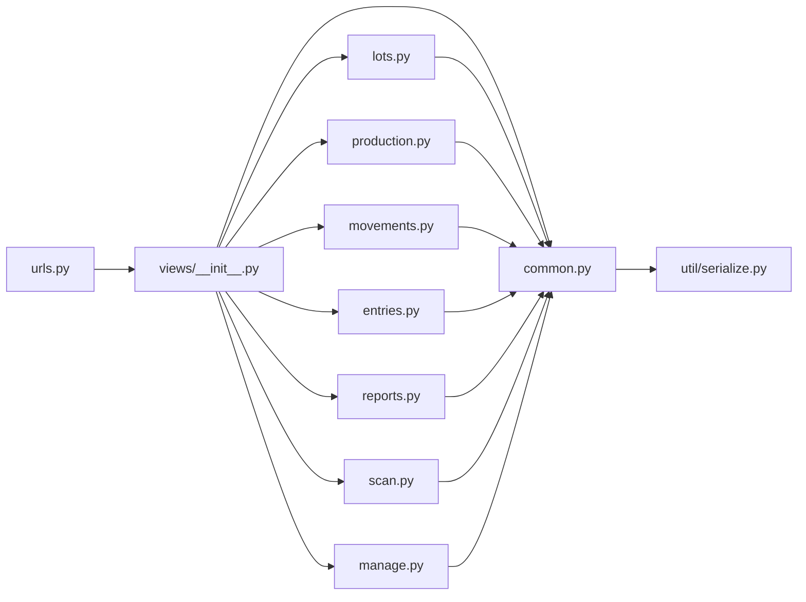

# Split stock_ledger views by domain

Replace [`stock_ledger/views.py`](stock_ledger/views.py) with a package. **Move code, do not rewrite it.** [`stock_ledger/util/services.py`](stock_ledger/util/services.py) and other util logic stay untouched.

[`stock_ledger/urls.py`](stock_ledger/urls.py) stays `from stock_ledger import views` — [`views/__init__.py`](stock_ledger/views/__init__.py) re-exports every API used in urls.

## Layout

| File | What moves (line ranges today) |
|---|---|
| [`views/common.py`](stock_ledger/views/common.py) | Parsers + actor stamp: `_parse_json_body`, `_parse_decimal`, `_parse_effective_at`, `_parse_date`, `_parse_clock`, `_format_display_date`, `_optional_int_param`, `_decode_bearer_claims`, `_common_write_kwargs` (~123–191, 836–920) |
| [`util/serialize.py`](stock_ledger/util/serialize.py) | Response dicts already belong here: `lot_dict`, `stock_unit_dict`, `unit_conversion_dict`, `entry_dict`, `audit_event_dict`, `production_run_dict`, `reservation_dict` |
| [`views/lots.py`](stock_ledger/views/lots.py) | lots + unit conversions |
| [`views/production.py`](stock_ledger/views/production.py) | production CRUD, downtime, requirements, allocation, consume |
| [`views/movements.py`](stock_ledger/views/movements.py) | receipt, issue, transfer, disposal, count-adjustment, reversal, goods-out suggest/form |
| [`views/entries.py`](stock_ledger/views/entries.py) | entry detail/post/cancel/queued, labels, stock-units, product label |
| [`views/reports.py`](stock_ledger/views/reports.py) | audit timeline, product history, reports, email recipients, balances, warehouse remaining, stream |
| [`views/scan.py`](stock_ledger/views/scan.py) | scan, investigate, recall, genealogy, trace, atp, mass-balance, reservations |
| [`views/manage.py`](stock_ledger/views/manage.py) | manage ping/list/preview/remove |
| [`views/__init__.py`](stock_ledger/views/__init__.py) | Re-export all `*_api` names + `_common_write_kwargs` / dicts so existing imports keep working |

Delete `stock_ledger/views.py` (cannot coexist with `views/`).

Domain-only helpers stay in their file (`_write_production`, `_suggest_goods_out_picks`, `_parse_transfer_lines`, `_fifo_check_error`, etc.). View modules import from `common` and `util/serialize`, not from each other.

## Do not duplicate / do not merge

- **Reuse** [`util/serialize.py`](stock_ledger/util/serialize.py). Do not add a new serialize or "connection" module.
- **Do not merge the two `_dec` functions.** Views strips trailing zeros; serialize uses `str(value)`. Keep the views helper in `common.py` as `_dec` (same body). Leave serialize’s `_dec` alone.
- `_common_write_kwargs` stays in `views/common.py` (HTTP/auth). Re-export from `__init__.py` so [`purchasing/views.py`](purchasing/views.py) and [`hardware/tests.py`](hardware/tests.py) keep `from stock_ledger.views import _common_write_kwargs`.

## Import / test updates (behavior-preserving)

Purchasing currently lazy-imports dicts from views to avoid a cycle. After dicts live in serialize, point them there:

- [`purchasing/services/receive.py`](purchasing/services/receive.py) — `entry_dict`, `stock_unit_dict`
- [`purchasing/services/adhoc_goods_in.py`](purchasing/services/adhoc_goods_in.py) — same

Patch paths that target the old module namespace:

- [`stock_ledger/tests/tests_closing_stock_email.py`](stock_ledger/tests/tests_closing_stock_email.py) → `stock_ledger.views.reports.require_any_admin` / `attach_user`
- [`stock_ledger/tests/tests_stock_management_hide_ops.py`](stock_ledger/tests/tests_stock_management_hide_ops.py) → wherever `codes_for_serials` is imported after the move (`util.serialize` if `audit_event_dict` uses it there)

## Verify

Run stock_ledger tests plus the purchasing/hardware tests that import these symbols. Same URLs, same JSON, same status codes.
