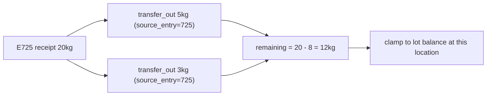

/* eslint-disable */
# Per-sticker draw-down on Goods Out

## Why E725 still shows 20 kg

`E725` is `stock_entry.id=725`, an immutable ledger row of 20000 g. `scan_goods_out_api` reports `abs(entry.quantity)`, which can never change. No table records that 5 kg left that specific sticker, so the number cannot be derived today.

Evidence from lot 166 (PEAS FROZEN, trace 26229):

- Stickers `E724` and `E725` are two 20 kg receipts on the same lot, both `source_document_type='po'`, id 29, line 1.
- All four outbound rows are `transfer_out` (10+13+5+5 kg) carrying `source_document_type='plan_requirement'`, id 693. Neither `source_document_*` column is free for a sticker link, so this needs its own column.
- Balance is 35 kg at Unit 2 because three of those transfers are still `QUEUED` (`queue_stock` defers the balance projection).



## 1. Store the link — [stock_ledger/models.py](stock_ledger/models.py)

Add to `StockEntry` (next to the existing `reverses_entry` self-FK):

```python
source_entry = models.ForeignKey(
    'self',
    on_delete=models.PROTECT,
    null=True,
    blank=True,
    related_name='sticker_draws',
)
```

Plus `models.Index(fields=['source_entry'], name='idx_stock_entry_source_entry')` in `Meta.indexes`, and migration `stock_ledger/migrations/0016_stock_entry_source_entry.py` (latest is `0015_lot_product_supplier`).

Leave the `stock_entry_bi` hash trigger in [0005_triggers_chunk7.py](stock_ledger/migrations/0005_triggers_chunk7.py) alone. The new column stays outside the audit hash; rewriting the trigger would invalidate every existing `entry_hash`.

## 2. Remaining calculation — new `stock_ledger/util/stickers.py`

```python
def remaining_for_entry(entry, *, lot_quantity=None) -> Decimal:
```

- `initial = abs(entry.quantity)`
- `drawn` = sum of `abs(quantity)` over `entry.sticker_draws`, excluding rows whose `posting.status == CANCELLED` and rows that have a reversal (`reverses_entry`, same check as `services._entry_is_reversed`)
- `remaining = max(initial - drawn, 0)`
- when `lot_quantity` is given, return `min(remaining, lot_quantity)`

Two deliberate rules, both worth confirming on the floor:

- `QUEUED` draws count. A bag committed to a pick must not read as full on re-scan, and this blocks double-picking before the post.
- The clamp keeps a sticker from promising more than the lot physically holds, since by-lot picks and count adjustments (like lot 166's 33 kg) name no sticker.

## 3. Carry the sticker through the write path — [stock_ledger/util/services.py](stock_ledger/util/services.py)

- `_insert_entry`: new `source_entry: StockEntry | None = None` kwarg, passed into `StockEntry.objects.create(...)`.
- `transfer`: new `source_entry` kwarg. It must go on the `transfer_out` row only, so pass it explicitly to the first `_insert_entry` call rather than adding it to the shared `insert_kw` dict that also feeds `transfer_in`.

## 4. Accept and validate it — `transfer_api` in [stock_ledger/views.py](stock_ledger/views.py)

Accept `source_entry_id` or `source_entry_code` (`"E725"`), reusing the resolution `issue_api` already does at lines 1349-1357: `entry_labels.parse_entry_code`, `get_entry_for_label`, `require_receipt_entry`. Then reject with a floor-readable 400 when:

- the sticker's `lot_id` differs from the transfer lot
- the sticker's `location_id` differs from `from_location_id`
- `quantity > remaining_for_entry(...)`, naming the remaining amount in the message

## 5. Report it — `scan_goods_out_api` and `entry_dict`

In `scan_goods_out_api`, replace `qty = abs(entry.quantity)` with `stickers.remaining_for_entry(entry, lot_quantity=lot_qty)`, and add `sticker_initial` so the app can render "15 of 20 kg". `quantity`, `display_kg` and `pack_quantity` keep their current meaning (this sticker) and simply become live. Add `source_entry_id` / `source_entry_code` to `entry_dict` for audit and for the app to confirm the link stuck.

App-side contract, unchanged except that the numbers now move: send `source_entry_code` on every scan-driven `POST /stock/transfer/`; a transfer without it still posts but leaves the sticker reading full.

## 6. Tests — [stock_ledger/tests_stock_units.py](stock_ledger/tests_stock_units.py)

Extend `ProductBarcodeTests` (two 20 kg receipts on one lot, mirroring 724/725):

- scan shows 20 / lot 40, transfer 5 kg with `source_entry_code`, re-scan shows 15 / lot 35
- a second transfer of 16 kg against the same sticker is rejected
- a by-lot transfer with no sticker leaves the link null and the clamp keeps the sticker at or below the lot balance
- the other sticker on the lot still reads 20

Run with `python manage.py test stock_ledger.tests_stock_units.ProductBarcodeTests --keepdb`. Note the shared dev MySQL blocks test DB setup for `gazebo_dev` (`SELECT command denied ... django_migrations`), so this may need to run against a local DB.

## Out of scope

`/stock/issue/`, `/stock/disposal/` and production consume keep dropping the sticker link, per your call to do `/stock/transfer/` only. The same `source_entry` column covers them later with no further migration.
