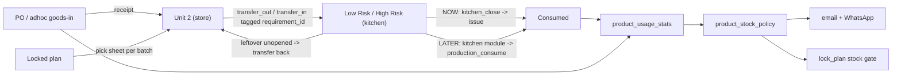

# Stock Accuracy Control System (kitchen-module ready)

## What we know

- Integrated today: **warehouse only** — goods-in (receipt) into Unit 2, goods-out (transfer Unit 2 -> Low Risk / High Risk). Kitchen module (batch cooking that consumes stock) comes later.
- Ledger has 0 `production_output`, 0 `production_consumption`, 0 `production_run`, 0 `stock_reservation`. Everything moved into a kitchen location stays there on paper forever. That is the Basil failure.
- Plans: 164 draft, 3 closed. `build_picking_list`, `issue_qty_by_requirement`, goods-out against `requirement_ids`, `lock_plan` already exist and are not used.
- 1,355 of 2,162 receipts bypass POs via `receive_stock_adjustment`.
- `services.production()` and `services.production_consume()` already write `production_output` + `production_consumption` with genealogy — this is the future kitchen module's entry point. The design below must not fight it.

## Design principle

Kitchen locations are **real stock with a short life**. Stock arrives as a picked kit for a specific batch, and leaves either by the kitchen module consuming it (future) or by the daily `kitchen_close` reconciliation (now). Nothing is deemed consumed at transfer time, so the kitchen module needs no schema change when it lands.

## Phase 0 — Stop the bleed (days 1–2)

- `StockProfile.location_kind` = `store | kitchen | dispatch`, plus `max_stock_age_hours` (kitchen default 24). Migration sets Unit 2 = store, Low Risk / High Risk = kitchen. ([locations/models.py](locations/models.py), table `loc_stock_profile`)
- Command `kitchen_close` ([stock_ledger/management/commands/](stock_ledger/management/commands/)):
  - For each kitchen location, every lot balance whose last `transfer_in` is older than `max_stock_age_hours` and has no `production_consumption` that day -> post `services.issue()` for the remaining qty, `source_document_type='kitchen_close'`, `source_document_id` = the plan requirement if the kit was tagged, `lan_username='System Admin'`, remark "Kitchen close: deemed consumed".
  - `--dry-run` prints CSV first. One-off run clears the Low Risk backlog (120kg Basil etc.). Nightly thereafter.
  - Kitchen supervisor can transfer unopened boxes back to Unit 2 before close; those are excluded.
- Result: kitchen balance is ~0 every morning; usage per day becomes visible in the ledger from day 1.

## Phase 1 — Production protection (week 1–2)

- **Kit pick against plan.** `transfer_api` ([stock_ledger/views/movements.py](stock_ledger/views/movements.py)): when destination `location_kind == kitchen`, `requirement_ids` is required; `goods_out_adhoc` to a kitchen is allowed only with `override_reason` (logged). Printable/mobile pick sheet endpoint `GET /planning/plans/<id>/pick-sheet/` reusing `build_picking_list` ([planning/services/picking.py](planning/services/picking.py)) with issued-so-far progress.
- **Plan lock stock gate.** `planning/services/stock_gate.py`: explode requirements (`forecast._bom_gross_needs`), compare with on-hand across store + kitchen (`netting.available_for_netting`), return `required / available / short / days_cover`. `lifecycle.lock_plan` refuses when any raw component is short > 5%; override needs `override_reason` and writes `plan_event`. `GET /planning/plans/<id>/stock-check/`.
- **Morning count sheet from tomorrow's plan.** `GET /stock/reports/count-sheet/?plan_date=` -> components of tomorrow's locked/draft plans with expected on-hand per location (CSV + JSON). `POST` counts -> `count_adjustment`.
- **Adjustment hygiene.** `services.count_adjustment` and `receive_stock_adjustment` reject missing `lan_username` or remark; `stock_adjustment` receipt route gated to supervisor RBAC role. Goods-in must go through PO or adhoc goods-in with supplier.
- **Physical (no code):** two-bin cards for top 30 runners; one stock controller per shift owns the store; cooks do not enter the store.

## Phase 2 — Procurement analytics + alerts (week 2–4)

- `ProductUsageStats` (`product_usage_stats`, PK product): `avg_daily_7/28/90`, `stddev_daily_28`, `avg_weekly`, `avg_monthly`, `days_with_usage_28`, `last_issue_at`, `last_receipt_at`, `po_count_90d`, `avg_days_between_po`, `avg_po_qty`, `avg_lead_time_days` (PO created -> first `po` receipt), `computed_at`.
- `stock_ledger/util/usage_stats.py`: usage = `issue` + `production_consumption` + `disposal` (so the kitchen module needs no change). Weekday means upserted into existing `DemandProfile` via `forecast.upsert_demand_profile`. Command `compute_usage_stats` nightly; `GET /stock/reports/usage/`, `/usage/<product_id>/`.
- `ProductStockPolicy` gains `policy_source` (`manual|auto`) and `review_period_days` (14). Command `suggest_stock_policy`:
  - < 8 weeks of data: cover-days rule — `reorder = avg_daily_28 * (lead + 2)`, `min = reorder`, `max = avg_daily_28 * 14`.
  - >= 8 weeks: `safety = 1.65 * stddev_daily_28 * sqrt(lead)`, `reorder = avg_daily_28 * lead + safety`, `max = reorder + avg_daily_28 * review_period_days`.
  - Round up to default `product_supplier` pack (`outer_qty * inner_qty`), respect `moq`. Never overwrite `manual`.
- `stock_ledger/util/stock_alerts.py` + command `send_stock_alerts` (nightly + 06:30): RED (`days_cover < lead`), AMBER (`on_hand < reorder`), AGED-KITCHEN (kitchen lot past `max_stock_age_hours`), DRIFT (`balance.find_balance_drift`), STALE (30d no movement), NO-PO (>= 3 `stock_adjustment` receipts in 7d with default supplier). SES email + CSV to `StockReportEmailRecipient`; WhatsApp summary (Twilio, `core/notify/whatsapp.py`, `StockAlertRecipient` model + CRUD). `GET /stock/reports/alerts/`.

## Phase 3 — Kitchen module hook (when built)

- Kitchen module records batches with existing `services.production()` (output at kitchen location, inputs = kit lots at that kitchen location) or `production_consume()` per component pile. No ledger/schema change.
- `kitchen_close` switches per location: if the location has `production_*` entries that day, it only flags leftovers (AGED-KITCHEN alert) instead of issuing. Variance report = kit issued vs recipe vs consumed, per batch.
- Plan gate and usage stats already read `production_consumption`, so procurement numbers improve automatically.

## Not in scope

- Deeming stock consumed at transfer time (rejected: blocks the kitchen module).
- Changing `_split_quantities` box-per-row receipts (correct behaviour, not a bug).
