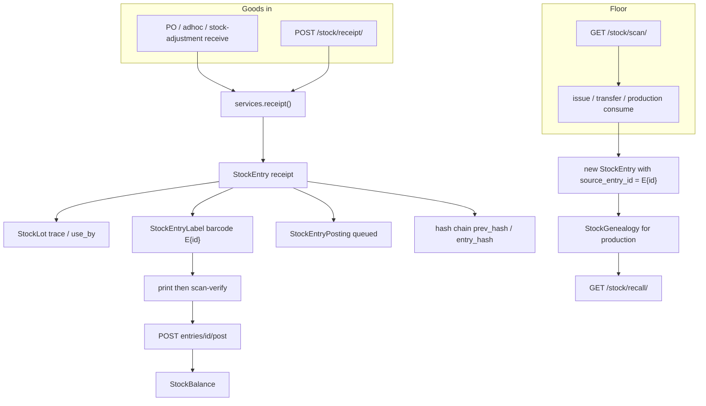
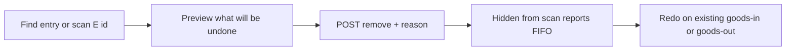

# Stock ledger today + manager remove/redo tool

This repo is the Django API only. The manager screen lives in the frontend; we ship the APIs, gates, and hide-from-ops behaviour here.

## How it works today

The ledger is **append-only**. MySQL triggers block UPDATE/DELETE on `StockEntry`. A wrong row cannot be edited or hard-deleted. Corrections already exist as **new compensating rows** (reversal / cancel / unit void). There is no manager console — developers currently compensate by calling those APIs.

### Features and how they connect

| Feature | What it is | How it joins the rest |
|---|---|---|
| **Lot** [`StockLot`](stock_ledger/models.py) | Batch identity: product + `trace_number` + dates + supplier | Every `StockEntry` points at one lot |
| **Ledger row** [`StockEntry`](stock_ledger/models.py) | Immutable movement: receipt, issue, transfer_out/in, production_output/consumption, count_adjustment, disposal, reversal, downtime | Hash-chained; drives `StockBalance` |
| **Balance** [`StockBalance`](stock_ledger/models.py) | On-hand read model, lot × location | Updated when an entry is posted |
| **Goods-in sticker** `E{id}` | Pallet/box label glued to physical stock | [`StockEntryLabel`](stock_ledger/models.py); goods-out picks set `source_entry_id` to that receipt |
| **GS1 unit** [`StockUnit`](stock_ledger/models.py) | Per-bag/pallet serial when `product.label_mode=per_unit` | Created from a receipt; consume/void/reprint already exist |
| **Product label** `P{id}` | Reusable product barcode | Batch chosen at scan (FIFO) |
| **Queue/post** [`StockEntryPosting`](stock_ledger/models.py) | Receipt/transfer starts `queued`; hits balance only after verify + post | Cancel exists for **unposted** only |
| **Production** | MADE output + consume inputs | Genealogy edges; PUT = reverse+recreate, DELETE = void |
| **Recall / trace** | [`util/trace.py`](stock_ledger/util/trace.py), [`util/recall.py`](stock_ledger/util/recall.py) | Walks genealogy + lot + units |
| **Reports** | goods-in, goods-out, closing stock, operator activity | Closing stock SUMs posted entries; does **not** hide reversed receipts from goods-in lists |
| **RBAC** | Warehouse `can_goods_in` / `can_goods_out`; Admin areas technical/operational/npd/finance; IT = global | Floor staff can already `POST /stock/reversal/` via `gate_floor_write`. No manager-only amend grant |

Writer: [`stock_ledger/util/services.py`](stock_ledger/util/services.py). Routes: [`stock_ledger/urls.py`](stock_ledger/urls.py) under `/stock/`. Purchasing GRN also writes receipts (`POST /purchasing/pos/.../receive/`, adhoc, stock-adjustment).

### Barcode ↔ physical stock

1. Receive creates `StockEntry` + sticker `E{entry.id}` (and optional `StockUnit` serials).
2. Print → scan-verify → post → quantity appears in warehouse.
3. Floor scans `E{id}` (or `P{id}` / GS1) to pick. Outbound rows keep `source_entry_id` so the sticker is the physical identity.
4. Unit void today (`POST /stock/stock-units/<serial>/void/`) **does not move stock** — label only. Entry reversal **does** move stock, but does **not** void stickers. Scan of a reversed `E{id}` still resolves.

### Traceability today

- Lot: `trace_number`, `use_by`, `production_date`, `supplier_lot_code`
- Sticker: `source_entry_id` on every pick
- Production: `StockGenealogy` input→output
- Audit: actor, workstation, device serial, hash chain, S3 anchors
- `StockLotAmendment` **model exists, no API**

### What already exists vs what managers need

| Need | Today |
|---|---|
| Undo unposted goods-in | Cancel posting |
| Undo posted movement | `POST /stock/reversal/` (one entry; **transfer only reverses one leg** — known P0 in the runbook) |
| Void a misprint unit | Unit void, reason required |
| Void an `E{id}` sticker | Missing |
| Hide reversed rows from goods-in/out/scan | Missing (reversal nets qty to 0, but the original still lists and still scans) |
| Reason + who + when | Partial (`remarks` / unit `void_reason`); not a manager-only trail |
| One click mistake → remove → redo | Missing; several APIs, developer-shaped |
| Manager-only | Missing; floor can reverse |

**Do not hard-delete ledger rows.** That would break the hash chain. “Soft delete” here means: reverse (or cancel if still queued), void barcodes, hide from operational surfaces, keep the full chain for audit.

---

## What we will build

One manager process:

1. Find the transaction (scan barcode or search).
2. Confirm + reason.
3. System undoes live stock, voids stickers/units, hides from ops.
4. Manager redoes the correct goods-in/out on the **existing** screens (new `E{id}` prints there).

### Permission: new Admin policy `stock_management`

Add `AdminArea.STOCK_MANAGEMENT = 'stock_management'` labelled **Stock Management Tool**.

- Gate: `require_admin_area(..., STOCK_MANAGEMENT)` (IT global already bypasses).
- Floor warehouse grants cannot call remove.
- Grant it like any other admin area via existing `/auth/users/<id>/grants/` (`admin_areas: ["stock_management"]`).

### One service, two endpoints

New [`stock_ledger/util/manage.py`](stock_ledger/util/manage.py) — do not scatter this across views.

**`GET /stock/manage/entries/<id>/`** (gated)

Returns the entry, posting/label/units, transfer sibling, live draws (`source_entry_id` + not reversed), and a preview: `action` = `cancel` | `reverse` | `blocked`, plus `will_undo` list.

**`POST /stock/manage/entries/<id>/remove/`** (gated)

Body: `{ "reason": "...", "idempotency_key": "..." }`. Reason required.

In one transaction:

| State | What happens |
|---|---|
| Queued / unposted | Cancel posting (existing). Void units. Sticker becomes unusable. |
| Posted, warehouse movement | Reverse this entry. If transfer: **reverse both legs** (fixes runbook D2). If receipt has live picks: reverse those draws first, then the receipt. Void all related `StockUnit`s. |
| Production output | Reuse existing `production_void()` (output + consumptions). |
| Already reversed / cancelled | Idempotent success. |
| Production already consumed this stock | **Block** with a clear message (do not unwind shop-floor MADE from this tool). Manager voids production first, then retries. |

Write the reason on the reversal `remarks` (and cancel meta). Actor = manager user id.

No reprint in this tool. New labels come from the normal receive/issue flow.

### Hide from everywhere except audit

Operational default: treat reversed originals, reversal rows, cancelled postings, and void units as gone.

- [`scan.py`](stock_ledger/util/scan.py): `E{id}` of reversed/cancelled → error like “This sticker is void. Do not use.” Void `StockUnit` serials same.
- [`reports.py`](stock_ledger/util/reports.py) goods-in/out: exclude `reversed_by__isnull=False` (closing stock already nets to 0 via SUM; leave that).
- FIFO / sticker remaining already skip reversed draws; keep it that way.
- **Keep** rows on `GET /stock/audit/timeline/` and on the manager GET (so the reason is visible only there).

No new `is_deleted` column. Visibility = `reversed_by` / posting `cancelled` / unit `void`.

### Frontend contract (this repo: Postman only)

Manager UI (other app): search/scan → preview list → reason → Remove → message “Redo this on goods-in/out. Bin the old stickers.”

Add a Postman folder **Stock Management Tool** on the stock collection, full Gazebo request docs (not one-liners).

### Tests (smallest that fail if this breaks)

- Queued receipt: cancel + scan `E{id}` fails + goods-in report omits it.
- Posted receipt with no draws: reverse + balance back + scan fails + report omits original.
- Posted receipt with a pick: both reversed in one call.
- Transfer: both legs reversed (D2).
- Floor user 403; `stock_management` admin 201.
- Production-consumed stock: 409, nothing reversed.

Skipped unless you ask: lot-date amendment API, in-tool recreate wizard, cascading production void, Django admin UI.
