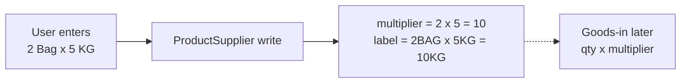

# Supplier Shape Format (auto multiplier)

## Decision (your photo)

**Put structured Shape Format on `product_supplier` — not a separate shape-format API.**

Why: legacy kept shape text + multiplier on the **supplier mapping row**. Different suppliers (A vs B) need different packs for the same product. A shared lookup API alone cannot own the multiplier per supplier.

Match the UI:

```
Shape Format (2BAG x 5KG = 10KG)

[2] Bag  ×  [5] KG  =  [10] KG
 qty unit    qty unit    auto auto
```

| UI | Field | Who sets it |
|---|---|---|
| Left qty | `outer_qty` | user (e.g. 2) |
| Left unit | `outer_unit_id` | user FK `product_unit` (Bag) |
| Right qty | `inner_qty` | user (e.g. 5) |
| Right unit | `inner_unit_id` | user FK `product_unit` (KG) — usually = product stock unit |
| Result qty | `multiplier` | **server auto** = `outer_qty × inner_qty` |
| Result unit | same as inner | display only |
| Label | `shape_format_label` | **server auto** e.g. `2BAG x 5KG = 10KG` |

Goods-in later: receive `N` of this mapping → stock += `N × multiplier` in `inner_unit` (then convert to `product.unit` if different).



## Why not “just one shape format API”?

| Approach | Verdict |
|---|---|
| Only enhance `PurchaseShapeFormat` {id, name} | Still no real math; manager problem remains |
| New global ShapeFormat CRUD + FK from ProductSupplier | Extra hop; same shape reused rarely across suppliers; **skip for now** |
| **Shape fields on ProductSupplier** | Matches photo + legacy mapping row — **do this** |

Keep existing `GET/POST/PATCH /product/purchase-format/` as optional **name-only** lookup if UI still wants a free-text tag; it is not the conversion source of truth.

## Schema change ([product/models.py](product/models.py) `ProductSupplier`)

Replace user-entered bare `conversion_to_base` with:

- `outer_qty` Decimal > 0
- `outer_unit` FK Unit (was roughly `pack_unit`)
- `inner_qty` Decimal > 0
- `inner_unit` FK Unit
- `multiplier` Decimal > 0 — **computed on save**, stored for stock/query speed (legacy column)
- `shape_format_label` CharField — **computed on save**
- `cost` → nullable (skip costing in UI/API emphasis)
- `is_default` Bool + partial unique per product

Migration path for existing rows: if only `pack_unit` + `conversion_to_base` exist, backfill as `outer_qty=1`, `outer_unit=pack_unit`, `inner_qty=conversion_to_base`, `inner_unit=product.unit`, then drop/rename `pack_unit` / stop writing raw `conversion_to_base` as input.

## API contract ([supplier_product_views.py](product/views/supplier_product_views.py))

**POST/PATCH body (create):**

```json
{
  "supplier_id": 115,
  "supplier_code": "code001",
  "supplier_product_name": "Basmati 2x5kg",
  "outer_qty": "2",
  "outer_unit_id": 12,
  "inner_qty": "5",
  "inner_unit_id": 3,
  "is_default": true
}
```

Server sets `multiplier=10`, `shape_format_label="2BAG x 5KG = 10KG"` (use unit names uppercased, compact).

**GET response:** include all shape fields + `multiplier` + `shape_format_label`. **Do not** return `cost_per_base_unit`. `cost` optional/null.

Reject if any qty ≤ 0 or units missing.

## Skip for now

- Cost UI / `cost_per_base_unit`
- Separate Shape Format master API
- `StockLot` FK change (when goods-in: use `product_supplier.multiplier`)

## Implement when approved

1. Model + migration (shape fields, nullable cost, is_default, backfill)
2. API write/read + default clearing
3. Postman full docs
4. Analysis markdown for manager explaining Shape Format formula
