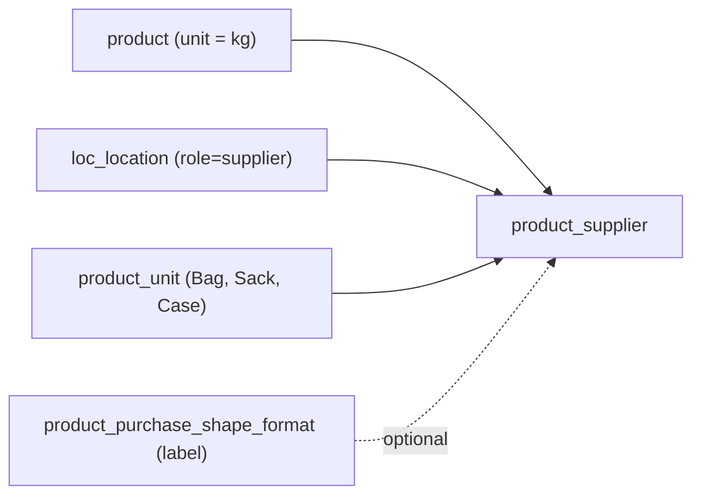

# Supplier Products mapping

## The problem

Today there is no link between a product and a supplier. `product.purchasing_unit_id` / `purchase_shape_format_id` hold a single default buy hint with no conversion factor and no supplier. So "Basmati rice from Supplier A (1 x 5 KG bag) and Supplier B (1 x 20 KG sack)" cannot be represented, and goods-in cannot convert packs to stock kg.

This adds one table that carries both the supplier mapping and the conversion the floor needs.



## Schema

New model `ProductSupplier` in [product/models.py](product/models.py), `db_table = 'product_supplier'`, placed after `Product`.

- `id` - AutoField (no legacy counterpart, unlike the other product tables)
- `product` - FK to `Product`, `on_delete=CASCADE`, `related_name='suppliers'`
- `supplier` - FK to `'locations.Location'`, `on_delete=PROTECT`, `related_name='supplied_products'`
- `supplier_code` - `CharField(max_length=64)` - supplier's own SKU code
- `supplier_product_name` - `CharField(max_length=128)` - how the supplier names it
- `cost` - `DecimalField(max_digits=16, decimal_places=6)` - cost per pack, matching `ProductCosting.unit_cost` precision
- `pack_unit` - FK to `Unit`, `on_delete=PROTECT` - the "Bag" dropdown
- `conversion_to_base` - `DecimalField(max_digits=16, decimal_places=6)` - how many `product.unit` in 1 `pack_unit`
- `purchase_shape_format` - FK to `PurchaseShapeFormat`, nullable - optional display label ("1 x 10 KG")
- `is_active` - `BooleanField(default=True)`
- `created_at` / `updated_at`

Constraints:

- `UniqueConstraint(fields=['product', 'supplier', 'supplier_code'], name='uniq_product_supplier_code')` - one supplier may sell the same product in several pack sizes, each with its own code
- `CheckConstraint(conversion_to_base__gt=0, name='chk_product_supplier_conversion_positive')`
- `Index(fields=['supplier'])` for the "what do we buy from this supplier" query

Migration: `product/migrations/0005_productsupplier.py` (latest is [0004](product/migrations/0004_productaudit_actor_email_productaudit_actor_sub_and_more.py)).

Reading the screenshot row: `Cost £ X` / `1 [Bag] = [Y] kg` maps to `cost`, `pack_unit`, `conversion_to_base`; the trailing `kg` is display-only, read from `product.unit.name`.

## Derived value

The API returns a computed `cost_per_base_unit = cost / conversion_to_base` (quantised to 6dp, `None` when conversion is zero/absent). Not stored - it is always derivable and storing it invites drift.

## APIs

New file `product/views/supplier_product_views.py`, following [product/views/allergen_views.py](product/views/allergen_views.py) exactly (same `_parse_json_body`, `api_success`/`api_error`, `capture_product_audit` with `entity='supplier_product'`).

- `GET /product/<pk>/suppliers/` - rows for one product
- `POST /product/<pk>/suppliers/` - create
- `GET /product/<pk>/suppliers/<row_id>/` - detail
- `PATCH /product/<pk>/suppliers/<row_id>/` - partial update
- `DELETE /product/<pk>/suppliers/<row_id>/` - delete
- `GET /product/supplier-products/?supplier_id=&product_id=` - the cross list ("which products from which supplier"), flat rows with product and supplier names joined via `select_related`

Validation on write:

- product exists, else 404
- `supplier_id` exists **and holds the supplier role** - reuse the filter from [locations/views/supplier_views.py](locations/views/supplier_views.py):

```python
Location.objects.filter(pk=supplier_id, roles__role=LocationRole.SUPPLIER).exists()
```

- `pack_unit_id` exists in `product_unit`; `purchase_shape_format_id`, if given, exists
- `conversion_to_base` parses as Decimal and is `> 0`, else 400
- `cost` parses as Decimal and is `>= 0`
- duplicate `(product, supplier, supplier_code)` returns 409

URLs registered in [product/urls.py](product/urls.py). Order matters: put `supplier-products/` before the `<int:pk>/` patterns, same as the existing lookup routes.

## Relationship to the existing purchase fields

`product.purchasing_unit_id`, `purchase_shape_format_id`, `purchasing_version` stay untouched for now - they remain the legacy default-buy hint. `product_supplier` is the accurate source for goods-in conversion. Migrating those three fields off `product` is a later, separate step once goods-in actually consumes this table.

This table also supersedes the previously discussed `product_purchase_pack` - a pack only exists because a supplier sells it, so one table covers both.

## Postman

Add a "Supplier Products" folder to [postman/Gazebo-Locations-Products.postman_collection.json](postman/Gazebo-Locations-Products.postman_collection.json) with the six requests, using the existing `{{base_url}}` / `{{product_id}}` variables.

## Seed

Extend [product/management/commands/seed_demo_product.py](product/management/commands/seed_demo_product.py) with two `ProductSupplier` rows against an existing supplier location so the two-suppliers-one-product case is testable immediately.

## Out of scope

- AI parsing/validation of typed pack text ("5 x 2 KG") - later
- Goods-in actually applying the conversion - belongs to `stock_ledger`
- Preferred/default supplier flag - add when purchasing needs it