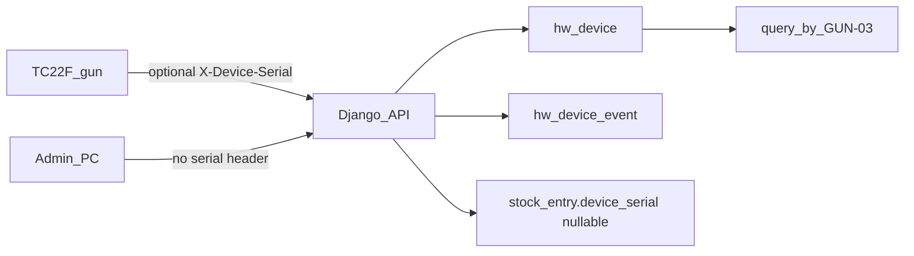

# Track TC22F scanner guns

## Live USB dump (this gun)

ADB is attached: `26202524703110 device product:TC22F model:TC22`.

**Stable IDs (use these):**

- **Serial (primary key):** `26202524703110` — same on USB iSerial (`VID_05E0&PID_2106`), `ro.serialno`, `ro.boot.serialno`, `adb devices`
- **Zebra hardware UUID:** `f375db664e6b0501F9F8DCBd39d840a`
- **Factory BT MAC:** `88:BC:AC:D5:21:BF`
- **BT / asset name:** `BSD01_Gazeboo_cloud`
- **SKU:** TC22 / product `TC22F`, imager `SE4710`, Wi‑Fi only (no IMEI)

**Do not use as PK:** `ANDROID_ID` `d008cd109f0700c6` (factory-reset), randomized Wi‑Fi MAC `e6:37:24:07:18:d7`, battery serial `T0575` (hot-swap).

Also present: Android 14 / build `14-20-14.00-UG-U00-STD-ATH-04`, ~5.3 GB RAM, on `GC-STAFF` at `172.16.0.98`, warehouse app `com.gazeboerp.warehouse` 1.0.0, DataWedge 13.0.325.

USB from a PC is **enrollment only**. Day-to-day tracking is the gun sending its serial on every API call (no USB needed on the floor).

There is **no Company model** — org queries are unfiltered (all sites) or by `location_id` (Unit 2=`8`, Unit 11=`2`).



**Serial is optional.** Admin PCs, Postman, and existing web clients send nothing. Login, receipt, transfer, scan all keep working; `device_serial` and hardware events stay empty. Only warehouse guns send the header.

**Short sticker code, not the 14-digit serial, is what people use.** Print a barcode `GUN-03` on the gun. Allocate with “pick up device 3”. Hardware serial stays in the DB for the gun to self-identify.

## What to build (backend only)

Small new app `hardware` — do **not** change the stock hash trigger (`actor_user_id` is already in the hash; `device_serial` stays out of it).

### 1. Registry + events

[`hardware/models.py`](hardware/models.py):

- `hw_device`:
  - `code` unique, short, barcode-safe — `GUN-01` … `GUN-05` (this is the sticker / “device 3”)
  - `serial` unique nullable — Zebra `26202524703110`; filled when the gun first phones home or via USB enroll
  - `nickname` — BT name e.g. `BSD01_Gazeboo_cloud`
  - `zebra_uuid`, `bt_mac`, `model`
  - `home_location_id`, `assigned_user_id` (who should pick it up today)
  - `identity_json`, `last_seen_at`, `last_user_id`, `last_location_id`, `status`
- `hw_device_event`: `device` FK, `user` FK nullable, `location_id` nullable, `action` (`enroll`/`login`/`scan`/`heartbeat`/`allocate`), `at`, `request_path`, `detail_json`

Code format: `GUN-` + 2-digit number. Barcode the `code` string (not the serial) so floor scan of the sticker resolves the same row the gun reports via serial.

### 2. How identity arrives

Read serial from `X-Device-Serial` (fallback body `device_serial`). Missing/blank = computer client; **do not 400**. Optional `X-Device-Nickname`.

- **Login** ([`users_rbac/views.py`](users_rbac/views.py)): header present → match `serial`, else auto-enroll with next `GUN-nn` + `login` event. Header absent → login unchanged.
- **Stock writes:** [`_common_write_kwargs`](stock_ledger/views.py) + [`create_entry`](stock_ledger/util/services.py) pass nullable `device_serial`. Indexed. Hash trigger unchanged.
- **Scans:** write a `scan` event **only if** serial is present.

Unknown serial auto-enrolls (other 4 guns). Seed this one as **`GUN-01`** / serial `26202524703110` / nickname `BSD01_Gazeboo_cloud`. Admin PATCHes `code` if they want GUN-03 on that sticker instead.

### 3. Query APIs (company / site / user)

Mounted at `/hardware/`:

Path param `<id>` accepts **code or serial** (`GUN-03` or `26202524703110`).

- `GET /hardware/devices/` — list; `?location_id=` / `?assigned_user_id=`
- `GET /hardware/devices/<id>/` — identity + last user/site + sticker `code`
- `GET /hardware/usage/?code=&serial=&user_id=&location_id=&from=&to=`
- `PATCH /hardware/devices/<id>/` — set `code` (sticker), `nickname`, home location, **`assigned_user_id`** (“Amit pick up device 3”), status
- `POST /hardware/devices/` — pre-register a gun by `code` before USB (serial null until first login)

Stock entry JSON includes `device_serial` and resolved `device_code` when stamped. PC writes omit both.

### 4. Client contract (warehouse app, not in this repo)

Warehouse app **only** (computers send neither header):

```
X-Device-Serial: 26202524703110
X-Device-Nickname: BSD01_Gazeboo_cloud
```

Serial = `Build.getSerial()` / `ro.serialno`. App does not invent `GUN-03` — admin sets the sticker code in the registry.

### 5. Docs + Postman

- Refresh [`docs/hardware-feature/tc22f.md`](docs/hardware-feature/tc22f.md) with this live dump (SoC is **QCM5430**, not 6490)
- Postman folder **Hardware devices** matching Gazebo Food API description rules
- Tests: (1) PC login + receipt with no header still 200 and `device_serial` null (2) gun header stamps serial and usage by `GUN-01` (3) PATCH assign user to `GUN-03`

Skipped: MDM, USB ingest service, extra stamp columns, hash-trigger change.
