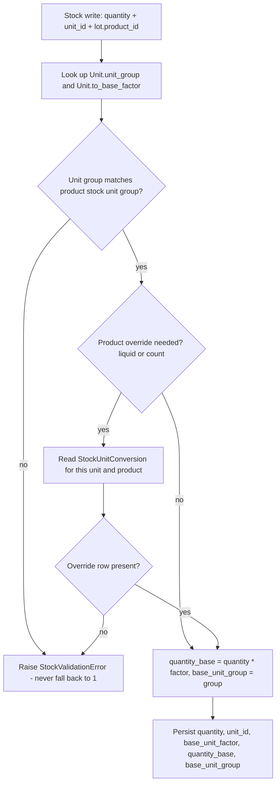

> Validated against [product/docs/UNIT_CALC.md](product/docs/UNIT_CALC.md) and [product/docs/legacy_unit_business_logic.sql](product/docs/legacy_unit_business_logic.sql). The current implementation reintroduces legacy defects 1, 2, 4, 6 and 7 from §6 of the audit, and its new fields are not read by any stock calculation.

# Unit Conversion Hardening

## Decisions taken

- `quantity_base` becomes **per-dimension**: kg for weight, L for liquid, each for count. A new `base_unit_group` column travels with every base quantity so aggregation can never mix dimensions.
- `product.Unit` is the **single source of truth** for unit-to-base maths. `StockUnitConversion` is narrowed to product-specific overrides only (density, pack weight).

Because our bases are kg and L, density in **kg per litre is numerically identical to g per ml**, so the doc's `density_g_per_ml` becomes `density_kg_per_litre` with the same numbers.

## Target conversion flow



## Phase 1 — Harden `product.Unit`

In [product/models.py](product/models.py):

- Extend `UnitGroup` with `LENGTH = 'length'` and `TIME = 'time'` so `meters` and `seconds` stop being NULL (audit §11 says keep them so existing product rows stay valid).
- Widen `to_base_factor` to `DECIMAL(24, 12)` per audit §9 rule 4, so tonnes and micrograms coexist without rounding to zero.
- Make `unit_group` and `to_base_factor` **NOT NULL** after backfill. This is what makes the fallback-to-1 path unreachable.
- Add `display_precision` (`PositiveSmallIntegerField`, default 3) — rounding is a calculation concern, and NotaZone treats it as part of the unit definition.
- Add `CheckConstraint(to_base_factor__gt=0)`.

Replace the current method, which is the reintroduced legacy bug:

```118:122:product/models.py
    def convert_to_base(self, quantity: 'Decimal') -> 'Decimal':
        """Return quantity expressed in the base unit of this unit's group."""
        from decimal import Decimal
        factor = self.to_base_factor if self.to_base_factor is not None else Decimal('1')
        return Decimal(str(quantity)) * factor
```

New `product/units.py` module (module-level import of `Decimal`, per the no-inline-imports rule) exposing:

- `to_base(quantity, unit)` — no NULL branch at all once the columns are NOT NULL.
- `convert(quantity, from_unit, to_unit)` — raises `UnitDimensionError` when `from_unit.unit_group != to_unit.unit_group`; computes `from.to_base_factor / to.to_base_factor` so there are no hops and no direction-dependent rows (audit §9 rule 1).
- `UnitDimensionError(ValueError)` as the shared exception type.

Base unit per group: weight to kg, liquid to L, count to each, length to m, time to s.

## Phase 2 — Reconcile migrations with the live database

Yesterday's `Case` / `grams` / `Liter` / `unit` values were written by an ad-hoc script, not a migration, so the database and migration history disagree. [product/migrations/0006_seed_unit_groups.py](product/migrations/0006_seed_unit_groups.py) was also edited after it had already been applied, so its added aliases never ran.

- New data migration `0007_reseed_unit_groups` that re-runs the seed idempotently, covering the alias list and adding `meters` to length and `seconds` to time.
- Follow-on schema migration `0008_unit_not_null` that widens the factor and flips both columns to NOT NULL. It must run after the reseed, and should fail loudly if any unit is still unmapped rather than defaulting anything.

## Phase 3 — Add density and narrow `StockUnitConversion`

- Add `Product.density_kg_per_litre` (`DECIMAL(12, 6)`, nullable) — required to turn a liquid unit into kg, and the fix for audit issue 3. Absence is an error the operator resolves, never an implicit 1.0.
- Make `StockUnitConversion.product` **NOT NULL**. Global factors now live on `Unit`, so the table becomes purely per-product overrides.

This also fixes the current non-deterministic lookup. Today's constraint is:

```90:99:stock_ledger/models.py
        constraints = [
            models.UniqueConstraint(
                fields=['unit', 'product'],
                name='uq_stock_unit_conversion',
            ),
```

MySQL treats NULLs as distinct in a unique index, so multiple global rows per unit are currently permitted and `resolve_to_kg` picks one with an unordered `.first()`. Making `product` NOT NULL makes the existing constraint actually hold — Django conditional unique constraints are not an option here because MySQL has no partial indexes.

- Rename `to_kg` to `to_base_factor` and widen to `DECIMAL(24, 12)`. Verified that [stock_ledger/migrations/0005_triggers_chunk7.py](stock_ledger/migrations/0005_triggers_chunk7.py) only references `stock_entry` columns, so no trigger depends on this name.
- Migrate existing global rows into `Unit.to_base_factor` before dropping nullability.

## Phase 4 — Per-dimension base in the ledger

In [stock_ledger/models.py](stock_ledger/models.py), on both `StockEntry` and `StockBalance`:

- Add `base_unit_group` (`CharField(max_length=8, choices=UnitGroup.choices, null=True)`).
- Widen `base_unit_factor` to `DECIMAL(24, 12)`.
- Extend the existing `chk_stock_entry_mass_pair` constraint so `base_unit_factor`, `quantity_base` and `base_unit_group` are all-null or all-present together.
- Add the same pairing constraint to `StockGenealogy.quantity_base` via a `base_unit_group` column, so mass-balance sums cannot straddle dimensions.

In [stock_ledger/util/conversions.py](stock_ledger/util/conversions.py):

- Replace `resolve_to_kg` with `resolve_to_base(*, unit_id, product_id) -> tuple[Decimal, str]` returning factor and base group. Order of resolution: `Unit` first, then `StockUnitConversion` override, then density for liquid-to-weight. Still raises rather than defaulting — that behaviour is already correct and must be preserved.
- Delete `GLOBAL_UNIT_TO_KG` and `seed_global_unit_conversions`; those factors now live on `Unit`.
- Rework `sync_product_unit_conversions_from_packaging`, which currently writes `Liter` factors from `packaging.unitary_weight` and is the density-1.0 assumption in disguise. Split it: pack weight for count units, `density_kg_per_litre` for liquid units.

In [stock_ledger/util/services.py](stock_ledger/util/services.py):

- `_mass_fields` returns `(factor, quantity_base, base_unit_group)`.
- `_project_balance` must reject an entry whose `base_unit_group` differs from the existing balance row's, instead of blindly summing:

```54:58:stock_ledger/util/services.py
    new_qty = entry.quantity if balance is None else balance.quantity + entry.quantity
    new_base = None
    if entry.quantity_base is not None:
        prev_base = Decimal('0') if balance is None or balance.quantity_base is None else balance.quantity_base
        new_base = prev_base + entry.quantity_base
```

- Add a write-time dimension guard: the entry unit's group must match the group of the lot product's stock unit (`Product.unit`). This implements audit §9 "validate dimensional consistency" and replaces the legacy mixed-unit guard that responded to a mismatch by silently disabling process loss.
- Make the `is_downtime` escape hatch in `_mass_fields` explicit rather than a bare `except`, since it currently converts a conversion failure into a NULL base quantity that then skips mass balance entirely.

## Phase 5 — Cross-department transfer with mass conservation

This is the stated use case. Legacy scaled only the IN leg and never checked conservation:

```679:679:product/docs/legacy_unit_business_logic.sql
        prmstktrf * `production`.`fnSTKtransactionMultiplier`(prmitem, TransactionOUTshapeFormat, prmsrccnt, prmdestcnt),
```

The current `transfer()` posts `-quantity` / `+quantity` in one unit with no multiplier, while [stock_ledger/util/verify.py](stock_ledger/util/verify.py) asserts both sums net to zero:

```31:37:stock_ledger/util/verify.py
_TRANSFER_IMBALANCE_SQL = """
SELECT transfer_group_id, SUM(quantity_base) AS net_base, SUM(quantity) AS net_qty
FROM stock_entry
WHERE transfer_group_id IS NOT NULL
GROUP BY transfer_group_id
HAVING SUM(quantity_base) <> 0 OR SUM(quantity) <> 0
"""
```

Changes:

- `transfer()` accepts optional distinct `from_unit_id` and `to_unit_id`. The OUT leg is recorded in the source unit, the IN leg in the destination unit, with the IN quantity derived through the shared base so **`quantity_base` nets to exactly zero**.
- Reject the transfer outright if the two units are in different groups, unless a product override (density or pack weight) makes the conversion well defined.
- Narrow the verify query to assert `SUM(quantity_base) = 0` only, and add a companion check that `SUM(quantity) = 0` holds whenever every leg in the group shares one unit. Mass conservation becomes the invariant; unit equality becomes a conditional one.

This is strictly stronger than legacy, which allowed the IN leg to change magnitude with nothing checking that anything was conserved.

## Phase 6 — Tests

[product/tests.py](product/tests.py) is still the Django stub, and neither PR #4 nor PR #5 added tests. Add real coverage for the arithmetic:

- Round-trip conversions within each group, including `g` to `kg` to `g` and `ml` to `L`.
- Cross-group conversion raises `UnitDimensionError` and never returns 1.
- A unit with a missing product override raises rather than defaulting.
- Cross-department transfer in differing units nets `quantity_base` to zero.
- `_project_balance` refuses a mixed-dimension accumulation.
- Regression test asserting no `Unit` row can exist with a NULL group or factor.

## Deferred

`code` and `is_active` on `product_unit` from audit §9 are worth adding eventually but change no arithmetic, so they are out of scope here.